## INTRO


There are a lot of the excellent documentations and researches about Windows containers:

[https://www.cyberark.com/resources/threat-research-blog/understanding-windows-containers-communication](https://www.cyberark.com/resources/threat-research-blog/understanding-windows-containers-communication)
<br>
[https://unit42.paloaltonetworks.com/what-i-learned-from-reverse-engineering-windows-containers/](https://unit42.paloaltonetworks.com/what-i-learned-from-reverse-engineering-windows-containers/)
<br>
[https://googleprojectzero.blogspot.com/2021/04/who-contains-containers.html](https://googleprojectzero.blogspot.com/2021/04/who-contains-containers.html) <br> 
[https://qiita.com/kikuchi\_kentaro/items/2fb0171e18821d402761](https://qiita.com/kikuchi_kentaro/items/2fb0171e18821d402761) 
<br>
[https://www.deepinstinct.com/blog/contain-yourself-staying-undetected-using-the-windows-container-isolation](https://www.deepinstinct.com/blog/contain-yourself-staying-undetected-using-the-windows-container-isolation-framework)
<br>
[https://blog.quarkslab.com/reversing-windows-container-episode-i-silo.html](https://blog.quarkslab.com/reversing-windows-container-episode-i-silo.html)

But there is almost no information on how networking in Windows containers are implemented.  

Let’s start our journey in Windows container networking:

- [HNS](#host-networking-service-hns)
<br>
- [NAMESPACES](#namespaces)
<br>
- [KERNEL](#kernel)
<br>
- [NDIS](#ndis)
<br>
- [INTERFACE](#interface)
<br>
- [MINIPORT](#miniport)
<br>
- [NET SETUP](#net-setup)
<br>
- [COMPARTMENT](#move-interface-to-the-compartment)


## **Container networking on Windows** 

Windows containers function similarly to virtual machines in regards to networking. Each container has a virtual network adapter (<span class="emphasizer_code_function_2">vNIC</span>) which is connected to a Hyper-V virtual switch (<span class="emphasizer_code_function_2">vSwitch</span>). The Host Networking Service (<span class="emphasizer_code_function_2">HNS</span>) and the Host Compute Service (<span class="emphasizer_code_function_2">HCS</span>) work together to create containers and attach container vNICs to networks. <span class="emphasizer_code_function_2">HCS</span> is responsible for the management of containers whereas <span class="emphasizer_code_function_2">HNS</span> is responsible for the management of networking resources.  

__[__ [https://kubernetes.io/docs/concepts/services-networking/windows-networking/](https://kubernetes.io/docs/concepts/services-networking/windows-networking/) __]__


<p align="center">
<a href="../images/cntnw/image0.png" target="_blank">
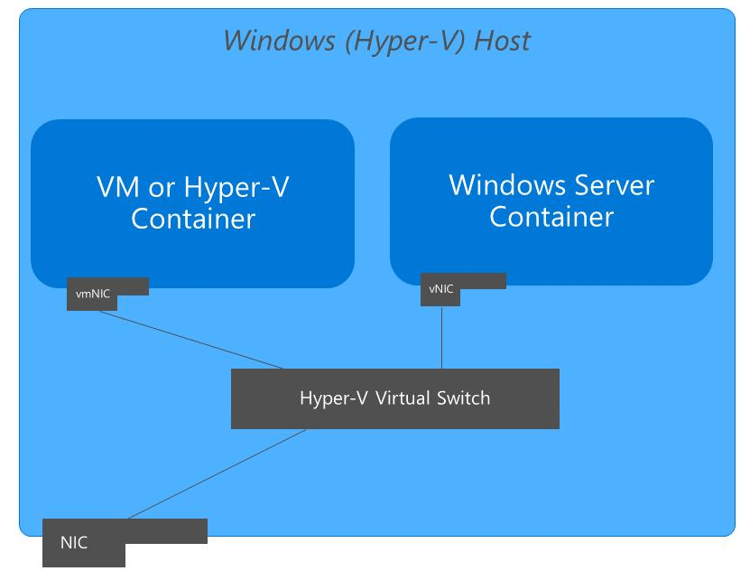
</a>
</p>
<div class="emphasizer_img_text">[ Containers networking ]</div>


## Host Networking Service (HNS)

The Windows Host Networking Service (<span class="emphasizer_code_function_2">HNS</span>) is a backend component that manages networking for containers and virtual machines on a Windows host.
Host Compute Network (<span class="emphasizer_code_function_2">HCN</span>) service API is a _public-facing_ <span class="emphasizer_code_function_2">Win32 API</span> that provides platform-level access to manage the virtual networks, virtual network endpoints, and associated policies. 

__[__ [https://learn.microsoft.com/en-us/windows-server/networking/technologies/hcn/hcn-top](https://learn.microsoft.com/en-us/windows-server/networking/technologies/hcn/hcn-top) __]__


Microsoft samples show how to use _Host Compute Network Service API_ to create a <span class="emphasizer_code_function_2">HCN</span> on the host that can be used to connect Virtual NICS to Virtual Machines or Containers [[hcn-scenarios](https://learn.microsoft.com/en-us/windows-server/networking/technologies/hcn/hcn-scenarios)]:

```cpp
using unique_hcn_network = wil::unique_any<HCN_NETWORK,decltype(&HcnCloseNetwork),HcnCloseNetwork>;
/// Creates a simple HCN Network, waiting synchronously to finish the task
void CreateHcnNetwork()
{
    unique_hcn_network hcnnetwork;
    wil::unique_cotaskmem_string result;
    std::wstring settings = ....;
    GUID networkGuid;
    HRESULT result = CoCreateGuid(&networkGuid);
    result = HcnCreateNetwork(
        networkGuid,              // Unique ID
        settings.c_str(),      // Compute system settings document
        &hcnnetwork,
        &result
        );
    ....
}
```

All public <span class="emphasizer_code_function_2">HCN</span> api can be categorized as:

* Network : <span class="emphasizer_code_function_2">HcnCreateNetwork</span>, <span class="emphasizer_code_function_2">HcnOpenNetwork</span>, .etc  
* Namespace: <span class="emphasizer_code_function_2">HcnCreateNamespace</span>,  <span class="emphasizer_code_function_2">HcnOpenNamespace</span>, .etc  
* Endpoint: <span class="emphasizer_code_function_2">HcnCreateEndpoint</span>, <span class="emphasizer_code_function_2">HcnOpenEndpoint</span>, .etc


What is a relation between <span class="emphasizer_code_function_2">Network</span>, <span class="emphasizer_code_function_2">Namespace</span> and <span class="emphasizer_code_function_2">Endpoint</span> in terms of the <span class="emphasizer_code_function_2">HCN</span>?  

<p align="center">
<a href="../images/cntnw/image1.png" target="_blank">
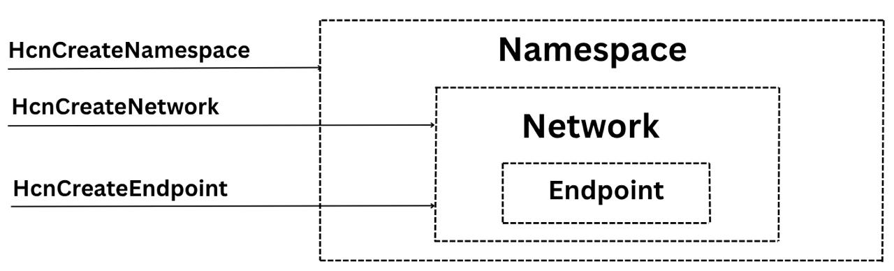
</a>
</p>
<div class="emphasizer_img_text">[ Network, Namespace and Endpoint relations ]</div>


As we can see <span class="emphasizer_code_function_2">Namespace</span> contains <span class="emphasizer_code_function_2">Network</span>, and <span class="emphasizer_code_function_2">Network</span> contains <span class="emphasizer_code_function_2">Endpoint</span>

Each container endpoint is placed in its own network namespace. The management host virtual network adapter and host network stack are located in the default network namespace. To enforce network isolation between containers on the same host, a network namespace is created for each Windows Server container and containers run under Hyper-V isolation into which the network adapter for the container is installed. Windows Server containers use a host virtual network adapter to attach to the virtual switch. Hyper-V isolation uses a synthetic VM network adapter (not exposed to the utility VM) to attach to the virtual switch.

__[__ [https://learn.microsoft.com/en-us/virtualization/windowscontainers/container-networking/network-isolation-security](https://learn.microsoft.com/en-us/virtualization/windowscontainers/container-networking/network-isolation-security)) __]__


<br>
## NAMESPACES

Searching for <span class="emphasizer_code_function_2">HcnCreateNamespace</span> on Windows host reveals:


<p align="center">
<a href="../images/cntnw/image2.png" target="_blank">
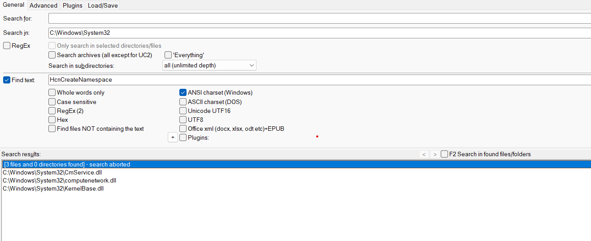
</a>
</p>
<div class="emphasizer_img_text">[ HcnCreateNamespace occurrence ]</div>


Well, there are <span class="emphasizer_code_function_2">CmService.dll</span> (Container Manager Service) and <span class="emphasizer_code_function_2">computenetwork.dll</span> (Hyper-V Host Networking Service Library). And <span class="emphasizer_code_function_2">computenetwork.dll</span> is our candidate:

<p align="center">
<a href="../images/cntnw/image3.png" target="_blank">
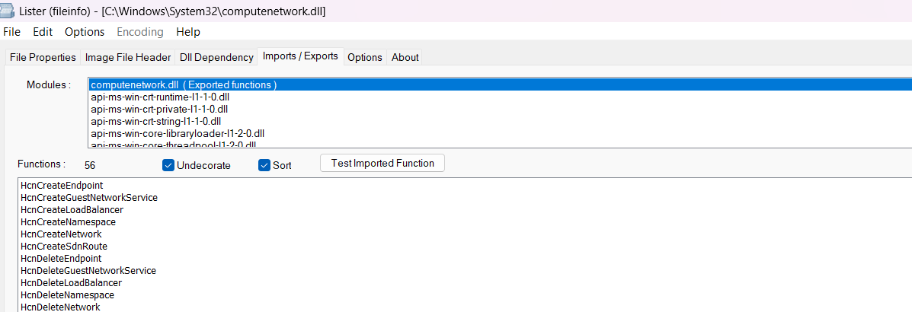
</a>
</p>
<div class="emphasizer_img_text">[ HcnCreateNamespace occurence ]</div>


Let’s open <span class="emphasizer_code_function_2">computenetwork.dll</span> in IDA:


<p align="center">
<a href="../images/cntnw/image4.png" target="_blank">
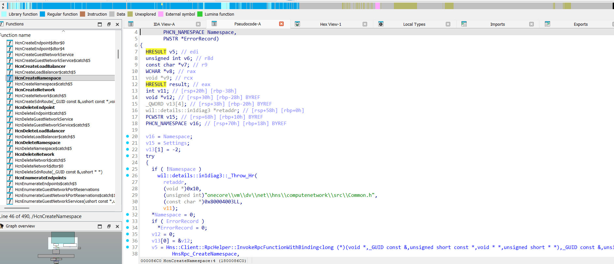
</a>
</p>
<div class="emphasizer_img_text">[ IDA pseudo code for HcnCreateNamespace in computenetwork.dll ]</div>

                      

<span class="emphasizer_code_function_2">HcnCreateNamespace</span> in <span class="emphasizer_code_function_2">computenetwork.dll</span>:

<p align="center">
<a href="../images/cntnw/image5.png" target="_blank">
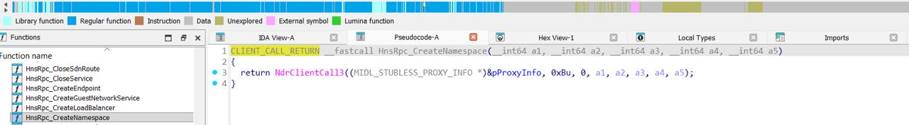
</a>
</p>
<div class="emphasizer_img_text">[ IDA pseudo code for HnsRpc_CreateNamespace in computenetwork.dll ]</div>


So, here is the call chain <span class="emphasizer_code_function_2">HcnCreateNamespace</span> \-\> <span class="emphasizer_code_function_2">HnsRpc_CreateNamespace</span>. <span class="emphasizer_code_function_2">HnsRpc*</span> prefix clearly says that creating namespaces will be performed in <span class="emphasizer_code_function_2">HostNetSvc.dll</span> (<span class="emphasizer_code_function_2">Hns*</span> \- Host network service) playing the role of the <span class="emphasizer_code_function_2">RPC</span> service, and it is an actual <span class="emphasizer_code_function_2">HNS</span>.

Lets load <span class="emphasizer_code_function_2">HostNetSvc.dll</span> into IDA:  

<p align="center">
<a href="../images/cntnw/image6.png" target="_blank">
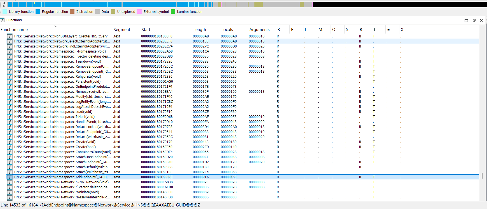
</a>
</p>
<div class="emphasizer_img_text">[ HostNetSvc.dll Namespace-related methods ]</div>


Namespace-related methods in the <span class="emphasizer_code_function_2">HostNetSvc.dll</span>:

```cpp
HNS::Service::Network::Namespace::Namespace(void)  
HNS::Service::Network::Namespace::~Namespace(void)  
HNS::Service::Network::Namespace::Teardown(void)  
HNS::Service::Network::Namespace::RemoveEndpointUnderLock(_GUID const &)  
HNS::Service::Network::Namespace::RemoveEndpoint(_GUID const &)  
HNS::Service::Network::Namespace::Modify(std::basic_string_view<ushort> const &)  
HNS::Service::Network::Namespace::Load(void)  
HNS::Service::Network::Namespace::IsHost(void)  
HNS::Service::Network::Namespace::DetachEndpoint(_GUID const &,ushort const *,bool)  
HNS::Service::Network::Namespace::Detach(wil::basic_zstring_view<ushort>,bool)  
HNS::Service::Network::Namespace::Create(void)  
HNS::Service::Network::Namespace::ContainersCount(void)  
HNS::Service::Network::Namespace::AttachHostEndpoint(_GUID const &)  
HNS::Service::Network::Namespace::AttachEndpoint(_GUID const &,ushort const *,bool)  
HNS::Service::Network::Namespace::AttachDefault(wil::basic_zstring_view<ushort>)  
HNS::Service::Network::Namespace::Attach(wil::basic_zstring_view<ushort>,bool)  
HNS::Service::Network::Namespace::AddEndpoint(_GUID const &)
```

Lets see at <span class="emphasizer_code_function_2">HNS::Service::Network::Namespace::Create method</span>:

```cpp
void __fastcall HNS::Service::Network::Namespace::Create(HNS::Service::Network::Namespace *this)  
{  
    ....  
    v8 = HNS::Service::Resource::ResourceManager::AllocateResource<25,HNS::Service::Resource::NetworkCompartmentResource::VariableSet *>( v6,v29,Activity,&v26);      
    ....  
}
```

Next go to <span class="emphasizer_code_function_2">Service::Resource::NetworkCompartmentResource</span>:

```cpp
HNS::Service::Resource::NetworkCompartmentResource::Load(void)  
HNS::Service::Resource::NetworkCompartmentResource::DeallocateResource(void)  
HNS::Service::Resource::NetworkCompartmentResource::AllocateResource(void)
```

<span class="emphasizer_code_function_2">HNS::Service::Resource::NetworkCompartmentResource::AllocateResource(void)</span>:

```cpp
_QWORD *__fastcall HNS::Service::Resource::NetworkCompartmentResource::AllocateResource(__int64 a1, _QWORD *a2)  
{  
    .....  
    HNSTraceProvider::TraceEnter("HNS::Service::Resource::NetworkCompartmentResource::AllocateResource", 0x2Eu);  
    AcquireSRWLockExclusive((PSRWLOCK)(a1 + 40));  
    .....  
    v10 = IpAddress::CreateCompartment(&v15, v5 == 1, v4);  
    ....  
}
```

Here is <span class="emphasizer_code_function_2">IpAddress</span> object, lets see:

```cpp
IpAddress::GetCompartment(_GUID const &)  
IpAddress::DeleteCompartment(_GUID const &)  
IpAddress::CreateCompartment(_GUID const &,bool,bool)
```

And here is <span class="emphasizer_code_function_2">IpAddress::CreateCompartment</span> method:

```cpp
__int64 __fastcall IpAddress::CreateCompartment(const struct _GUID *a1, char a2, char a3)  
{  
    ....  
    CompartmentId = 0;  
    v6 = ConvertCompartmentGuidToId(a1, &CompartmentId);  
    ....  
    v13 = NsiSetAllParameters(2, 1, &NPI_MS_NDIS_MODULEID);  
    ....  
    return CompartmentId;  
}
```

So, <span class="emphasizer_code_function_2">Namespaces</span> are implemented with the help of the  <span class="emphasizer_code_function_2">Compartments</span>!

We can find that the <span class="emphasizer_code_function_2">NsiSetAllParameters</span> function is exported by <span class="emphasizer_code_function_2">netio.sys</span> and <span class="emphasizer_code_function_2">nsi.dll</span>:

<p align="center">
<a href="../images/cntnw/image7.png" target="_blank">
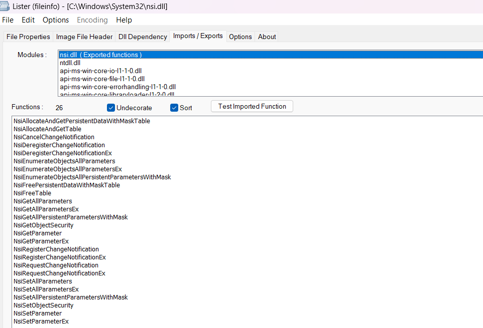
</a>
</p>
<div class="emphasizer_img_text">[ Nsi.dll export ]</div>
<br>
<hr class="line_1">
<p align="center">
<a href="../images/cntnw/image8.png" target="_blank">
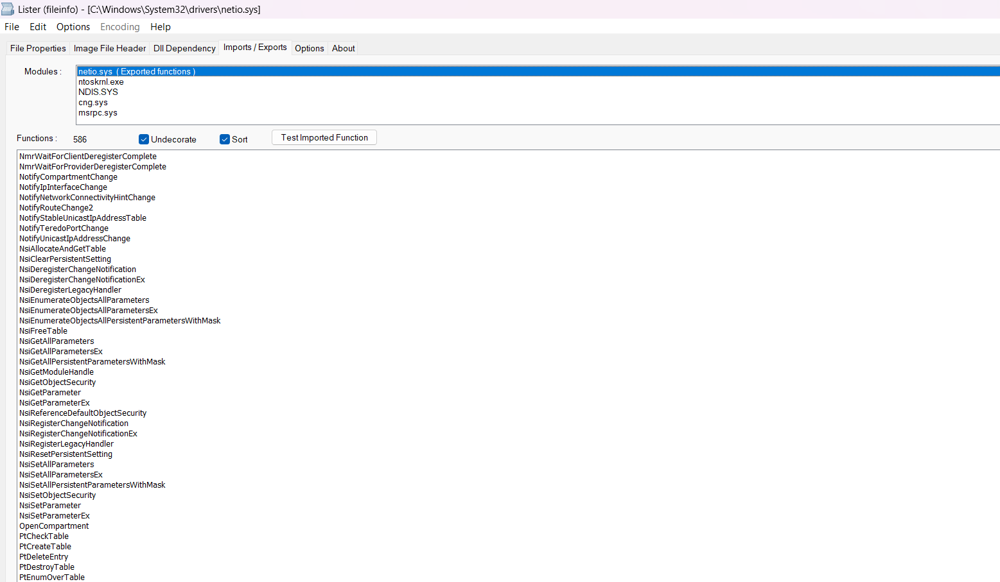
</a>
</p>
<div class="emphasizer_img_text">[ Netio.sys export ]</div>


<span class="emphasizer_code_function_2">nsi.dll</span> implements Network Store Interface (<span class="emphasizer_code_function_2">NSI</span>). The <span class="emphasizer_code_function_2">NSI</span> service is responsible for storing and providing information about network interfaces and their states to other parts of the operating system, and runs under a shared process called <span class="emphasizer_code_function_2">svchost.exe</span>. 

Let's take a closer look at the <span class="emphasizer_code_function_2">NsiSetAllParameters</span> function (IDA pseudo code):


```c
__int64 __fastcall NsiSetAllParameters(int a1, int a2, LPVOID a3, int a4, LPVOID a5, int a6, LPVOID a7, int a8)  
{  
  _QWORD v9[3]; // [rsp+30h] [rbp-58h] BYREF  
  ....  
  return NsiIoctl(0x120013u, v9, 0x48u, v9, (LPDWORD)&a6, 0);  
}
```

```c
DWORD __fastcall NsiIoctl(DWORD dwIoControlCode, LPVOID lpInBuffer, DWORD nInBufferSize, LPVOID lpOutBuffer, LPDWORD lpBytesReturned, LPOVERLAPPED lpOverlapped)  
{  
    ULONG OutputBufferLength; // ebx  
    HANDLE EventA; // rdi  
    int Status; // ebx  
    HANDLE FileW; // rax  
    struct _IO_STATUS_BLOCK IoStatusBlock; // [rsp+58h] [rbp-30h] BYREF

    FileW = CreateFileW(L"\\\\.\\Nsi", 0, 3u, 0, 3u, 0x40000000u, 0);  
    ....
    if ( !lpOverlapped )  
    {  
        ....
        Status = NtDeviceIoControlFile(g_NsiAsyncDeviceHandle, EventA, 0, 0, &IoStatusBlock, dwIoControlCode, lpInBuffer, nInBufferSize, lpOutBuffer, OutputBufferLength);  
    }  
    ....  
}
```

Symbolic link <span class="emphasizer_code_function_2">L"\\\\.\\Nsi"</span> is created by <span class="emphasizer_code_function_2">nsiproxy.sys</span> driver (discovered during <span class="emphasizer_code_function_2">nsiproxy.sys</span> reversing):

```c
__int64 __fastcall NsippCreateDevice(PDRIVER_OBJECT DriverObject)  
{  
    ....  
    RtlInitUnicodeString(&DestinationString, L"\\Device\\Nsi");  
    v8 = WdmlibIoCreateDeviceSecure(v1, v6, &DestinationString, v7, v14, v15, &DefaultSDDLString, v16);  
    if ( v8 >= 0 )  
    {  
        ....  
        RtlInitUnicodeString(&SymbolicLinkName, L"\\??\\Nsi");  
        v8 = IoCreateSymbolicLink(\&SymbolicLinkName, &DestinationString);  
        if ( v8 >= 0 )  
        {  
           *MajorFunction = (PDRIVER_DISPATCH)&NsippDispatch;  
    ....  
 }
 ```

<span class="emphasizer_code_function_2">NsippDispatch</span> is a dispatch handler:

```c
__int64 __fastcall NsippDispatch(__int64 a1, IRP *a2)  
{  
    ....  
    CurrentStackLocation = (__int64)a2->Tail.Overlay.CurrentStackLocation;  
    ....  
    v7 = *(_DWORD*)(CurrentStackLocation + 24);  
    v8 = *(volatile void **)(CurrentStackLocation + 32);  
    v10 = *(_DWORD *)(CurrentStackLocation + 16);  
    switch ( v7 )  
    {  
        ....  
      switch ( v7 )  
      {  
        ....  
        case 0x120013:  
          AllParameters = NsippSetAllParameters((__int128*)v8, v10, RequestorMode, CurrentStackLocation);  
    ....
}
```

And <span class="emphasizer_code_function_2">NsippSetAllParameters</span>:

```c
__int64 __fastcall NsippSetAllParameters(__int128* a1, unsigned int a2, unsigned __int8 a3, __int64 a4)  
{  
    ....   
    Parameters = NsippProbeAndAllocateParameters(  
                 (_DWORD)a1,  
                 72,  
                 (int)a1 + 8,  
                 (int)a1 + 40,  
                 (__int64)a1 + 56,  
                 a3,....);  
    v14 = (char*)Parameters;  
    ....  
LABEL_9:  
        Parameters = NsiSetAllParametersEx(v14);  
    ....  
}
```

And <span class="emphasizer_code_function_2">NsiSetAllParametersEx</span> is located in <span class="emphasizer_code_function_2">netio.sys</span>:  

```c
__int64 __fastcall NsiSetAllParametersEx(__int64 a1)  
{  
    ....  
    NmpContext = NsipGetNmpContext(a1 + 8);  
    ....  
    v11 = *(_QWORD*)(NmpContext + 48);  
    v5 = NsipValidateSetAllParametersRequest(v11, a1);  
    ....  
    v20 = NsipWritePersistentData(a1 + 8, v4, a1 + 40, *(_QWORD*)(a1 + 56), 0, *(_DWORD*)(a1 + 64), 0, v27);  
    ....
}
```

And <span class="emphasizer_code_function_2">NsipWritePersistentData</span> function write all network related information into the registry key <span class="emphasizer_code_function_2">L"\\Registry\\Machine\\System\\CurrentControlSet\\Control\\Nsi"</span>:
```c
__int64 __fastcall NsipWritePersistentData(  
        __int64 a1,  
        unsigned int a2,  
        __int64 a3,  
        void *a4,  
        void *Src,  
        unsigned int Size,  
        unsigned int a7,  
        bool a8)  
{  
    ....  
    result = NsipOpenInformationObjectKey(&KeyHandle);  
    ....  
    v16 = ZwQueryValueKey(KeyHandle, &ValueName, KeyValueFullInformation, v33, DataSize, &DataSize);  
    ....  
    NsipConvertKeyValueDataToRw(LowPriority, LowPriority, 0, 0, v35);  
    ....  
    v24 = ZwSetValueKey(KeyHandle, &ValueName, 0, 3u, v12, 2 * v20);  
    ....
}  
    
__int64 __fastcall NsipOpenInformationObjectKey(PHANDLE KeyHandle, unsigned int *a2)  
{  
  ....  
  PersistedStateLocation = RtlGetPersistedStateLocation(  
                                 L"NsiPersistentStore",  
                                 0,  
                                 L"\\Registry\\Machine\\System\\CurrentControlSet\\Control\\Nsi",  
                                 0,  
                                 v17,  
                                 512,  
                                 &v11);  
.... 
}
```
<br>
View of the <span class="emphasizer_code_function_2">\Registry\Machine\System\CurrentControlSet\Control\Nsi</span>:
<p align="center">
<a href="../images/cntnw/image9.png" target="_blank">
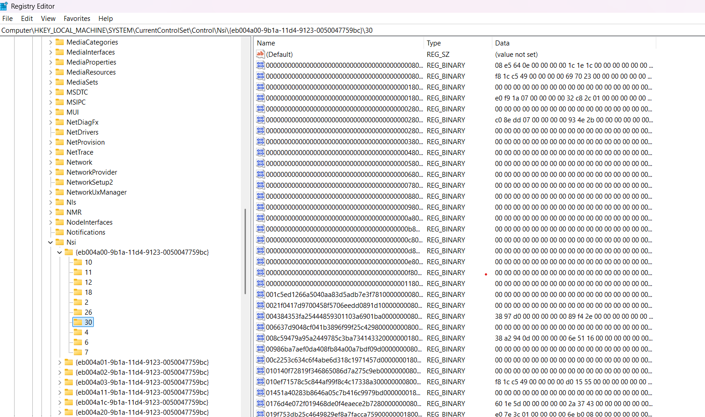
</a>
</p>
<div class="emphasizer_img_text">[ NSI tables in a registry ]</div>


Full call chain for <span class="emphasizer_code_function_2">namespaces</span> creation:  

<p align="center">
<a href="../images/cntnw/image10.png" target="_blank">
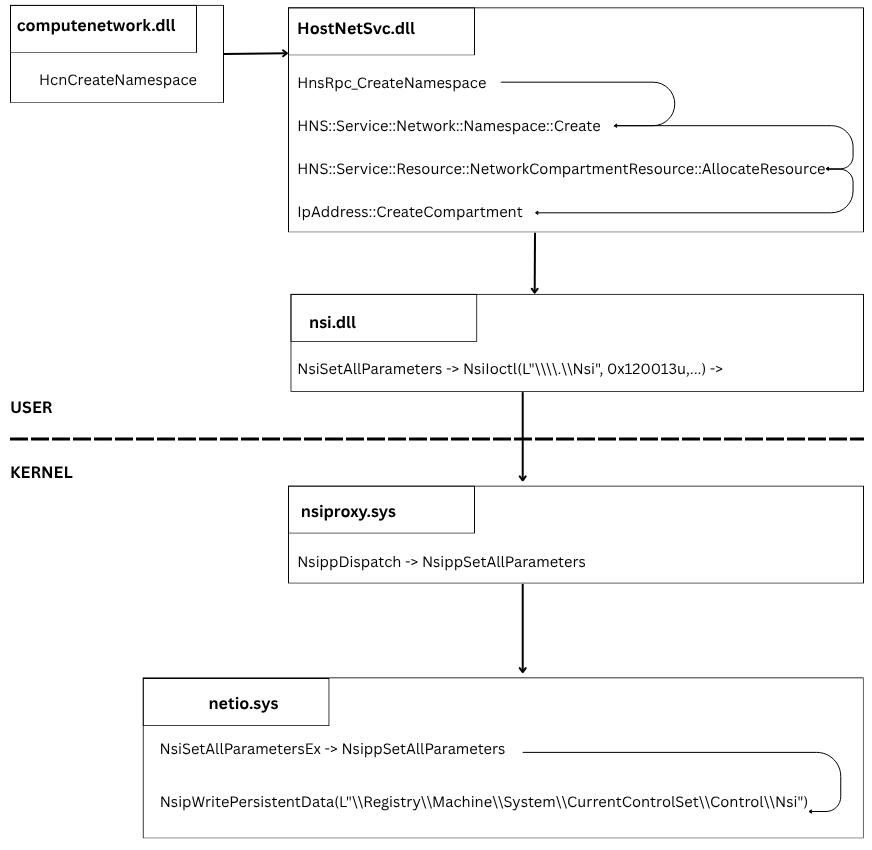
</a>
</p>
<div class="emphasizer_img_text">[ NSI call chain ]</div>


<br>
## COMPARTMENTS


So, to create <span class="emphasizer_code_function_2">Namespace</span> (internally implemented via <span class="emphasizer_code_function_2">Compartments</span>) we can use <span class="emphasizer_code_function_2">Hcn*</span> functions or <span class="emphasizer_code_function_2">Nsi*</span> functions.<br>
A traffic from the one <span class="emphasizer_code_function_2">Namespace</span> ( <span class="emphasizer_code_function_2">Compartment</span> ) _can't_ get to the others by default.<br>
Let’s search for something compartment-related:


<p align="center">
<a href="../images/cntnw/image11.png" target="_blank">
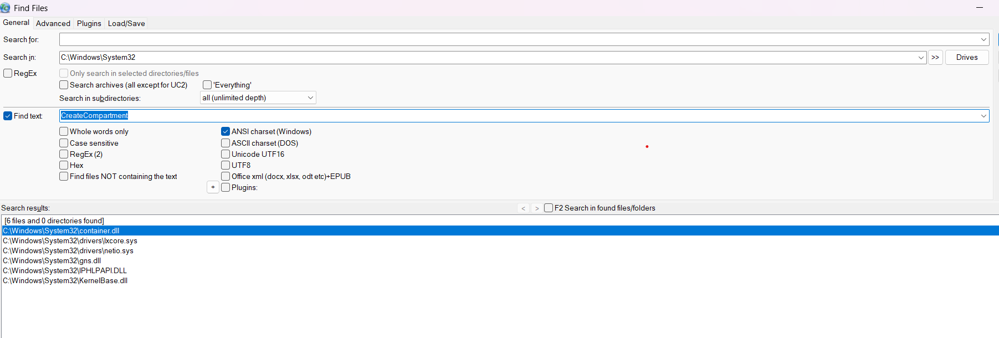
</a>
</p>
<div class="emphasizer_img_text">[ Searching for ‘CreateCompartment’ ]</div>


				
<span class="emphasizer_code_function_2">Container.dll</span> sounds promising! There are a lot of the interesting things:  
<p align="center">
<a href="../images/cntnw/image12.png" target="_blank">
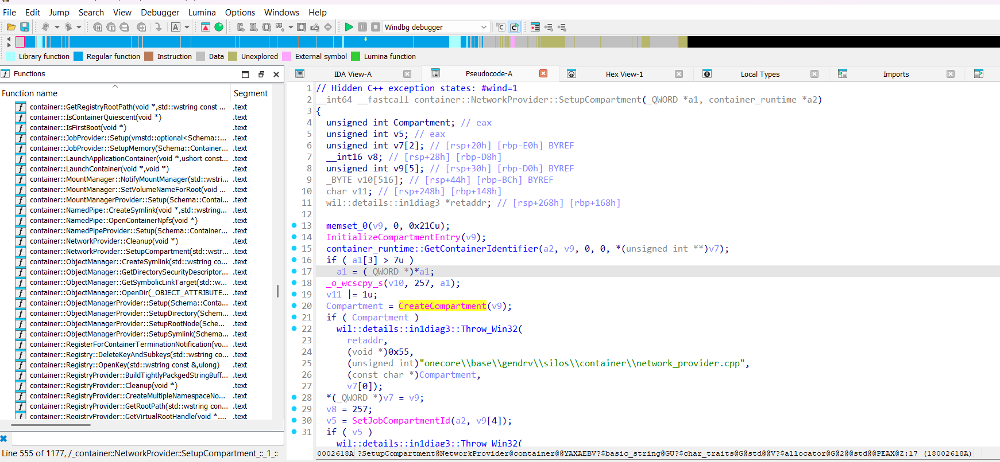
</a>
</p>
<div class="emphasizer_img_text">[ Inside container.dll]</div>


<span class="emphasizer_code_function_2">NetworkProvider::SetupCompartment</span> method:


```cpp
__int64 __fastcall container::NetworkProvider::SetupCompartment(_QWORD *a1, container_runtime *a2)  
{  
    ....  
    memset_0(v9, 0, 0x21Cu);  
    InitializeCompartmentEntry(v9);  
    container_runtime::GetContainerIdentifier(a2, v9, 0, 0, *(unsigned int **)v7);  
    if ( a1[3] > 7u )  
        a1 = (_QWORD *)*a1;  
    _o_wcscpy_s(v10, 257, a1);  
    v11 |= 1u;  
    Compartment = CreateCompartment(v9);  
 
}
```

Functions <span class="emphasizer_code_function_2">InitializeCompartmentEntry</span> and <span class="emphasizer_code_function_2">CreateCompartment</span> are imported from <span class="emphasizer_code_function_2">IPHLPAPI.DLL</span>:

<p align="center">
<a href="../images/cntnw/image13.png" target="_blank">
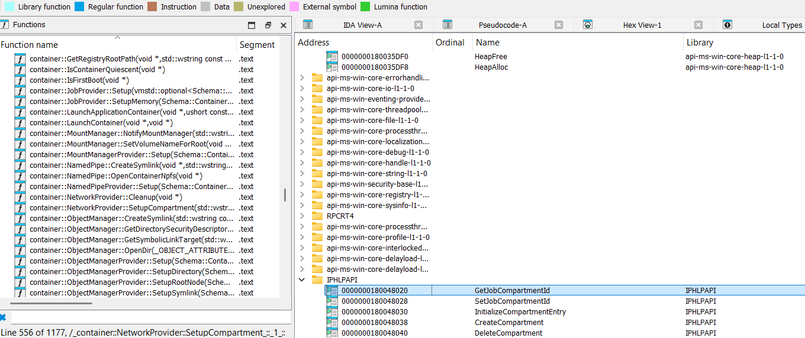
</a>
</p>
<div class="emphasizer_img_text">[ Container.dll imported functions ]</div>


Firstly look at <span class="emphasizer_code_function_2">InitializeCompartmentEntry</span> function:

```c
__int64 __fastcall InitializeCompartmentEntry(__int64 a1)  
{  
    __int64 result; // rax  
    memset_0((void *)a1, 255, 0x21Cu);  
    result = 0;  
    *(_DWORD *)(a1 + 16) = 0;  
    *(_WORD *)(a1 + 20) = 0;  
  return result;  
}
```

It provides information about compartment entry structure, it has size of the <span class="emphasizer_code_function_2">0x21C</span> bytes and at least two fields one with <span class="emphasizer_code_function_2">_DWORD</span> type at <span class="emphasizer_code_function_2">0x10</span> bytes offset, and other with <span class="emphasizer_code_function_2">_WORD</span> type at <span class="emphasizer_code_function_2">0x14</span> bytes.

Next look at <span class="emphasizer_code_function_2">CreateCompartment</span> function:

```c
__int64 __fastcall CreateCompartment(const wchar_t *a1)  
{  
    _DWORD v4[4]; // [rsp+58h] [rbp-B0h] BYREF  
    _DWORD v5[270]; // [rsp+68h] [rbp-A0h] BYREF  
    wchar_t pszDest[259]; // [rsp+4B2h] [rbp+3AAh] BYREF  
    int v9; // [rsp+6B8h] [rbp+5B0h]  
    v4[0] = 0;  
    memset_0(v5, 0, 0x668u);  
    v5[0] = 107479981;  
    .... 
    LODWORD(result) = StringCbCopyW(pszDest, 0x202u, a1 + 10);  
    ....
    if ( (a1[268] & 1) != 0 )  
        v9 |= 4u;  
    result = NsiSetAllParameters(1, 1, &NPI_MS_NDIS_MODULEID, 7, v4, 4, v5, 1640);
    ....
}
```

So, it is obvious that input for <span class="emphasizer_code_function_2">CreateCompartment</span> is some structure.  
After some manipulations we can reconstruct compartment entry structure:

```c
typedef struct _COMPARTMENT_ENRTY  
{  
    GUID    Guid;                
    DWORD   CompartmentId;  
    WORD    DescriptionSize;  
    WCHAR   Description[257];  
    DWORD   Flags;  
    // Structure size: 0x21C (540 bytes)  
} COMPARTMENT_ENRTY, *PCOMPARTMENT_ENRTY;
```

Now we can create our own compartment initializing <span class="emphasizer_code_function_2">COMPARTMENT_ENRTY</span> and invoking <span class="emphasizer_code_function_2">CreateCompartment</span> from the <span class="emphasizer_code_function_2">IPHLPAPI.DLL</span>:

<p align="center">
<a href="../images/cntnw/image14.png" target="_blank">
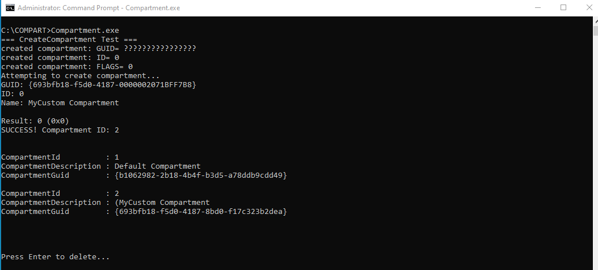
</a>
</p>
<div class="emphasizer_img_text">[ Create ‘MyCustom Compartment’ with generated GUID ]</div>
<br>
<hr class="line_1">
<p align="center">
<a href="../images/cntnw/image15.png" target="_blank">
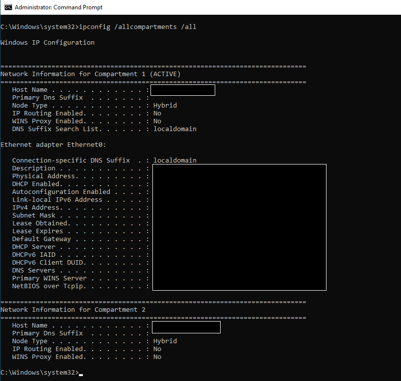
</a>
</p>
<div class="emphasizer_img_text">[ Newly created ‘MyCustom Compartment’ ]</div>


We already know that the root of the isolation is the <span class="emphasizer_code_function_2">compartment</span> (<span class="emphasizer_code_function_2">namespace</span>) mechanism.   
So obviously modules involved in a network stack somehow have to know about the <span class="emphasizer_code_function_2">compartment</span>.

For user mode  we have ap exported by <span class="emphasizer_code_function_2">IPHLPAPI.DLL</span> like:

```c
GetCurrentThreadCompartmentId  
GetSessionCompartmentId  
GetCurrentThreadCompartmentScope  
GetJobCompartmentId  
GetInterfaceCompartmentId

SetCurrentThreadCompartmentId  
SetSessionCompartmentId  
SetCurrentThreadCompartmentScope  
SetJobCompartmentId  
SetInterfaceCompartmentId
```

For kernel mode we have api exported by <span class="emphasizer_code_function_2">ndis.sys</span>  like:

```c
NdisGetThreadObjectCompartmentId  
NdisGetSessionCompartmentId  
NdisGetProcessObjectCompartmentId  
NdisGetJobObjectCompartmentId  
NdisGetThreadObjectCompartmentScope

NdisSetThreadObjectCompartmentId  
NdisSetSessionCompartmentId  
NdisSetProcessObjectCompartmentId  
NdisSetJobObjectCompartmentId  
NdisSetThreadObjectCompartmentScope
```


So modules involved in a network stack can just call this api to get a compartment and perform appropriate actions regarding compartment information. It is called _‘module is compartment-aware’_. And if we do search for this api on disk <span class="emphasizer_code_function_2">C:</span> we see that it is true:


<p align="center">
<a href="../images/cntnw/image16.png" target="_blank">
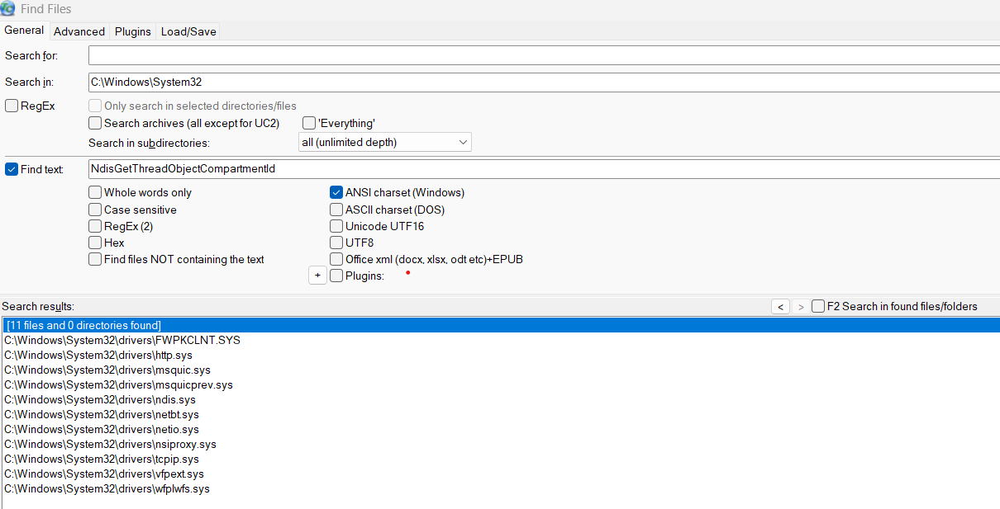
</a>
</p>
<div class="emphasizer_img_text">[ Kernel mode compartment-aware modules ]</div>
<br>
<hr class="line_1">
<p align="center">
<a href="../images/cntnw/image17.png" target="_blank">
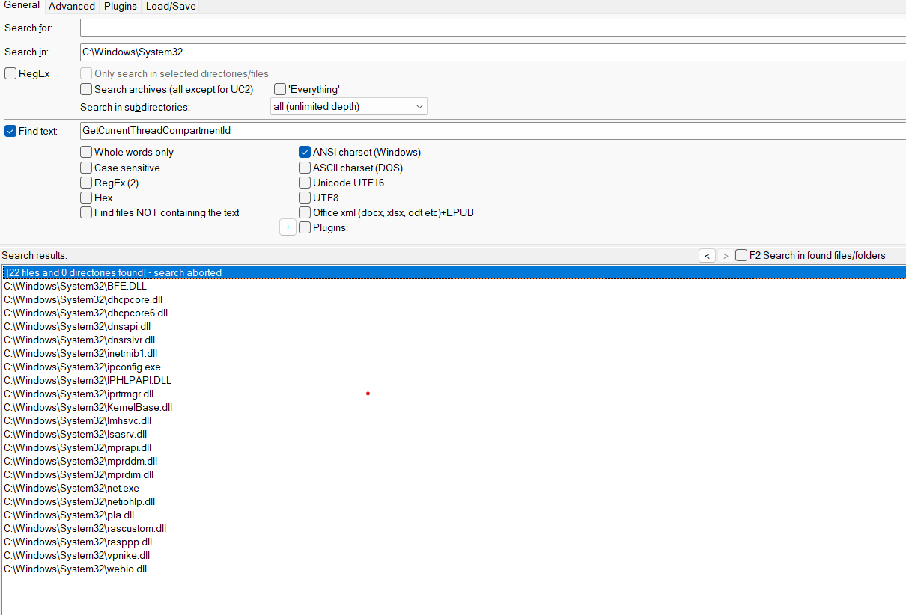
</a>
</p>
<div class="emphasizer_img_text">[ User mode compartment-aware modules ]</div>


For example let's see at exported from <span class="emphasizer_code_function_2">netio.sys</span> function <span class="emphasizer_code_function_2">GetIpPath</span>:

<p align="center">
<a href="../images/cntnw/image18.png" target="_blank">
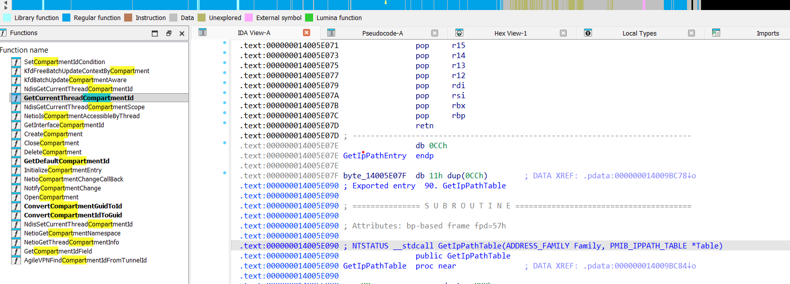
</a>
</p>
<div class="emphasizer_img_text">[ GetIpPath function from netio.sys ]</div>


Here is reconstructed code for <span class="emphasizer_code_function_2">GetIpPath</span> function, that fill ip path based on <span class="emphasizer_code_function_2">compartment</span>:

```c
NTSTATUS __stdcall GetIpPathTable(ADDRESS_FAMILY Family,  PMIB_IPPATH_TABLE *Table)  
{  
    ....
    ULONG CurrentCompartmentId = GetCurrentThreadCompartmentId();  
    ....
    // Get path table for each family  
    for (FamilyIndex = 0; FamilyIndex < 2; FamilyIndex++) {  
        GetModuleIdFromFamily(FamilyTable[FamilyIndex], &ModuleId);          
        // Allocate and retrieve NSI path table  
        NTSTATUS Status = NsiAllocateAndGetTable(&ModuleId, .... pathPtr, keyPtr, rodPtr,  
                                                    &FamilyData[FamilyIndex].NumEntries);         
        // Count entries matching current compartment  
        ....
        for (DWORD i = 0; i < FamilyData[FamilyIndex].NumEntries; i++) {  
                PVOID keyEntry = (PBYTE)pathBase + (i * keySize);  
                if (*(PULONG)keyEntry == CurrentCompartmentId) {  
                    TotalEntries++;  
                }  
            }  
        }  
    }      
    // Allocate output MIB table  
    Status = NetioAllocateMibTable(TotalEntries, MIB_IPPATH_TABLE_VERSION, &PathTable);      
    for (FamilyIndex = 0; FamilyIndex < 2; FamilyIndex++) {   
        for (i = 0; i < FamilyData[FamilyIndex].NumEntries; i++) {  
            ....
            if (*(PULONG)keyEntry == CurrentCompartmentId) {  
                // Fill MIB_IPPATH_ROW entry  
                FillIpPathEntry( (PMIB_IPPATH_ROW)((PBYTE)PathTable + .....);  
                OutputIndex++;  
            }  
        }  
    }  
    *Table = PathTable;
    ....
}
```


<br>
## KERNEL

We already know that <span class="emphasizer_code_function_2">CreateCompartment</span> from the <span class="emphasizer_code_function_2">IPHLPAPI.DLL</span> leads to the <span class="emphasizer_code_function_2">netio.sys</span> -> <span class="emphasizer_code_function_2">NsiSetAllParametersEx</span>


<p align="center">
<a href="../images/cntnw/image19.png" target="_blank">
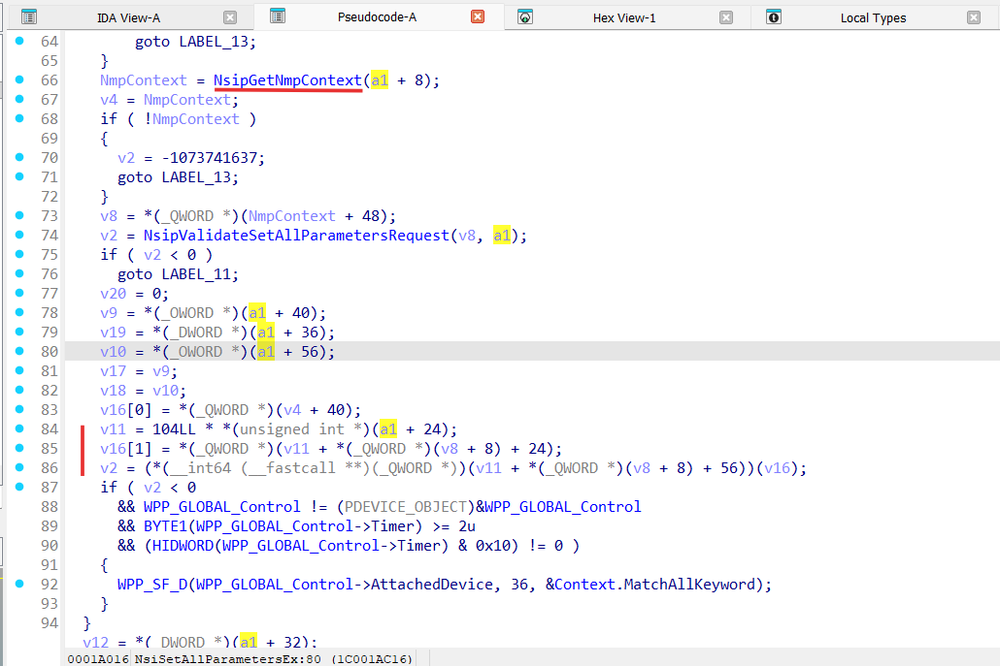
</a>
</p>
<div class="emphasizer_img_text">[ NsiSetAllParametersEx from the netio.sys ]</div>


Analyzing <span class="emphasizer_code_function_2">NsiSetAllParametersEx</span> function we can see that it gets a pointer to the some network manager provider and calls the handler for <span class="emphasizer_code_function_2">SetAllParameters</span> from this provider:

```c
v11 = 104LL * *(unsigned int *)(a1 + 24);  
v16[1] = *(_QWORD *)(v11 + *(_QWORD *)(v8 + 8) + 24);  
v2 = (*(__int64 (__fastcall **)(_QWORD *))(v11 + *(_QWORD *)(v8 + 8) + 56))(v16);
```


Let’s run a <span class="emphasizer_code_function_2">Windbg</span> kernel debug session, install a  break point on the <span class="emphasizer_code_function_2">netio!NsiSetAllParametersEx</span> and run our console application that creates a <span class="emphasizer_code_function_2">compartment</span>.

After we ran the application stopped at the <span class="emphasizer_code_function_2">netio!NsiSetAllParametersEx</span> in the <span class="emphasizer_code_function_2">Windbg</span>, and during indirect call through <span class="emphasizer_code_function_2">CFG</span> (_Control Flow Guard_) we landed at <span class="emphasizer_code_function_2">ndis!ndisSetAllCompartment</span> function:


<p align="center">
<a href="../images/cntnw/image20.png" target="_blank">
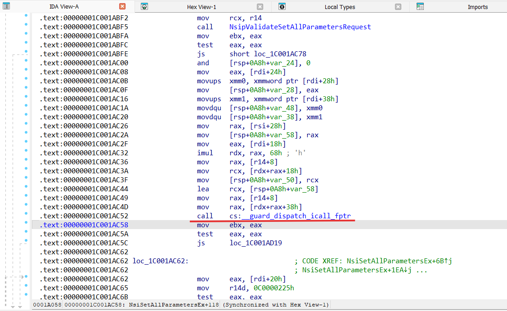
</a>
</p>
<div class="emphasizer_img_text">[ Indirect call through CFG to the ndis!ndisSetAllCompartments ]</div>
<br>
<hr class="line_1">
<p align="center">
<a href="../images/cntnw/image21.png" target="_blank">
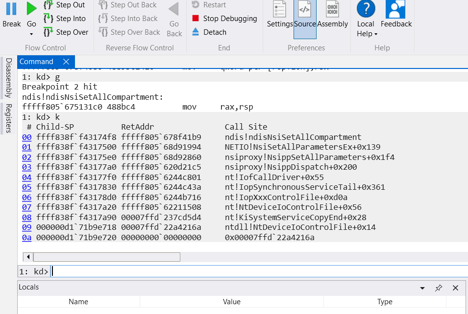
</a>
</p>
<div class="emphasizer_img_text">[ Call stack for ndis!ndisSetAllCompartments ]</div>


<br>
## NDIS

<span class="emphasizer_code_function_2">NDIS</span> stands for Network Driver Interface Specification.  
It is the core networking framework in Windows — a kernel subsystem and API standard that defines how network interface drivers interact with the operating system and each other:

<p align="center">
<a href="../images/cntnw/image22.png" target="_blank">

</a>
</p>
<div class="emphasizer_img_text">[ NDIS stack ]</div>


Let’s analyze <span class="emphasizer_code_function_2">ndis.sys</span> for any _compartment-aware_ functionality:

<p align="center">
<a href="../images/cntnw/image23.png" target="_blank">
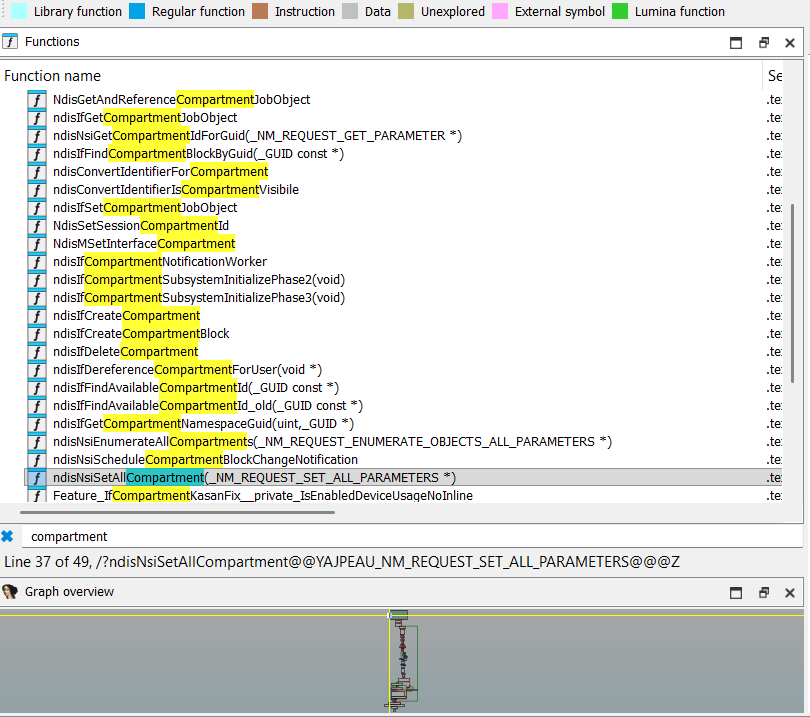
</a>
</p>
<div class="emphasizer_img_text">[ Compartment-aware functions in ndis.sys ]</div>


Functionality of the <span class="emphasizer_code_function_2">ndisSetAllCompartments</span>:

<p align="center">
<a href="../images/cntnw/image24.png" target="_blank">

</a>
</p>
<div class="emphasizer_img_text">[ ndisSetAllCompartments function ]</div>


So, <span class="emphasizer_code_function_2">ndisSetAllCompartments</span> based on input parameters can create or delete the compartment (<span class="emphasizer_code_function_2">ndisIfCreateCompartment</span>/<span class="emphasizer_code_function_2">ndisIfDeleteCompartment</span>).

Let’s see what <span class="emphasizer_code_function_2">ndisIfCreateCompartment</span> does:

<p align="center">
<a href="../images/cntnw/image25.png" target="_blank">
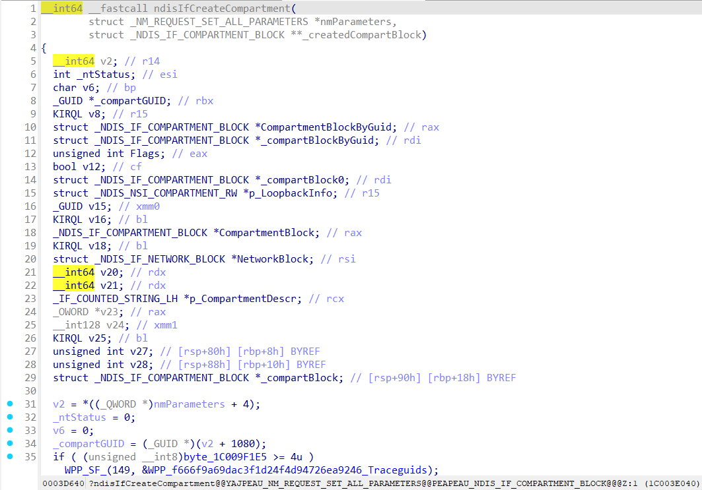
</a>
</p>
<div class="emphasizer_img_text">[ ndisIfCreateCompartment function ]</div>


Setup <span class="emphasizer_code_function_2">namespace</span> guid as provided <span class="emphasizer_code_function_2">compartment</span> guid:


<p align="center">
<a href="../images/cntnw/image26.png" target="_blank">
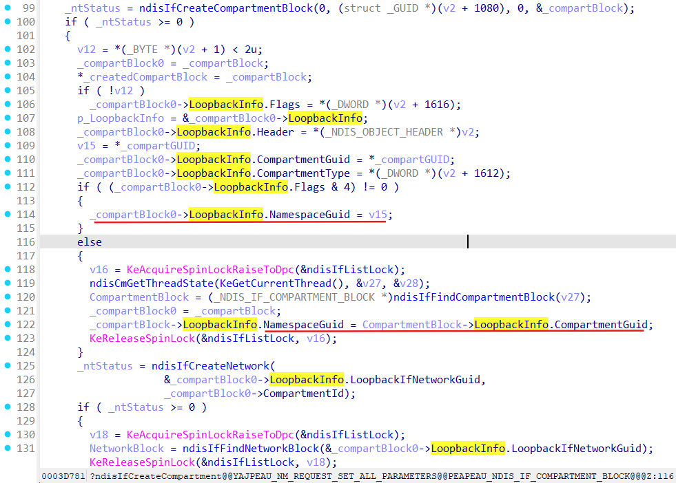
</a>
</p>
<div class="emphasizer_img_text">[ Setup LoopbackInfo inside ndisIfCreateCompartment ]</div>


<span class="emphasizer_code_function_2">LoopbackIfNetworkGuid</span> and <span class="emphasizer_code_function_2">CompartmentId</span> get set up in the <span class="emphasizer_code_function_2">ndisIfCreateCompartmentBlock</span> function:

<p align="center">
<a href="../images/cntnw/image27.png" target="_blank">
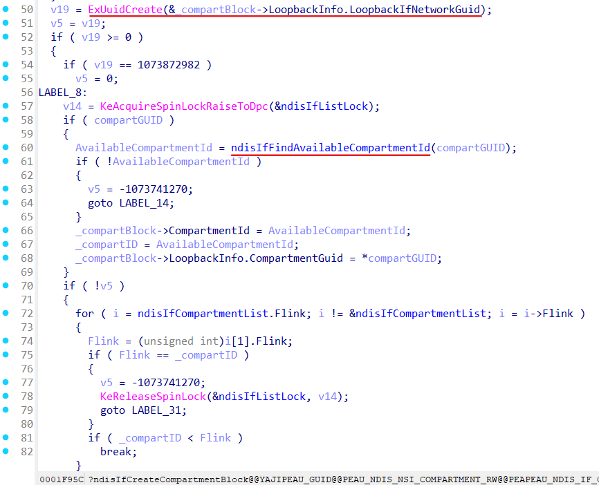
</a>
</p>
<div class="emphasizer_img_text">[ ndisIfCreateCompartmentBlock function ]</div>

			

<span class="emphasizer_code_function_2">Network</span> gets created with guid from the generated <span class="emphasizer_code_function_2">LoopbackIfNetworkGuid</span>:

<p align="center">
<a href="../images/cntnw/image28.png" target="_blank">
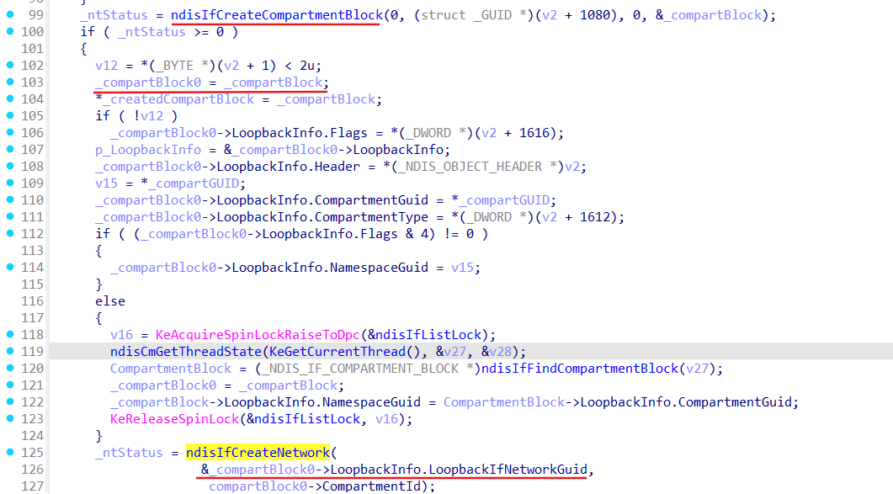
</a>
</p>
<div class="emphasizer_img_text">[ Network creation in the ndisIfCreateCompartment function ]</div>


<span class="emphasizer_code_function_2">Loopback</span> interface creation:

<p align="center">
<a href="../images/cntnw/image29.png" target="_blank">
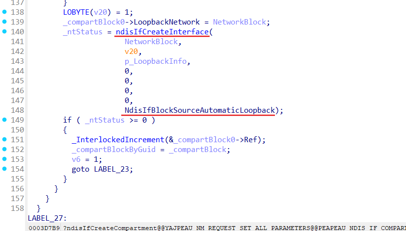
</a>
</p>
<div class="emphasizer_img_text">[ Loopback interface creation in the ndisIfCreateCompartment function ]</div>


What we can see here is that for each compartment Loopback interface __must__ be created (obviously to not reach host <span class="emphasizer_code_function_2">Loopback</span> from the <span class="emphasizer_code_function_2">Namespaces</span>). 

<span class="emphasizer_code_function_2">Compartments</span> creation call chain:
<p align="center">
<a href="../images/cntnw/image30.png" target="_blank">
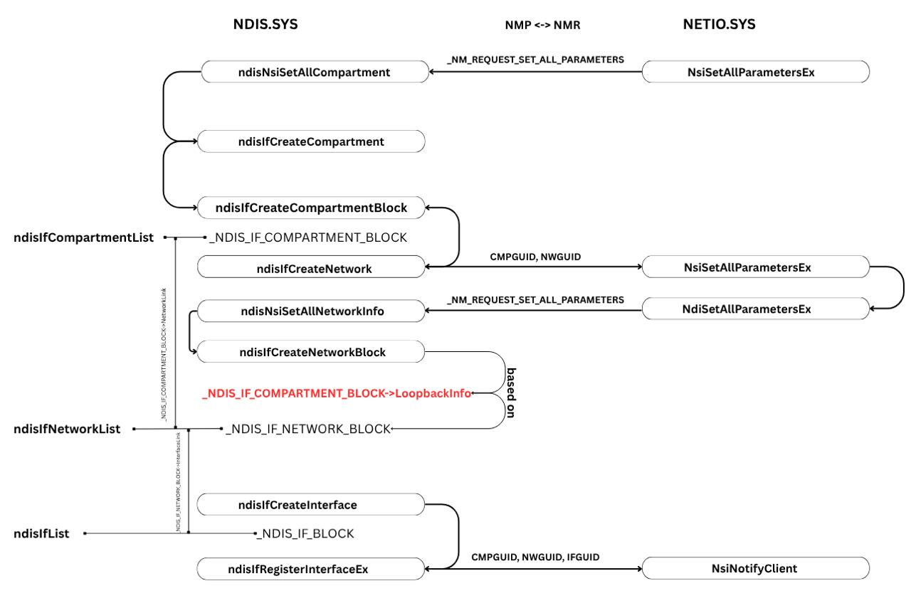
</a>
</p>
<div class="emphasizer_img_text">[ Call chain for compartment creation ]</div>
 


Objects links involved to the <span class="emphasizer_code_function_2">compartment</span> creation : 
<p align="center">
<a href="../images/cntnw/image31.png" target="_blank">
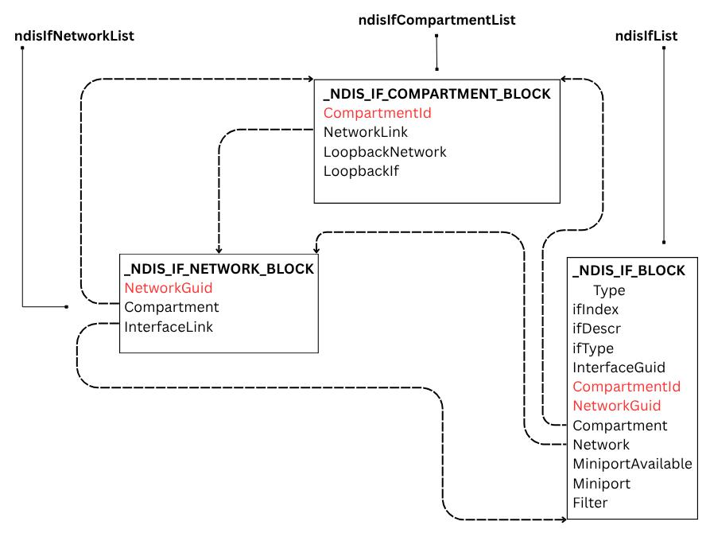
</a>
</p>
<div class="emphasizer_img_text">[ ndis.sys objects links ]</div> 
 
 					
Debugging our compartment creation we can observe that <span class="emphasizer_code_function_2">"Software Loopback Interface 2"</span>  with <span class="emphasizer_code_function_2">InterfaceGuid {a3470f2f-b255-11f0-921d-000c29bc37c7}</span>  gets created and attached to newly created <span class="emphasizer_code_function_2">Network</span> with <span class="emphasizer_code_function_2">NetworkGuid {a3470f2e-b255-11f0-921d-000c29bc37c7}</span>:

<p align="center">
<a href="../images/cntnw/image63.png" target="_blank">
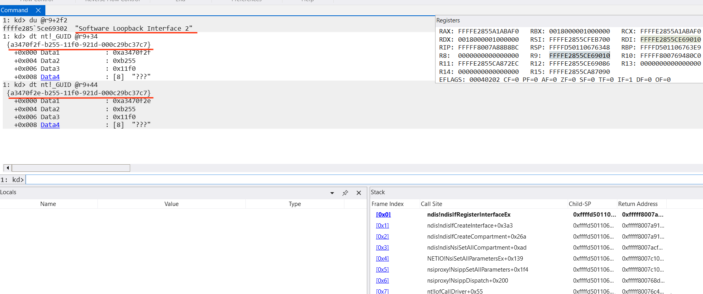
</a>
</p>
<div class="emphasizer_img_text">[ "Software Loopback Interface 2" ]</div> 

Call stack for <span class="emphasizer_code_function_2">compartment</span> creation from <span class="emphasizer_code_function_2">Windbg</span>:  
```c
kd> k  
fffff987`d3cc2dff fffff800`6c96a460   ndis!ndisIfRegisterInterfaceEx  
fffff987`d3cc2dff fffff800`6c915447   ndis!ndisIfCreateInterface  
fffff987`d3cc2d98 fffff800`6c915246   ndis!ndisIfCreateNetworkBlock  
fffff987`d3cc2da0 fffff800`6ccf41b9   ndis!ndisNsiSetAllNetworkInfo+0x356   
fffff987`d3cc3080 fffff800`6c987ad1   NETIO!NsiSetAllParametersEx+0x139  
fffff987`d3cc3160 fffff800`6c9128a5   ndis!ndisIfCreateNetwork+0xf9  
fffff987`d3cc3430 fffff800`6c91326d   ndis!ndisIfCreateCompartment+0x1ed  
fffff987`d3cc34b0 fffff800`6ccf41b9   ndis!ndisNsiSetAllCompartment+0xad  
fffff987`d3cc3500 fffff800`6fd91994   NETIO!NsiSetAllParametersEx+0x139  
fffff987`d3cc35e0 fffff800`6fd92860   nsiproxy!NsippSetAllParameters+0x1f4  
fffff987`d3cc37a0 fffff800`676d21c5   nsiproxy!NsippDispatch+0x200  
fffff987`d3cc37f0 fffff800`67a4c801   nt!IofCallDriver+0x55  
fffff987`d3cc3830 fffff800`67a4c43a   nt!IopSynchronousServiceTail+0x361  
fffff987`d3cc38d0 fffff800`67a4b716   nt!IopXxxControlFile+0xd0a  
fffff987`d3cc3a20 fffff800`67811508   nt!NtDeviceIoControlFile+0x56  
fffff987`d3cc3a90 00007ffd`abe2d5d4   nt!KiSystemServiceCopyEnd+0x28  
0000006d`e439e688 00007ffd`ab3d216a   ntdll!NtDeviceIoControlFile+0x14  
0000006d`e439e690 00000000`00000000   0x00007ffd`ab3d216a
```


So, during <span class="emphasizer_code_function_2">compartment</span> creation following objects are set up:

- <span class="emphasizer_code_function_2">_NDIS_IF_COMPARTMENT_BLOCK</span>;  
- <span class="emphasizer_code_function_2">_NDIS_IF_NETWORK_BLOCK</span>, linked to <span class="emphasizer_code_function_2">_NDIS_IF_COMPARTMENT_BLOCK</span>;  
- <span class="emphasizer_code_function_2">_NDIS_IF_BLOCK</span> for <span class="emphasizer_code_function_2">Loopback Interface</span>, linked to <span class="emphasizer_code_function_2">_NDIS_IF_NETWORK_BLOCK</span>;

Obviously our <span class="emphasizer_code_function_2">compartment</span> is almost empty, it doesn’t contain any interfaces that point to the real or virtual adapters, only the <span class="emphasizer_code_function_2">loopback</span> interface. We should somehow add a working interface to our <span class="emphasizer_code_function_2">compartment</span>. But to add an interface firstly we should create it. 

How is it linked to a real  (or virtual) communication channel?   
Microsoft says that a miniport driver communicates with its <span class="emphasizer_code_function_2">NICs</span>  (network interface card) and with higher-level drivers through the <span class="emphasizer_code_function_2">NDIS</span> library. 

__[__ [https://learn.microsoft.com/en-us/windows-hardware/drivers/network/windows-network-architecture-and-the-osi](https://learn.microsoft.com/en-us/windows-hardware/drivers/network/windows-network-architecture-and-the-osi-model) __]__

So the underlying component for an <span class="emphasizer_code_function_2">interface</span> is <span class="emphasizer_code_function_2">miniport</span> (real or virtual). An <span class="emphasizer_code_function_2">interface</span> is linked to a <span class="emphasizer_code_function_2">miniport</span>.


<br>
## INTERFACE

According to Microsoft documentation a network <span class="emphasizer_code_function_2">interface</span> is the point where two pieces of network equipment or protocol layers connect. Network interfaces are defined by the Internet Engineering Task Force (IETF) in <span class="emphasizer_code_function_2">RFC 2863</span> (__[__ [RFC 2863](https://www.rfc-editor.org/rfc/rfc2863.txt) __]__). An <span class="emphasizer_code_function_2">interface</span> is just an abstraction for underlying components.


__[__ [https://learn.microsoft.com/en-us/windows/win32/network-interfaces](https://learn.microsoft.com/en-us/windows/win32/network-interfaces) __]__


In the <span class="emphasizer_code_function_2">ndis.sys</span> interface is presented as <span class="emphasizer_code_function_2">_NDIS_IF_BLOCK</span>:

```c
_NDIS_IF_BLOCK  
ifIndex         	: Uint4B  
ifDescr         	: _IF_COUNTED_STRING_LH  
ifType           	: Uint2B  
InterfaceGuid   	: _GUID  
CompartmentId   	: Uint4B  
Compartment     	: Ptr64 _NDIS_IF_COMPARTMENT_BLOCK  
NetLuid         	: _NET_LUID_LH  
NetworkGuid     	: _GUID  
NetworkLink     	: _LIST_ENTRY  
Network         	: Ptr64 _NDIS_IF_NETWORK_BLOCK  
MiniportAvailable 	: UChar  
Miniport         	: Ptr64 _NDIS_MINIPORT_BLOCK  
Filter           	: Ptr64 _NDIS_FILTER_BLOCK
```

<span class="emphasizer_code_function_2">_NDIS_IF_BLOCK</span> get created by the <span class="emphasizer_code_function_2">ndisIfCreateInterface</span> with help of the <span class="emphasizer_code_function_2">ndisIfRegisterInterfaceEx</span> function:

<p align="center">
<a href="../images/cntnw/image32.png" target="_blank">
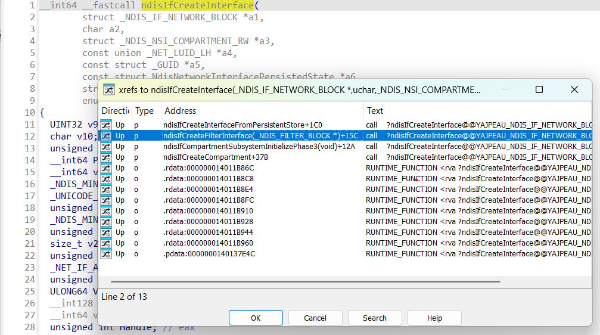
</a>
</p>
<div class="emphasizer_img_text">[ References to the ndisIfCreateInterface function ]</div>

			

<span class="emphasizer_code_function_2">ndisIfRegisterInterfaceEx</span> performs registration of the newly created <span class="emphasizer_code_function_2">_NDIS_IF_BLOCK</span> into the <span class="emphasizer_code_function_2">NDIS</span> stack:  

- allocates interface index (<span class="emphasizer_code_function_2">ndisIfAllocateIfIndex</span>);  
- links interface to the corresponding network (<span class="emphasizer_code_function_2">ndisIfFindNetworkBlock</span>);  
- link compartment to the interface (<span class="emphasizer_code_function_2">CompartmentId</span> and <span class="emphasizer_code_function_2">Compartment</span> fields);  
- notifies NSI clients (<span class="emphasizer_code_function_2">ndisNsiNotifyClientInterfaceChange</span>);

We have already analyzed <span class="emphasizer_code_function_2">ndisIfCreateCompartment</span> function, which actually creates only <span class="emphasizer_code_function_2">loopback</span> interface:

<p align="center">
<a href="../images/cntnw/image33.png" target="_blank">
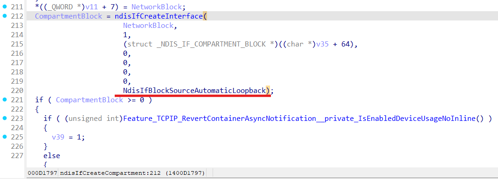
</a>
</p>
<div class="emphasizer_img_text">[ Loopback interface creation inside ndisIfCreateCompartment ]</div>

			

Interfaces for <span class="emphasizer_code_function_2">loopback</span> get also created during <span class="emphasizer_code_function_2">NDIS</span> initialization in <span class="emphasizer_code_function_2">ndisIfCompartmentSubsystemInitializePhase3</span> function:

<p align="center">
<a href="../images/cntnw/image34.png" target="_blank">

</a>
</p>
<div class="emphasizer_img_text">[ Loopback interface creation inside ndisIfCompartmentSubsystemInitializePhase3 ]</div>


Interface for lightweight filter (<span class="emphasizer_code_function_2">LWF</span> - __[__ [NDIS LWF](https://learn.microsoft.com/en-us/windows-hardware/drivers/network/ndis-filter-drivers) __]__) gets created in <span class="emphasizer_code_function_2">ndisIfCreateFilterInterface</span> function:

<p align="center">
<a href="../images/cntnw/image35.png" target="_blank">
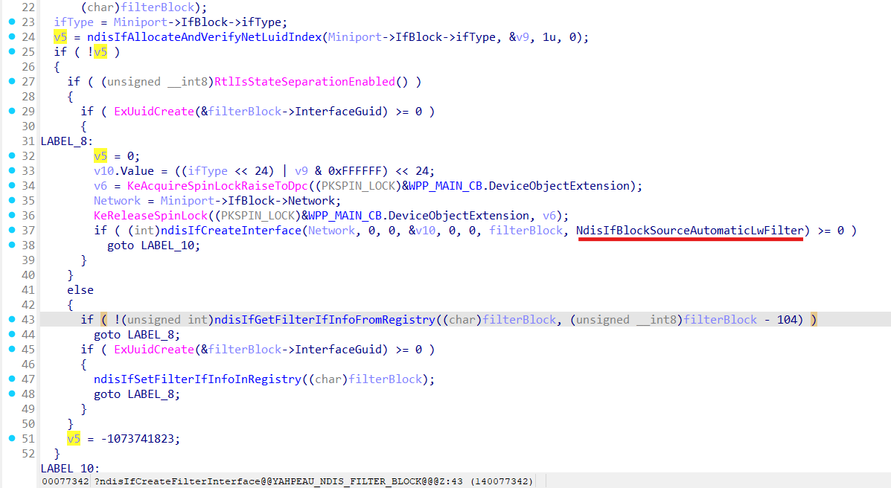
</a>
</p>
<div class="emphasizer_img_text">[ LWF interface creation inside ndisIfCreateFilterInterface ]</div>
 
		

Interface for usual network setup installation __[__ [network setup installation](https://learn.microsoft.com/en-us/previous-versions/windows/hardware/network/ff559080(v=vs.85)) __]__ gets created in <span class="emphasizer_code_function_2">ndisIfCreateInterfaceFromPersistentStore</span> function:


<p align="center">
<a href="../images/cntnw/image36.png" target="_blank">
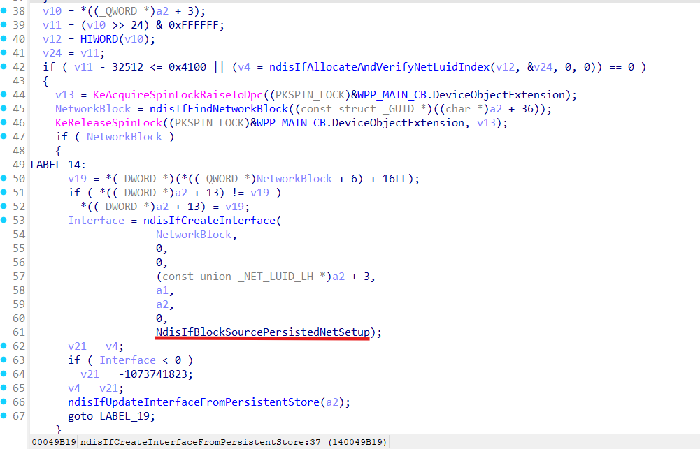
</a>
</p>
<div class="emphasizer_img_text">[ NetSetup interface creation inside ndisIfCreateInterfaceFromPersistentStore ]</div>


Interfaces created by third-party components just get registered via exported from the <span class="emphasizer_code_function_2">ndis.sys</span> <span class="emphasizer_code_function_2">NdisIfRegisterInterface</span> as:

<p align="center">
<a href="../images/cntnw/image37.png" target="_blank">
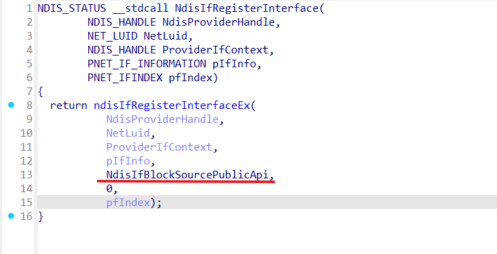
</a>
</p>
<div class="emphasizer_img_text">[ Exported NdisIfRegisterInterface function for third-party components ]</div>


For instance <span class="emphasizer_code_function_2">wfplwfs.sys</span> (<span class="emphasizer_code_function_2">WFP</span> <span class="emphasizer_code_function_2">NDIS</span> <span class="emphasizer_code_function_2">LWF</span> Driver implementing <span class="emphasizer_code_function_2">WFP</span> subsystem) use <span class="emphasizer_code_function_2">NdisIfRegisterInterface</span> inside <span class="emphasizer_code_function_2">vSwitchFlpCreateAdapter</span> function:

<p align="center">
<a href="../images/cntnw/image38.png" target="_blank">
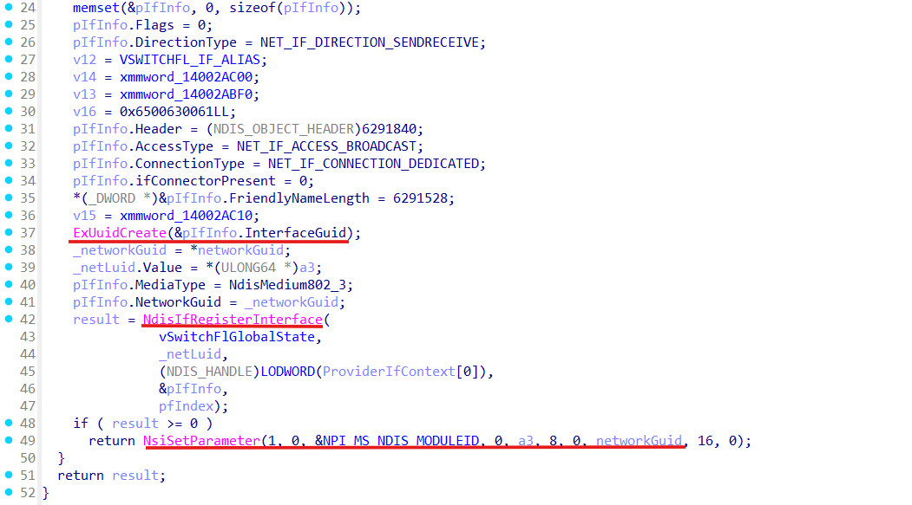
</a>
</p>
<div class="emphasizer_img_text">[ Call to NdisIfRegisterInterface in wfplwfs.sys ]</div>


The remaining part here is to find the place where the <span class="emphasizer_code_function_2">interface</span> gets attached to a <span class="emphasizer_code_function_2">miniport</span>.

<br>
## MINIPORT

According to Microsoft documentation a <span class="emphasizer_code_function_2">miniport</span> driver communicates with its <span class="emphasizer_code_function_2">NICs</span> and with higher-level drivers through the <span class="emphasizer_code_function_2">NDIS</span> library. The <span class="emphasizer_code_function_2">NDIS</span> library exports a full set of functions (<span class="emphasizer_code_function_2">NdisMXxx</span> and other <span class="emphasizer_code_function_2">NdisXxx</span> functions) that encapsulate all of the operating system functions that a <span class="emphasizer_code_function_2">miniport</span> driver must call. 

An <span class="emphasizer_code_function_2">NDIS</span> <span class="emphasizer_code_function_2">miniport</span> driver has two basic functions:

- Managing a network interface card, including sending and receiving data through this interface;
- Interfacing with higher-level drivers, such as filter drivers, intermediate drivers, and protocol drivers;

In <span class="emphasizer_code_function_2">ndis.sys</span> <span class="emphasizer_code_function_2">miniport</span> is presented as <span class="emphasizer_code_function_2">_NDIS_MINIPORT_BLOCK</span>:

```c
_NDIS_MINIPORT_BLOCK  
InterfaceGuid    	: _GUID  
NetLuid          	: _NET_LUID_LH  
IfBlockAvailable 	: UChar  
IfBlock          	: Ptr64 _NDIS_IF_BLOCK  
IfIndex         	: Uint4B
```


<span class="emphasizer_code_function_2">Miniport</span> is created in the <span class="emphasizer_code_function_2">ndisAddDevice</span> function:


<p align="center">
<a href="../images/cntnw/image39.png" target="_blank">
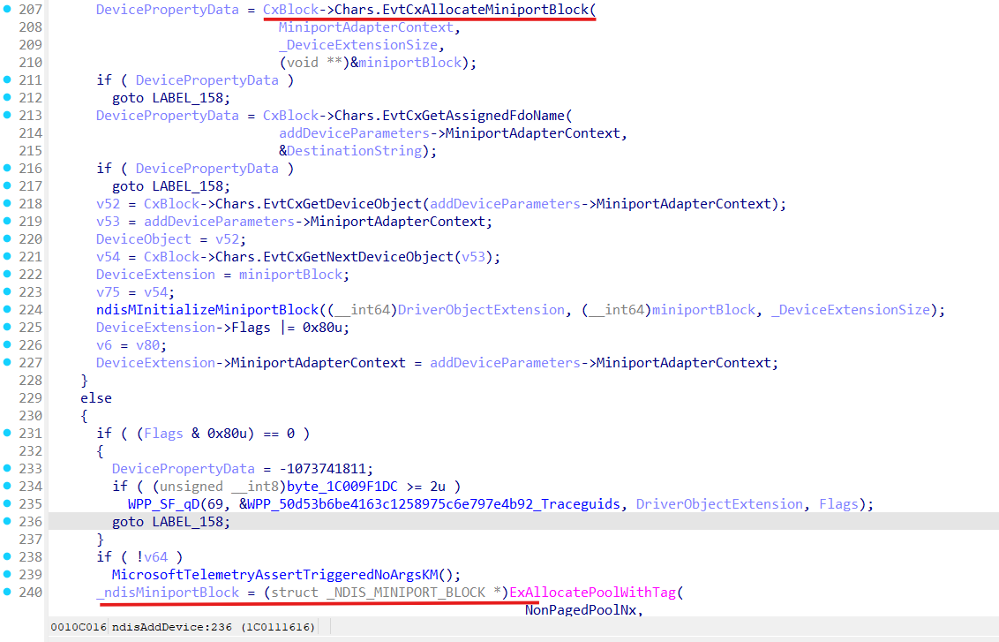
</a>
</p>
<div class="emphasizer_img_text">[ Miniport creation in the ndisAddDevice function ]</div>


<span class="emphasizer_code_function_2">ndisAddDevice</span> gets invoked from the two places, <span class="emphasizer_code_function_2">ndisPnPAddDevice</span> and <span class="emphasizer_code_function_2">ndisLWMCreateMiniport</span> functions. 

<span class="emphasizer_code_function_2">ndisLWMCreateMiniport</span> is used by <span class="emphasizer_code_function_2">NetAdapterCx</span> (__[__ [netcx](https://learn.microsoft.com/en-us/windows-hardware/drivers/netcx) __]__), <span class="emphasizer_code_function_2">ndisPnPAddDevice</span> gets invoked during devices (real or virtual) detection by <span class="emphasizer_code_function_2">PnP</span> manager (__[__ [state-transitions-for-pnp-devices](https://learn.microsoft.com/en-us/windows-hardware/drivers/kernel/state-transitions-for-pnp-devices) __]__).

Let’s analyze <span class="emphasizer_code_function_2">ndisAddDevice</span> function:

<p align="center">
<a href="../images/cntnw/image40.png" target="_blank">
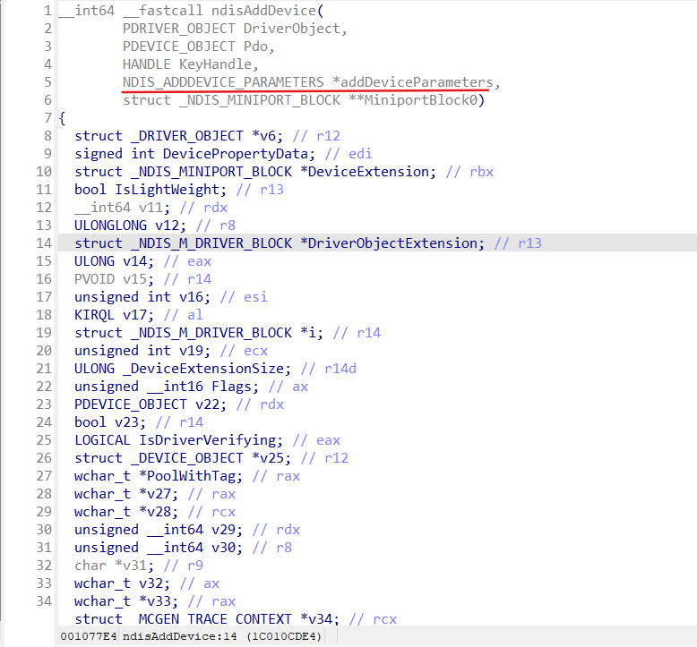
</a>
</p>
<div class="emphasizer_img_text">[ ndisAddDevice function ]</div>


<span class="emphasizer_code_function_2">NDIS_ADDDEVICE_PARAMETERS</span> is filled in the <span class="emphasizer_code_function_2">ndisPnPAddDevice</span> function before invoking <span class="emphasizer_code_function_2">ndisAddDevice</span>: 

```c
NDIS_ADDDEVICE_PARAMETERS  
InterfaceGuid		: _GUID  
NetLuid         	: _NET_LUID_LH  
HideInUi         	: Bool  
MiniBlock        	: Ptr64 _NDIS_M_DRIVER_BLOCK
```


<span class="emphasizer_code_function_2">ndisPnPAddDevice</span> reads information about the <span class="emphasizer_code_function_2">interface</span> from the registry key <span class="emphasizer_code_function_2">HKLM\SYSTEM\CurrentControlSet \Control\Class\{4d36e972-e325-11ce-bfc1-08002be10318}\{devId}</span> and also <span class="emphasizer_code_function_2">interface</span> guid (<span class="emphasizer_code_function_2">HKLM\SYSTEM\CurrentControlSet\Control\Class\{4d36e972-e325-11ce-bfc1-08002be10318}\{devId}\NetCfgInstanceId</span>), this information gets into registry during network component installation.

<span class="emphasizer_code_function_2">ndisAddDevice</span> basing on the provided <span class="emphasizer_code_function_2">NDIS_ADDDEVICE_PARAMETERS</span> finds corresponding <span class="emphasizer_code_function_2">interface</span> in the <span class="emphasizer_code_function_2">ndisIfList</span> (<span class="emphasizer_code_function_2">ndisIfFindInterfaceByInterfaceGuid</span>), and updates this interface with help of <span class="emphasizer_code_function_2">ndisIfUpdateInterfaceOnAddDevice</span>:

<p align="center">
<a href="../images/cntnw/image41.png" target="_blank">
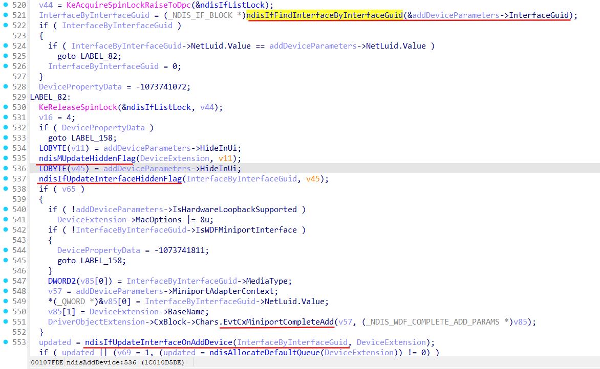
</a>
</p>
<div class="emphasizer_img_text">[ ndisAddDevice function ]</div>


<span class="emphasizer_code_function_2">ndisIfUpdateInterfaceOnAddDevice</span> function:
- links <span class="emphasizer_code_function_2">miniport</span> (the <span class="emphasizer_code_function_2">MiniBlock</span> field of the provided <span class="emphasizer_code_function_2">NDIS_ADDDEVICE_PARAMETERS</span>)  to <span class="emphasizer_code_function_2">interface</span> and <span class="emphasizer_code_function_2">interface</span> to <span class="emphasizer_code_function_2">miniport</span>;
- sets <span class="emphasizer_code_function_2">IfBlockAvailable</span> field of the <span class="emphasizer_code_function_2">_NDIS_MINIPORT_BLOCK</span> and <span class="emphasizer_code_function_2">MiniportAvailable</span> field of the <span class="emphasizer_code_function_2">_NDIS_IF_BLOCK</span>;
- update <span class="emphasizer_code_function_2">NSI</span> database if it is needed (<span class="emphasizer_code_function_2">ndisIfUpdatePersistedInterfaceInfo</span>):

<p align="center">
<a href="../images/cntnw/image42.png" target="_blank">
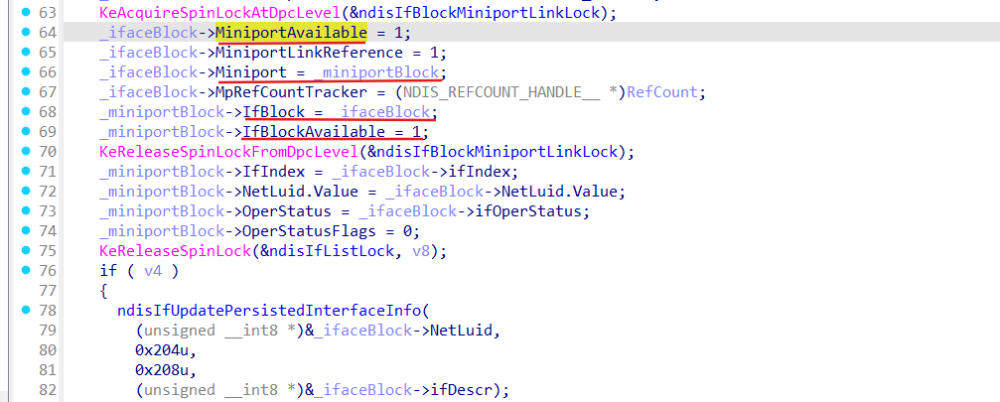
</a>
</p>
<div class="emphasizer_img_text">[ ndisIfUpdateInterfaceOnAddDevice function ]</div>


There is also <span class="emphasizer_code_function_2">ndisPnpRefresh</span> function, but it is not invoked by <span class="emphasizer_code_function_2">PnP</span> manager, it gets triggered by other network components, directly via <span class="emphasizer_code_function_2">IOCTL</span> (code <span class="emphasizer_code_function_2">0x1700CC</span>) to the <span class="emphasizer_code_function_2">“Device\\Ndis”</span>.

<span class="emphasizer_code_function_2">ndisPnpRefresh</span> triggers <span class="emphasizer_code_function_2">ndisIfCreateOrUpdateInterface</span> function:

<p align="center">
<a href="../images/cntnw/image43.png" target="_blank">
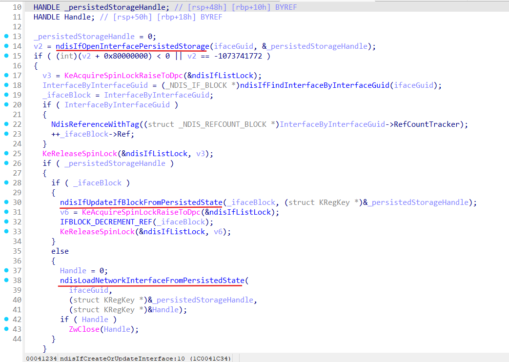
</a>
</p>
<div class="emphasizer_img_text">[ ndisIfCreateOrUpdateInterface function ]</div>


So, it is pretty clear what <span class="emphasizer_code_function_2">ndisIfCreateOrUpdateInterface</span> does, it opens interface persisted storage, retrieves persisted state objects for some interface by its guid, and based on this information creates (<span class="emphasizer_code_function_2">ndisLoadNetworkInterfaceFromPersistedState</span>) or updates (<span class="emphasizer_code_function_2">ndisIfUpdateIfBlockFromPersistedState</span>)  specified interface.

Let’s see what <span class="emphasizer_code_function_2">ndisLoadNetworkInterfaceFromPersistedState</span> does:


<p align="center">
<a href="../images/cntnw/image44.png" target="_blank">
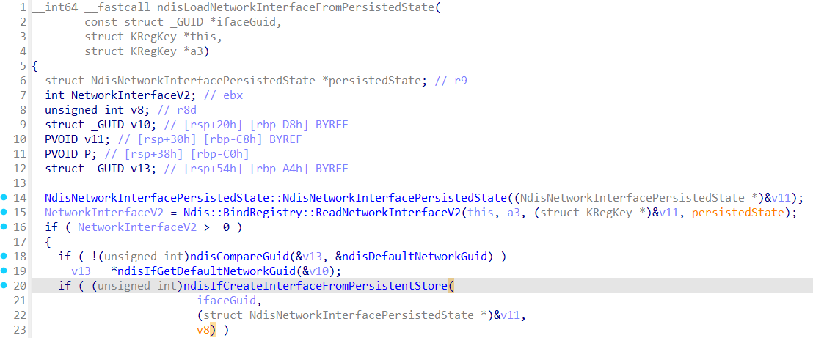
</a>
</p>
<div class="emphasizer_img_text">[ ndisLoadNetworkInterfaceFromPersistedState function ]</div>


<span class="emphasizer_code_function_2">ndisLoadNetworkInterfaceFromPersistedState</span> create interface from the persisted state with help of the <span class="emphasizer_code_function_2">ndisIfCreateInterfaceFromPersistentStore</span> (_we already know about this function_):


<p align="center">
<a href="../images/cntnw/image45.png" target="_blank">
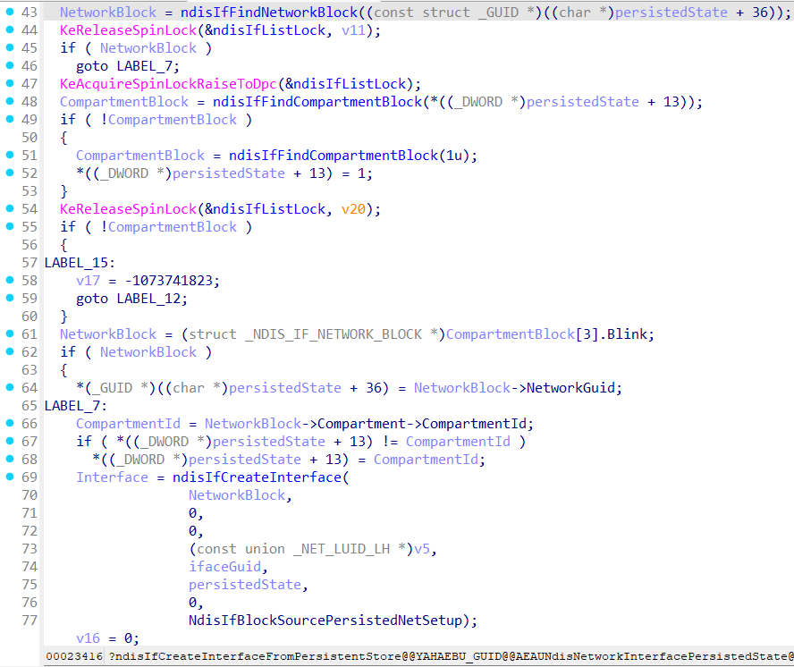
</a>
</p>
<div class="emphasizer_img_text">[ ndisIfCreateInterfaceFromPersistentStore function ]</div>


<span class="emphasizer_code_function_2">ndisIfCreateInterfaceFromPersistentStore</span> flow:  

<p align="center">
<a href="../images/cntnw/image46.png" target="_blank">
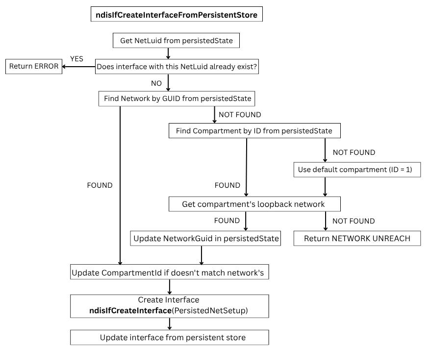
</a>
</p>
<div class="emphasizer_img_text">[ ndisIfCreateInterfaceFromPersistentStore flow ]</div>


From the flow above we can see that the <span class="emphasizer_code_function_2">interface</span> will go to the _default_ <span class="emphasizer_code_function_2">compartment</span>  (with <span class="emphasizer_code_function_2">ID = 1</span>) if there is no specified <span class="emphasizer_code_function_2">network</span> or <span class="emphasizer_code_function_2">compartment</span> for it!

Let’s see what <span class="emphasizer_code_function_2">ndisIfUpdateIfBlockFromPersistedState</span> does:

<p align="center">
<a href="../images/cntnw/image47.png" target="_blank">
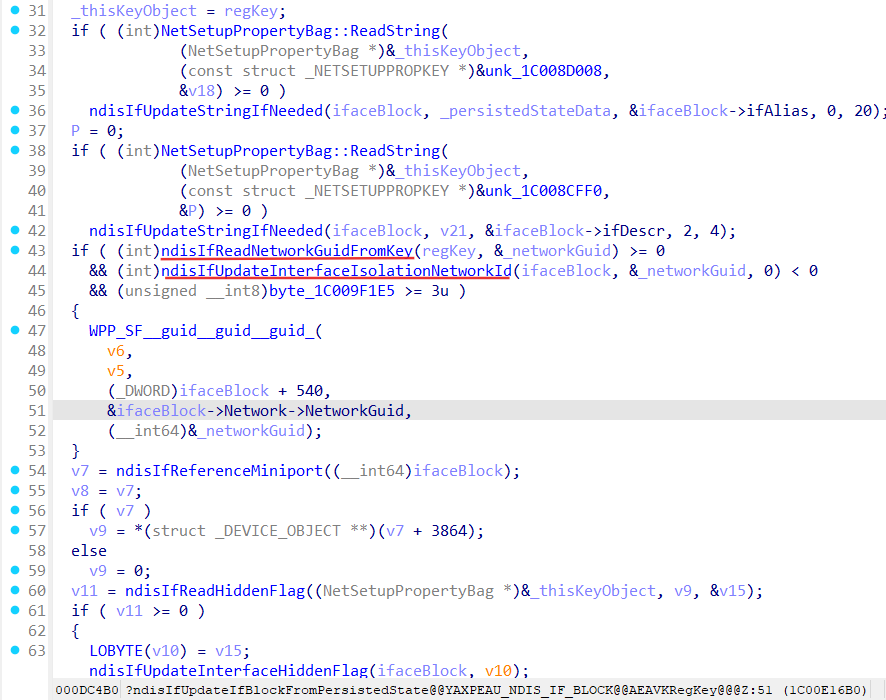
</a>
</p>
<div class="emphasizer_img_text">[ ndisIfUpdateIfBlockFromPersistedState function ]</div>
 

<span class="emphasizer_code_function_2">ndisIfReadNetworkGuidFromKey</span> function:  

<p align="center">
<a href="../images/cntnw/image48.png" target="_blank">
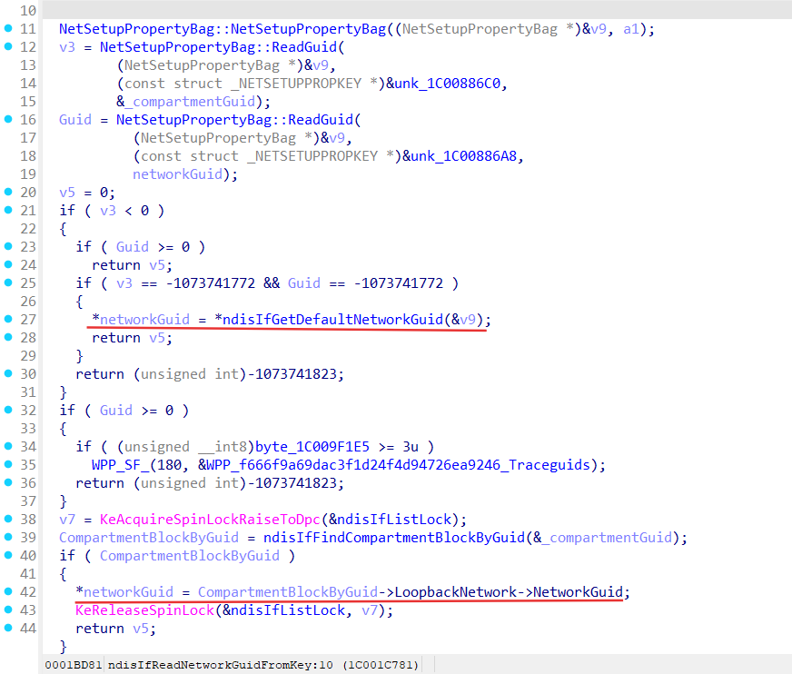
</a>
</p>
<div class="emphasizer_img_text">[ ndisIfReadNetworkGuidFromKey function ]</div>
  

Here we can see if <span class="emphasizer_code_function_2">ndisIfReadNetworkGuidFromKey</span> can’t find <span class="emphasizer_code_function_2">compartment</span> guid from the persisted state object as well as <span class="emphasizer_code_function_2">network</span> guid it returns _default_ <span class="emphasizer_code_function_2">network</span> guid (_default_ <span class="emphasizer_code_function_2">network</span> belongs to _default_ <span class="emphasizer_code_function_2">compartment</span>) for the updated <span class="emphasizer_code_function_2">interface</span>. 

So every <span class="emphasizer_code_function_2">interface</span> will go to the _default_ <span class="emphasizer_code_function_2">compartment</span> if there is no specified <span class="emphasizer_code_function_2">network</span> or <span class="emphasizer_code_function_2">compartment</span> for it!


<p align="center">
<a href="../images/cntnw/image61.png" target="_blank">
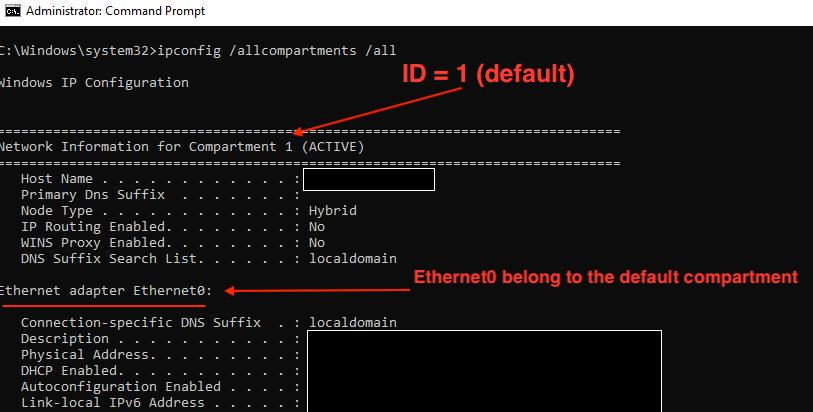
</a>
</p>
<div class="emphasizer_img_text">[ Defult compartment (ID = 1) ]</div>


After that <span class="emphasizer_code_function_2">ndisIfUpdateIfBlockFromPersistedState</span> tries to invoke <span class="emphasizer_code_function_2">ndisIfUpdateInterfaceIsolationNetworkId<span>: 

<p align="center">
<a href="../images/cntnw/image49.png" target="_blank">
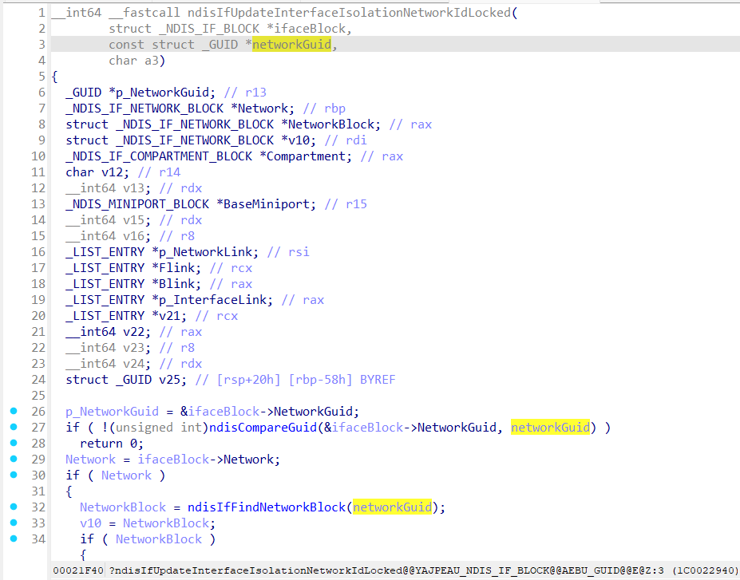
</a>
</p>
<div class="emphasizer_img_text">[ ndisIfUpdateInterfaceIsolationNetworkIdLocked function ]</div>
  


This function actually changes which <span class="emphasizer_code_function_2">network</span> (by provided <span class="emphasizer_code_function_2">GUID</span>) an <span class="emphasizer_code_function_2">interface</span> belongs to, if it is needed!

<span class="emphasizer_code_function_2">ndisIfUpdateInterfaceIsolationNetworkIdLocked</span> is also used in the <span class="emphasizer_code_function_2">ndisNsiChangeInterfaceInfo</span> triggered by the <span class="emphasizer_code_function_2">ndisNsiSetInterfaceInformation</span> function.

Now everything is linked, <span class="emphasizer_code_function_2">miniport</span> <span style="color: #fe7e61;"><-></span> <span class="emphasizer_code_function_2">interface</span> <span style="color: #fe7e61;"><-></span> <span class="emphasizer_code_function_2">network</span> <span style="color: #fe7e61;"><-></span> <span class="emphasizer_code_function_2">compartment</span>!

Let’s summarise:   
```c
COMPARTMENT  
 ├─ NETWORK (NDIS_IF_NETWORK_BLOCK)  
 │    ├─ INTERFACE(S) (NDIS_IF_BLOCK)  
 │    │    └─ MINIPORT (NDIS_MINIPORT_BLOCK)  
 │    │         └─ ADAPTER / DRIVER  
 │    └─ LoopbackIf (mandatory)  
 └─ Other networks
```

- we created <span class="emphasizer_code_function_2">compartment</span> with <span class="emphasizer_code_function_2">network</span> and <span class="emphasizer_code_function_2">loopback</span> interface, linked it together (<span class="emphasizer_code_function_2">CreateCompartmen</span> -> <span class="emphasizer_code_function_2">ndisIfCreateCompartment</span>);  
- newly created <span class="emphasizer_code_function_2">compartment</span> contains only <span class="emphasizer_code_function_2">interface</span> for <span class="emphasizer_code_function_2">Loopback</span>;  
- all <span class="emphasizer_code_function_2">interfaces</span> created during network components discovering are automatically attached to the _default_ <span class="emphasizer_code_function_2">compartment</span> (<span class="emphasizer_code_function_2">ndisIfFindCompartmentBlock(1)</span>);  
- <span class="emphasizer_code_function_2">interface</span> can be attached to another <span class="emphasizer_code_function_2">compartment</span> using <span class="emphasizer_code_function_2">ndisIfUpdateInterfaceIsolationNetworkId</span>;  


<br>
## NET SETUP


All information about created <span class="emphasizer_code_function_2">interfaces</span>, <span class="emphasizer_code_function_2">networks</span>, <span class="emphasizer_code_function_2">compartments</span> and <span class="emphasizer_code_function_2">binding</span> between them is stored in the <span class="emphasizer_code_function_2">\Registry\Machine\System\CurrentControlSet\Control\NetworkSetup2</span>:

<p align="center">
<a href="../images/cntnw/image50.png" target="_blank">
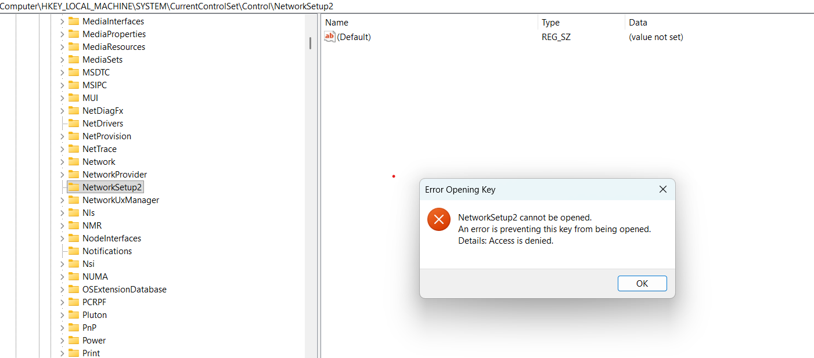
</a>
</p>
<div class="emphasizer_img_text">[ Access denied to the NetworkSetup2 ]</div>


But we can run <span class="emphasizer_code_function_2">regedit.exe</span> via __[__ [RunAsTI64.exe](https://github.com/jschicht/RunAsTI/blob/master/RunAsTI64.exe) __]__:

<p align="center">
<a href="../images/cntnw/image51.png" target="_blank">
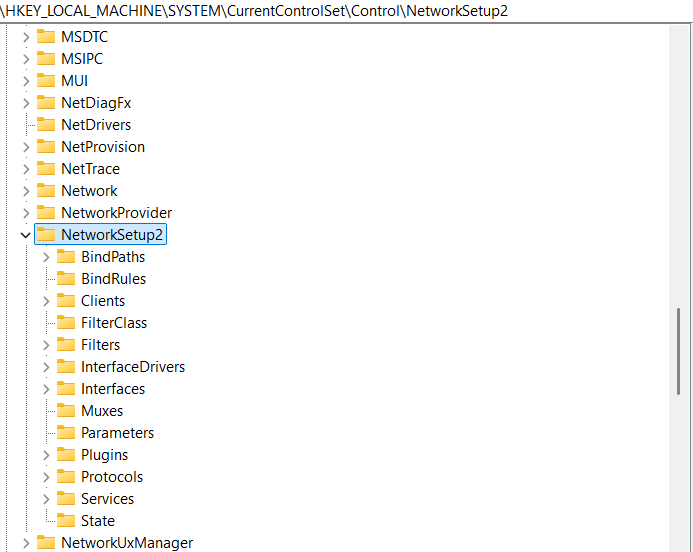
</a>
</p>
<div class="emphasizer_img_text">[ View of the NetworkSetup2 ]</div>
<br>
<hr class="line_1">
<p align="center">
<a href="../images/cntnw/image52.png" target="_blank">
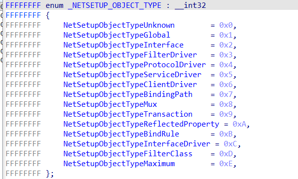
</a>
</p>
<div class="emphasizer_img_text">[ NetSetup objects types ]</div>


Path to the <span class="emphasizer_code_function_2">NetworkSetup2</span> registry is constructed by <span class="emphasizer_code_function_2">netsetupBuildObjectPath</span> from the <span class="emphasizer_code_function_2">ndis.sys</span>:

<p align="center">
<a href="../images/cntnw/image53.png" target="_blank">
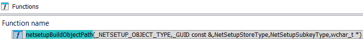
</a>
</p>
<div class="emphasizer_img_text">[ netsetupBuildObjectPath function signature ]</div>
<br>
<hr class="line_1">
<p align="center">
<a href="../images/cntnw/image54.png" target="_blank">

</a>
</p>
<div class="emphasizer_img_text">[ NetSetup subkeys types ]</div>
<br>
<hr class="line_1">
<p align="center">
<a href="../images/cntnw/image55.png" target="_blank">
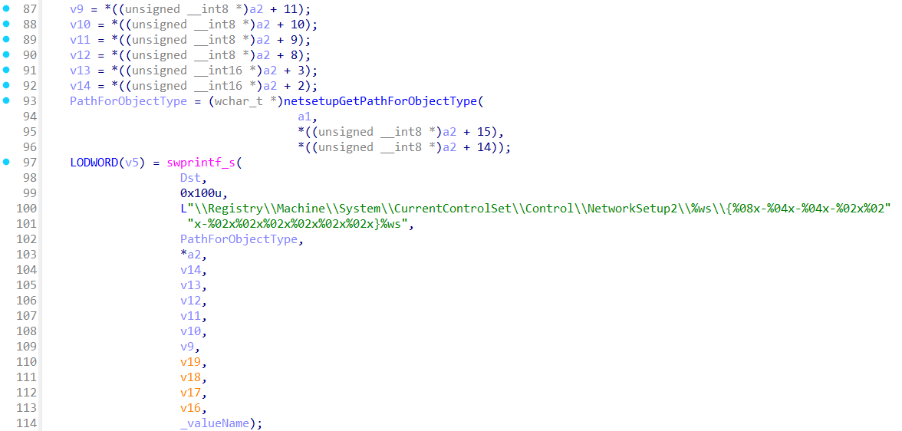
</a>
</p>
<div class="emphasizer_img_text">[ netsetupBuildObjectPath registry path creation ]</div>
<br>
<hr class="line_1">
<p align="center">
<a href="../images/cntnw/image56.png" target="_blank">
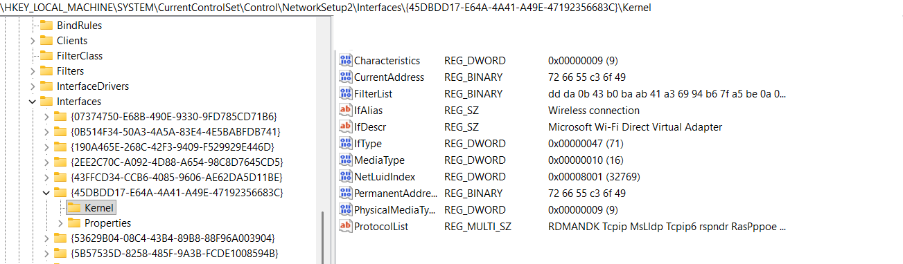
</a>
</p>
<div class="emphasizer_img_text">[ Path in the Network2 registry ]</div>


		
This registry location is used during interfaces creation (<span class="emphasizer_code_function_2">NdisIfBlockSourcePersistedNetSetup</span>).
In user mode <span class="emphasizer_code_function_2">NetSetup</span> is implemented by <span class="emphasizer_code_function_2">NetSetupApi.dll</span>, <span class="emphasizer_code_function_2">NetMgmtIF.dll</span> and <span class="emphasizer_code_function_2">netcfgx.dll</span>, <span class="emphasizer_code_function_2">setupapi.dll</span>.
When the new network component is going to be installed (for instance from the <span class="emphasizer_code_function_2">INF</span> file) <span class="emphasizer_code_function_2">NetSetup</span> does this work.

<span class="emphasizer_code_function_2">NetMgmtIF.dll</span> is aware about compartments:


<p align="center">
<a href="../images/cntnw/image57.png" target="_blank">
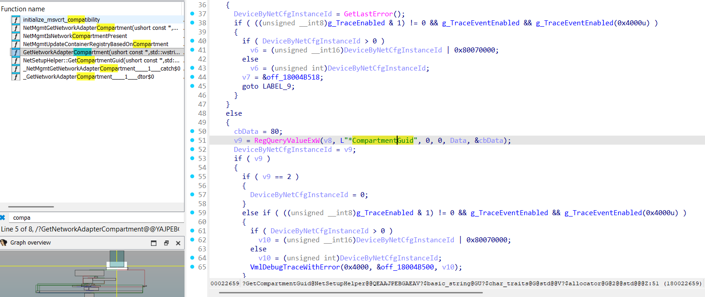
</a>
</p>
<div class="emphasizer_img_text">[ NetMgmtIF.dll compartment-related functions ]</div>


## MOVE INTERFACE TO THE COMPARTMENT


Time to move some actual <span class="emphasizer_code_function_2">interface</span> to our <span class="emphasizer_code_function_2">compartment</span>!  
To experiment with moving interfaces to the <span class="emphasizer_code_function_2">compartments</span> additional <span class="emphasizer_code_function_2">adapter [-> interface]</span> (perfectly with internet access) should be added to a tested system. <br>
As we already know <span class="emphasizer_code_function_2">interface</span> can be moved to another <span class="emphasizer_code_function_2">compartment</span> using <span class="emphasizer_code_function_2">ndisIfUpdateInterfaceIsolationNetworkId</span> function:

<p align="center">
<a href="../images/cntnw/image58.png" target="_blank">
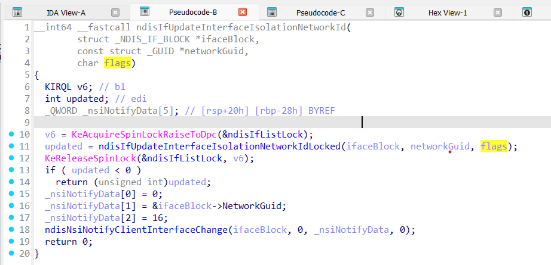
</a>
</p>
<div class="emphasizer_img_text">[ ndisIfUpdateInterfaceIsolationNetworkId functions ]</div>


Signature for <span class="emphasizer_code_function_2">ndisIfUpdateInterfaceIsolationNetworkId</span>:

```c
__int64 __fastcall ndisIfUpdateInterfaceIsolationNetworkId  
(  
        struct _NDIS_IF_BLOCK *ifaceBlock,  
        const struct _GUID *networkGuid,  
        char flags  
);
```

<span class="emphasizer_code_function_2">ifaceBlock</span> - <span class="emphasizer_code_function_2">interface</span> that is going to be moved to another <span class="emphasizer_code_function_2">compartment</span>;  
<span class="emphasizer_code_function_2">networkGuid</span> - guid of the <span class="emphasizer_code_function_2">network</span> that belongs to the another <span class="emphasizer_code_function_2">compartment</span>;

How to get <span class="emphasizer_code_function_2">networkGuid</span> and <span class="emphasizer_code_function_2">ifaceBlock</span>?  
There is some kind of the _‘helper’_ function <span class="emphasizer_code_function_2">NdisMSetInterfaceCompartment</span>:

<p align="center">
<a href="../images/cntnw/image59.png" target="_blank">
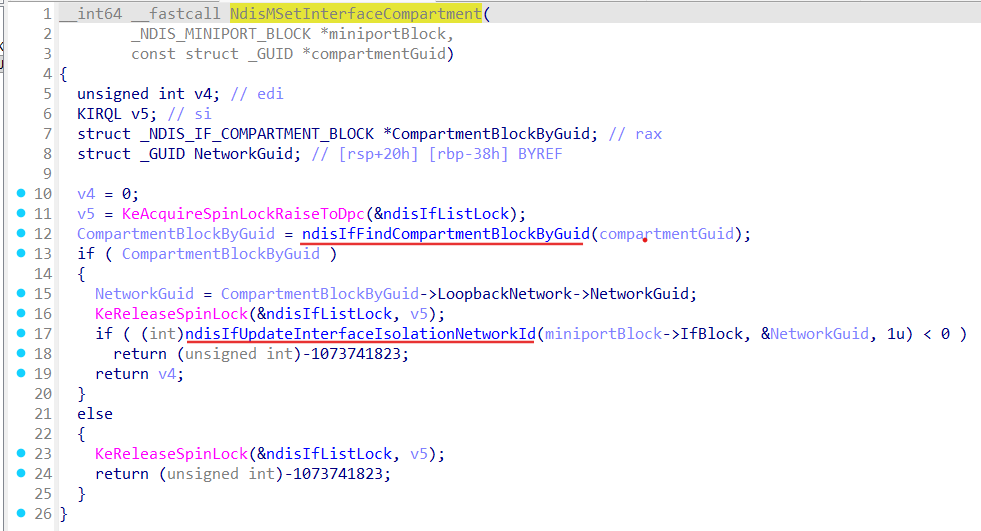
</a>
</p>
<div class="emphasizer_img_text">[ NdisMSetInterfaceCompartment function ]</div>


Signature for <span class="emphasizer_code_function_2">NdisMSetInterfaceCompartment</span>:

```c
__int64 __fastcall NdisMSetInterfaceCompartment  
(  
        _NDIS_MINIPORT_BLOCK *miniportBlock,  
        const struct _GUID *compartmentGuid  
);  
```

  
<span class="emphasizer_code_function_2">miniportBlock</span> - <span class="emphasizer_code_function_2">miniport</span> that has attached <span class="emphasizer_code_function_2">interface</span> which is going to be moved;  
<span class="emphasizer_code_function_2">compartmentGuid</span> - guid of the <span class="emphasizer_code_function_2">compartment</span> we want to move <span class="emphasizer_code_function_2">interface</span> to;

Obviously we have to somehow get required <span class="emphasizer_code_function_2">_NDIS_MINIPORT_BLOCK</span>.

One of the ways to obtain <span class="emphasizer_code_function_2">_NDIS_MINIPORT_BLOCK</span> is to create a <span class="emphasizer_code_function_2">NDIS</span> lightweight filter and in the <span class="emphasizer_code_function_2">FILTER_ATTACH_HANDLER</span> reach <span class="emphasizer_code_function_2">_NDIS_MINIPORT_BLOCK</span>.

__[__ [ndis-filter-attach](https://learn.microsoft.com/en-us/windows-hardware/drivers/ddi/ndis/nc-ndis-filter_attach) __]__ : 

```c
NDIS_STATUS  
FilterAttach(  
    IN  NDIS_HANDLE                     NdisFilterHandle,  
    IN  NDIS_HANDLE                     FilterDriverContext,  
    IN  PNDIS_FILTER_ATTACH_PARAMETERS  AttachParameters  
    );
```


<span class="emphasizer_code_function_2">Ndis.sys</span> will call our <span class="emphasizer_code_function_2">FILTER_ATTACH_HANDLER</span> in the <span class="emphasizer_code_function_2">ndisFInvokeAttach</span> function:


<p align="center">
<a href="../images/cntnw/image60.png" target="_blank">
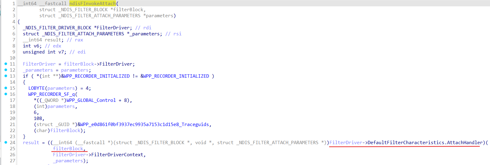
</a>
</p>
<div class="emphasizer_img_text">[ ndisFInvokeAttach function ]</div>
 

Where <span class="emphasizer_code_function_2">NdisFilterHandle</span> in the <span class="emphasizer_code_function_2">FilterAttach</span> handler is <span class="emphasizer_code_function_2">_NDIS_FILTER_BLOCK</span>:


```c
_NDIS_FILTER_BLOCK  
Header                : _NDIS_OBJECT_HEADER  
NextFilter            : Ptr64 _NDIS_FILTER_BLOCK  
FilterDriver          : Ptr64 _NDIS_FILTER_DRIVER_BLOCK  
FilterModuleContext   : Ptr64 Void  
Miniport              : Ptr64 _NDIS_MINIPORT_BLOCK
```


Field <span class="emphasizer_code_function_2">Miniport</span> of the <span class="emphasizer_code_function_2">_NDIS_FILTER_BLOCK</span>: is what we need!

Pass _<span class="emphasizer_code_function_2">NDIS_FILTER_BLOCK.Miniport</span> to the <span class="emphasizer_code_function_2">NdisMSetInterfaceCompartment</span> along with our own created compartment guid and <span class="emphasizer_code_function_2">Miniport</span> which belonged to its <span class="emphasizer_code_function_2">interface</span> will be moved and appear in our <span class="emphasizer_code_function_2">compartment</span>! In this way we can move almost any <span class="emphasizer_code_function_2">adapter-interface</span> to an any <span class="emphasizer_code_function_2">compartment</span>!

<p align="center">
<a href="../images/cntnw/image62.png" target="_blank">
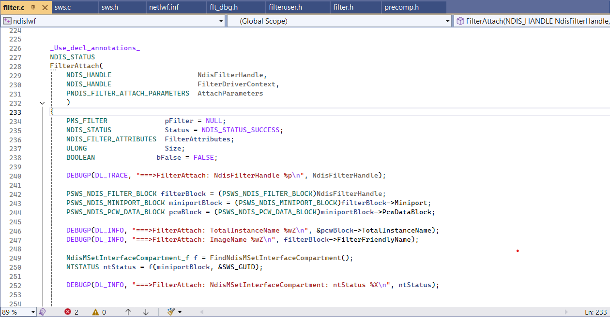
</a>
</p>
<div class="emphasizer_img_text">[ Modified Microsoft LWF example ]</div>

To route traffic through our <span class="emphasizer_code_function_2">compartment</span> we can use <span class="emphasizer_code_function_2">SetCurrentThreadCompartmentId</span> for user mode code, and <span class="emphasizer_code_function_2">NdisSetThreadObjectCompartmentId</span> for kernel mode code. We should invoke these functions at the very beginning before using any network functions (<span class="emphasizer_code_function_2">connect</span>, <span class="emphasizer_code_function_2">send</span>, <span class="emphasizer_code_function_2">recv</span>).
<br>
