## INTRO


In the previous article ([windows-containers-network-isolation](https://safesws.github.io/windows-containers-network-isolation/)) we discovered that networking isolation for Windows containers is implemented with help of the <span class="emphasizer_code_function_2">compartments</span> (low-level mechanism for the network <span class="emphasizer_code_function_2">namespaces</span>).<br><br>
We also found out that there is a _default_ <span class="emphasizer_code_function_2">compartment</span> (<span class="emphasizer_code_function_2">ID = 1</span>) presented in the system, and by _default_ every _network interface_ goes to this <span class="emphasizer_code_function_2">compartment</span>. 
Also we found out the way to create our own <span class="emphasizer_code_function_2">compartment</span> and move some _network interface_ to this <span class="emphasizer_code_function_2">compartment</span> so it gets isolated in the Windows network stack. <br>
Something almost identical happens when we create a new Windows <span class="emphasizer_code_function_2">container</span> - it gets its own network stack _isolated_ within the <span class="emphasizer_code_function_2">compartment</span>. <br> <br>
But if in our case we have been moving a _network interface_ that represents real <span class="emphasizer_code_function_2">NIC</span> with access to the _internet_, what is a case for a <span class="emphasizer_code_function_2">container</span>? How does traffic from the <span class="emphasizer_code_function_2">container</span> reach the _internet_? <br>
Since a _container's network stack_ is isolated and can’t cross the boundaries of the <span class="emphasizer_code_function_2">compartment</span>, and doesn’t have real <span class="emphasizer_code_function_2">NIC</span>, how can we establish connection to the _internet_?
<br>
<br>
<br>
Let’s figure out:

- [NAT](#nat)
<br>
- [WINNAT.SYS](#winnat)


## NAT

Network Address Translation (<span class="emphasizer_code_function_2">NAT</span>) allows users to create a private, internal network which shares a _public IP address(es)_. <br>
When a new connection is established, the <span class="emphasizer_code_function_2">NAT</span> translates the _private (source) IP address_ assigned to your device to the shared _public IP address_ which is routable on the internet and creates a new entry in the <span class="emphasizer_code_function_2">NAT</span> _flow state table_. When a connection comes back into your network, the _public (destination) IP address_ is translated to the _private IP address_ based on the matching _flow state entry_. <br><br>
This same <span class="emphasizer_code_function_2">NAT</span> technology and concept can also work with _host networking_ using _virtual machine_ and _container endpoints_ running on a single host. _IP addresses_ from the <span class="emphasizer_code_function_2">NAT</span> internal subnet (prefix) can be assigned to _VMs, containers,_ or other services running on this host. <br>
Similar to how the <span class="emphasizer_code_function_2">NAT</span> translates the _source IP address_ of a device, NAT can also translate the _source IP address_ of a _VM_ or _container_ to the _IP address_ of a virtual network adapter (<span class="emphasizer_code_function_2">Host vNIC</span>) on the host
__[__ [windows-nat-winnat](https://techcommunity.microsoft.com/blog/virtualization/windows-nat-winnat----capabilities-and-limitations/382303) __]__. <br><br>
So, it looks like <span class="emphasizer_code_function_2">NAT</span> is involved into process that enables to go traffic from an <span class="emphasizer_code_function_2">container</span> to the _internet_. 
<br>
<p align="center">
<a href="../images/winnat/image0.png" target="_blank">
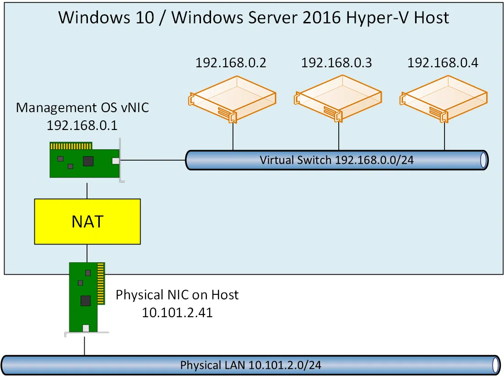
</a>
</p>
<div class="emphasizer_img_text">[ https://petri.com/create-nat-rules-hyper-v-nat-virtual-switch/ ]</div>
<br>
<span class="emphasizer_code_function_2">NAT</span> functionality on Windows can be accessed by <span class="emphasizer_code_function_2">NetNat</span> powershell cmdlets __[__ [powershell/module/netnat](https://learn.microsoft.com/en-us/powershell/module/netnat/?view=windowsserver2025-ps) __]__.

Let’s create our <span class="emphasizer_code_function_2">NAT</span> network using <span class="emphasizer_code_function_2">New-NetNat</span> cmdlet:
<br>
<p align="center">
<a href="../images/winnat/image1.png" target="_blank">
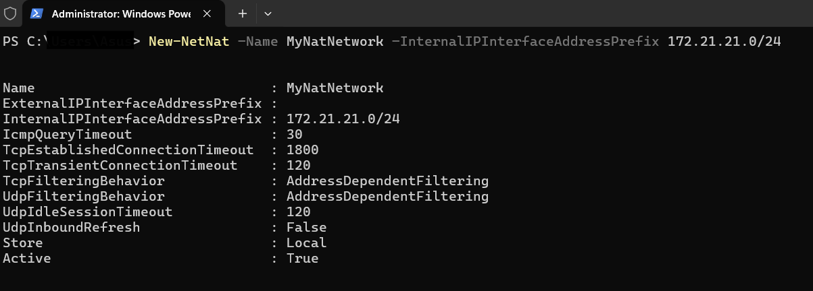
</a>
</p>
<div class="emphasizer_img_text">[ MyNatNetwork ]</div>

<span class="emphasizer_code_function_2">New-NetNat</span> cmdlet is implemented by <span class="emphasizer_code_function_2">NetNat.dll</span> in <span class="emphasizer_code_function_2">MSFT_NetNat_CreateInstance</span> function:
<br>
<p align="center">
<a href="../images/winnat/image2.png" target="_blank">
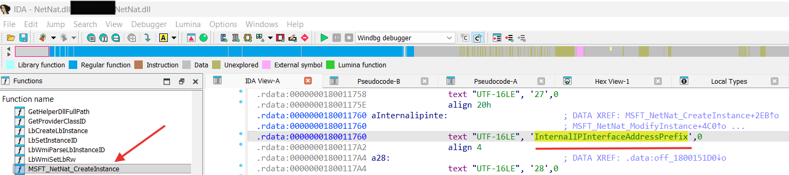
</a>
</p>
<div class="emphasizer_img_text">[ MSFT_NetNat_CreateInstance in NetNat.dll ]</div>

Let’s analyze <span class="emphasizer_code_function_2">MSFT_NetNat_CreateInstance</span>:
<br>
<p align="center">
<a href="../images/winnat/image3.png" target="_blank">
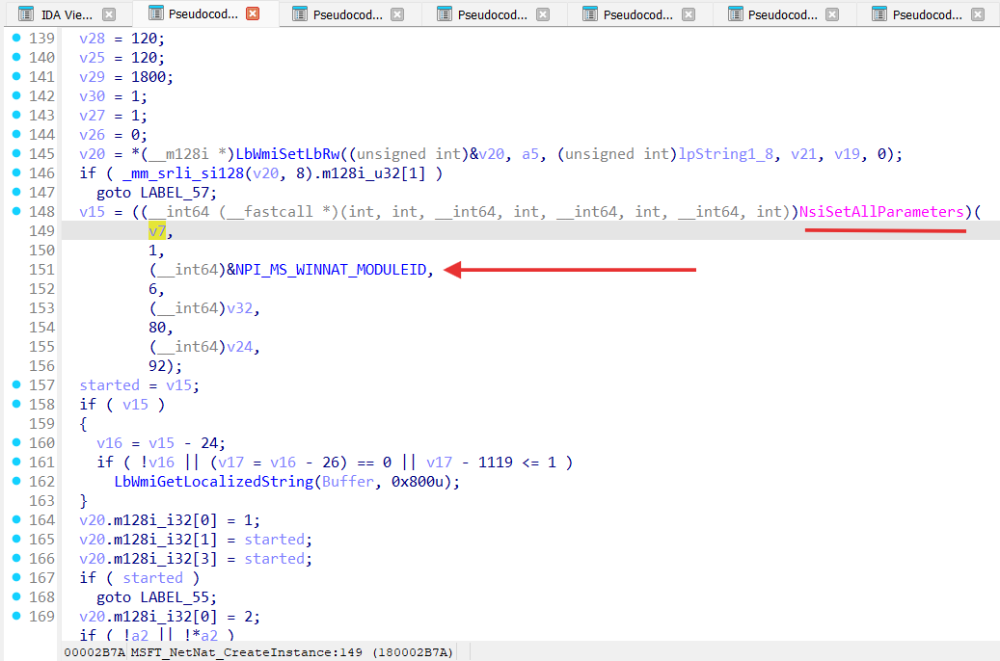
</a>
</p>
<div class="emphasizer_img_text">[ MSFT_NetNat_CreateInstance pseudo-code ]</div>
<br>
As we can see from the IDA pseudo-code for <span class="emphasizer_code_function_2">MSFT_NetNat_CreateInstance</span> it uses <span class="emphasizer_code_function_2">NSI</span> with a specified _Network Programming Interface module_ (<span class="emphasizer_code_function_2">NPI_MS_WINNAT_MODULEID</span>). A _Network Programming Interface_, or <span class="emphasizer_code_function_2">NPI</span>, defines the interface between network modules that can be attached to one another __[__ [network-programming-interface](https://learn.microsoft.com/en-us/windows-hardware/drivers/network/network-programming-interface) __]__ . 
<br>
<p align="center">
<a href="../images/winnat/image4.png" target="_blank">
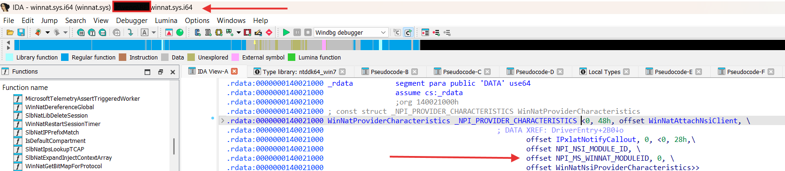
</a>
</p>
<div class="emphasizer_img_text">[ NPI_MS_WINNAT_MODULEID in winnat.sys ]</div>
<br>
<hr class="line_1">
<p align="center">
<a href="../images/winnat/image5.png" target="_blank">
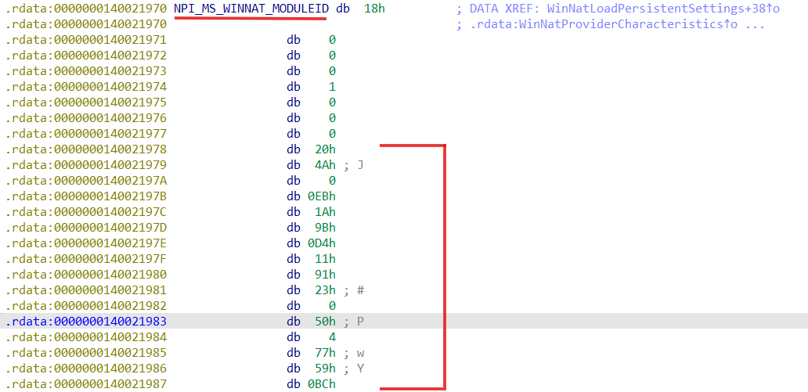
</a>
</p>
<div class="emphasizer_img_text">[ NPI_MS_WINNAT_MODULEID ]</div>
<br>
We can decode it as <span class="emphasizer_code_function_2">GUID</span> and get <span class="emphasizer_code_function_2">204A00EB-1A9B-D411-9123-0050047759BC</span>.
<br><br>
## WINNAT.SYS
<span class="emphasizer_code_function_2">Winnat.sys</span> registers itself as a _Provider_ (<span class="emphasizer_code_function_2">NPI_MS_WINNAT_MODULEID = 204A00EB-1A9B-D411-9123-0050047759BC</span>) to _Network Module Registrar_ (<span class="emphasizer_code_function_2">NMR</span>) and <span class="emphasizer_code_function_2">NetNat.dll</span> uses it as _Client_ __[__ [introduction-to-the-network-module-registrar](https://learn.microsoft.com/en-us/windows-hardware/drivers/network/introduction-to-the-network-module-registrar) __]__.
<br>
<p align="center">
<a href="../images/winnat/image6.png" target="_blank">
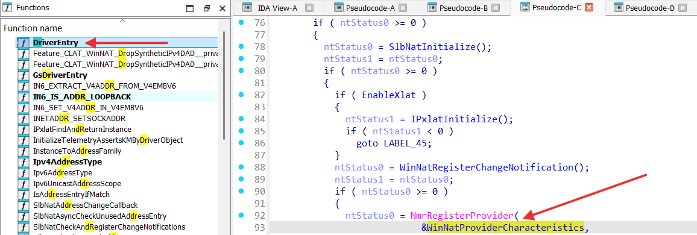
</a>
</p>
<div class="emphasizer_img_text">[ winnat.sys NMR registration ]</div>
<br>
So we can conclude that kernel-mode functionality of the <span class="emphasizer_code_function_2">NAT</span> on Windows is implemented by <span class="emphasizer_code_function_2">winnat.sys</span>.
<br><br>
<span class="emphasizer_code_function_2">Winnat.sys</span> is actually _Windows Filtering Platform_ callout driver __[__ [windows-filtering-platform-callout-drivers](https://learn.microsoft.com/en-us/windows-hardware/drivers/network/introduction-to-windows-filtering-platform-callout-drivers) __]__ :
<br>
<p align="center">
<a href="../images/winnat/image7.png" target="_blank">
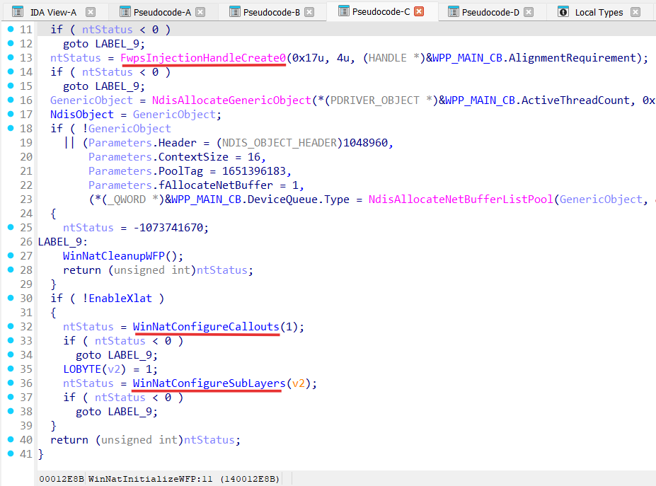
</a>
</p>
<div class="emphasizer_img_text">[ WinNatInitializeWFP function in winnat.sys ]</div>
<br>
<span class="emphasizer_code_function_2">Winnat.sys</span> registers __3__ <span class="emphasizer_code_function_2">WFP</span> callouts:
<br>
<p align="center">
<a href="../images/winnat/image8.png" target="_blank">
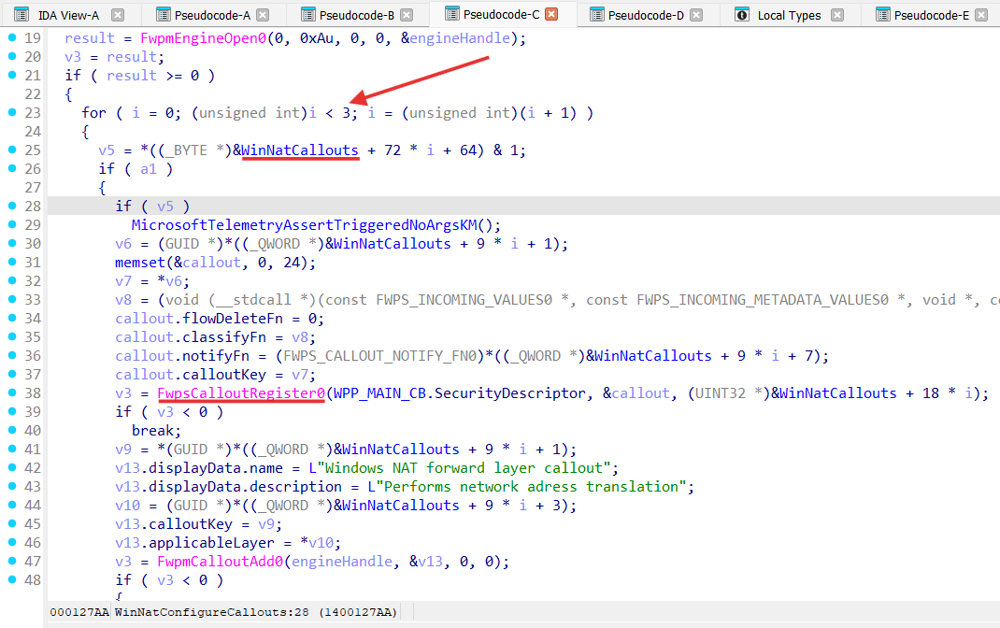
</a>
</p>
<div class="emphasizer_img_text">[ WinNatCallouts WFP callouts ]</div>
<br>
These callouts are:
- <span class="emphasizer_code_function_2">WINNAT_WFP_FORWARD_LAYER_CALLOUT_IPV6</span> for <span class="emphasizer_code_function_2">FWPM_LAYER_IPFORWARD_V6</span> layer;
- <span class="emphasizer_code_function_2">WINNAT_WFP_FORWARD_LAYER_CALLOUT_IPV4</span> for <span class="emphasizer_code_function_2">FWPM_LAYER_IPFORWARD_V4</span> layer;
- <span class="emphasizer_code_function_2">WINNAT_WFP_INBOUND_IP_LAYER_CALLOUT_IPV4</span> for <span class="emphasizer_code_function_2">FWPM_LAYER_INBOUND_IPPACKET_V4</span> layer:
<br>
<p align="center">
<a href="../images/winnat/image9.png" target="_blank">
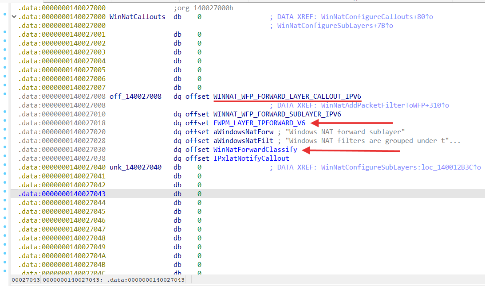
</a>
</p>
<div class="emphasizer_img_text">[ WINNAT_WFP_FORWARD_LAYER_CALLOUT_IPV6 callout for FWPM_LAYER_IPFORWARD_V6 layer ]</div>
<br>
<span class="emphasizer_code_function_2">FWPM_LAYER_IPFORWARD_V4</span> / <span class="emphasizer_code_function_2">FWPM_LAYER_IPFORWARD_V6</span> filtering layer is located in the _forwarding path_ at the point where a received packet is forwarded. <br>
<span class="emphasizer_code_function_2">FWPM_LAYER_INBOUND_IPPACKET_V4</span> / <span class="emphasizer_code_function_2">FWPM_LAYER_INBOUND_IPPACKET_V6</span> filtering layer is located in the _receive path_ just after the IP header of a received packet has been parsed but before any IP header processing takes place __[__ [wfp-management-filtering-layer-identifiers](https://learn.microsoft.com/en-us/windows/win32/fwp/management-filtering-layer-identifiers-) __]__ .
<br><br>
<span class="emphasizer_code_function_2">FWPM_LAYER_IPFORWARD_V4</span> / <span class="emphasizer_code_function_2">FWPM_LAYER_IPFORWARD_V6</span> is processed by <span class="emphasizer_code_function_2">WinNatForwardClassify</span> function:
```c
void __fastcall WinNatForwardClassify(
        FWPS_INCOMING_VALUES0 *inFixedValues,
        FWPS_INCOMING_METADATA_VALUES0 *inMetaValues,
        const NET_BUFFER_LIST *layerData,
        FWPS_FILTER0 *filter,
        __int64 flowContext,
        FWPS_CLASSIFY_OUT0 *classifyOut)
```
<span class="emphasizer_code_function_2">FWPM_LAYER_INBOUND_IPPACKET_V4</span> / <span class="emphasizer_code_function_2">FWPM_LAYER_INBOUND_IPPACKET_V6</span> is processed by <span class="emphasizer_code_function_2">WinNatIpv4IPClassify</span> function:
```c
void __fastcall WinNatIpv4IPClassify(
        FWPS_INCOMING_VALUES0 *inFixedValues,
        FWPS_INCOMING_METADATA_VALUES0 *inMetaValues,
        NET_BUFFER_LIST *layerData,
        FWPS_FILTER0 *filter,
        __int64 flowContext,
        FWPS_CLASSIFY_OUT0 *classifyOut)
```
The <span class="emphasizer_code_function_2">WinNatForwardClassify</span> function gets invoked after the _inbound_ packet has been validated and a _routing decision_ has been made — but before the packet is actually sent out on the _egress_ interface.
Let’s analyze <span class="emphasizer_code_function_2">WinNatForwardClassify</span>:
<br>
<p align="center">
<a href="../images/winnat/image10.png" target="_blank">
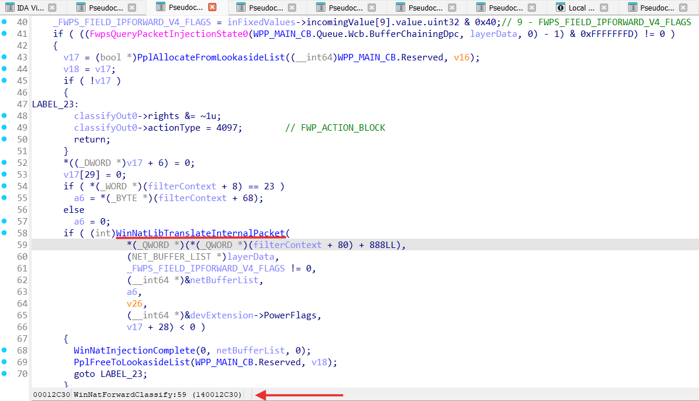
</a>
</p>
<div class="emphasizer_img_text">[ WinNatForwardClassify function ]</div>
<br>
<span class="emphasizer_code_function_2">WinNatForwardClassify</span> performs packet <span class="emphasizer_code_function_2">NATing</span> in the <span class="emphasizer_code_function_2">WinNatLibTranslateInternalPacket</span> function, where actual packets _translation_ happens in <span class="emphasizer_code_function_2">WinNatTranslatePacket</span>.
<br>
<br>
The <span class="emphasizer_code_function_2">WinNatIpv4IPClassify</span> function gets invoked when a packet is _received_ by the IP layer but before it is _delivered_ up to _higher layers_.
Let’s analyze <span class="emphasizer_code_function_2">WinNatIpv4IPClassify</span> function:
<br>
<p align="center">
<a href="../images/winnat/image11.png" target="_blank">
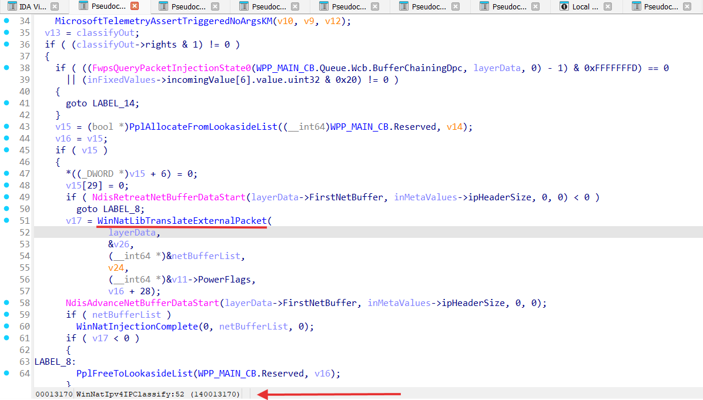
</a>
</p>
<div class="emphasizer_img_text">[ WinNatIpv4IPClassify function ]</div>
<br>
<span class="emphasizer_code_function_2">WinNatIpv4IPClassify</span> performs packet <span class="emphasizer_code_function_2">NATing</span> in the <span class="emphasizer_code_function_2">WinNatLibTranslateExternalPacket</span> function, where actual packets _translation_ happens in <span class="emphasizer_code_function_2">WinNatTranslatePacket</span>:
<br>
<p align="center">
<a href="../images/winnat/image12.png" target="_blank">
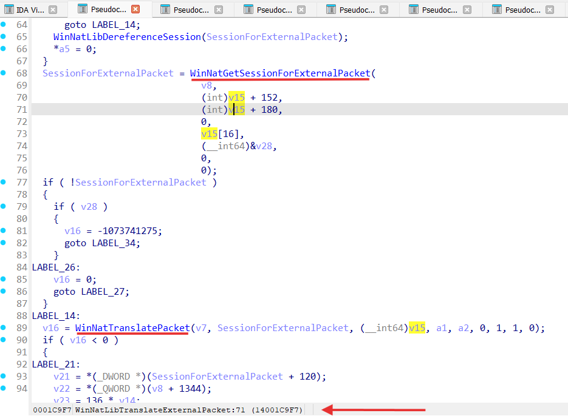
</a>
</p>
<div class="emphasizer_img_text">[ WinNatLibTranslateExternalPacket function ]</div>
<br>
So for both <span class="emphasizer_code_function_2">WinNatForwardClassify</span> and <span class="emphasizer_code_function_2">WinNatIpv4IPClassify</span> perform <span class="emphasizer_code_function_2">NATing</span> _modifying_ IP and transport headers (TCP/UDP) with help of the <span class="emphasizer_code_function_2">WinNatTranslatePacket</span> function:
<br>
<p align="center">
<a href="../images/winnat/image13.png" target="_blank">
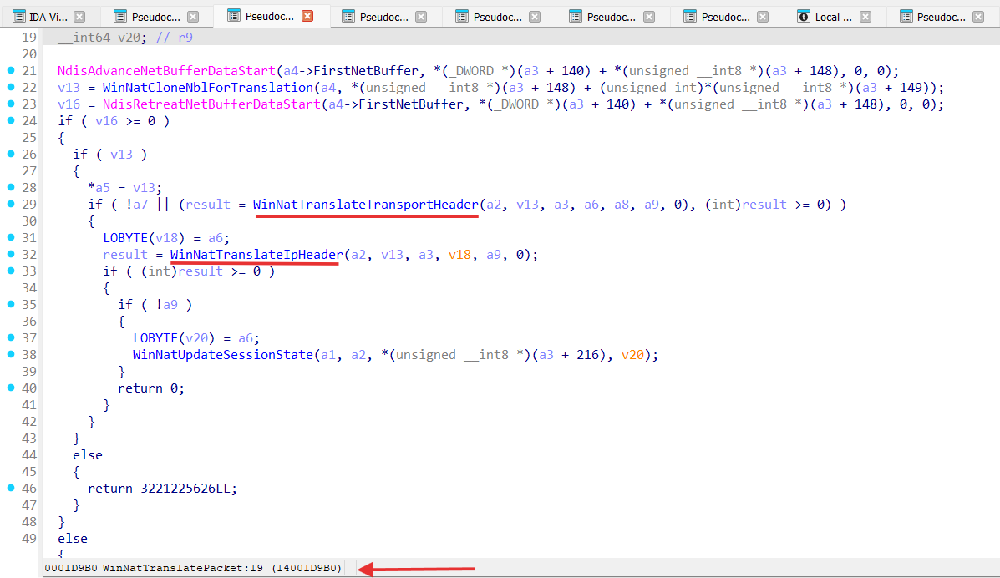
</a>
</p>
<div class="emphasizer_img_text">[ WinNatTranslatePacket function ]</div>
<br>
Modification of the packets is pretty simple - change _source address_ of the packet from an _internal_ <span class="emphasizer_code_function_2">NAT</span> interface (<span class="emphasizer_code_function_2">virtual NAT adapter</span>) to an _external_ public <span class="emphasizer_code_function_2">NIC</span> interface (<span class="emphasizer_code_function_2">physical NIC adapter</span>) on the _send path_ (for example: <span class="emphasizer_code_function_2">172.24.16.2</span> -> <span class="emphasizer_code_function_2">192.168.0.10</span>), and _vice versa_ on the _receive_ path. 
<br><br>
After packets were modified the are _re-injected_ to the data path by the <span class="emphasizer_code_function_2">WinNatInjectTranslatedPacket</span> from the scheduled <span class="emphasizer_code_function_2">WinNatTranslationDpc</span> _DPC_:
<br>
<p align="center">
<a href="../images/winnat/image14.png" target="_blank">
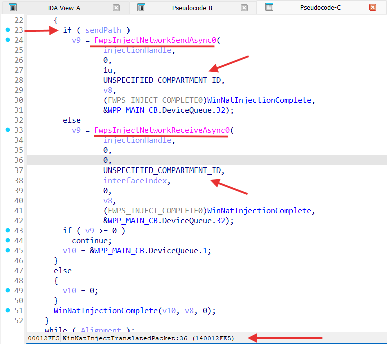
</a>
</p>
<div class="emphasizer_img_text">[ WinNatInjectTranslatedPacket function ]</div>
<br>
<br>
So, overall flow for <span class="emphasizer_code_function_2">winnat.sys</span> can be draw as following:
<br>
<p align="center">
<a href="../images/winnat/image15.png" target="_blank">
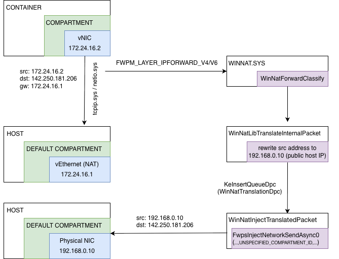
</a>
</p>
<div class="emphasizer_img_text">[ NATing on the send path ]</div>
<br>
<hr class="line_1">
<br>
<p align="center">
<a href="../images/winnat/image16.png" target="_blank">
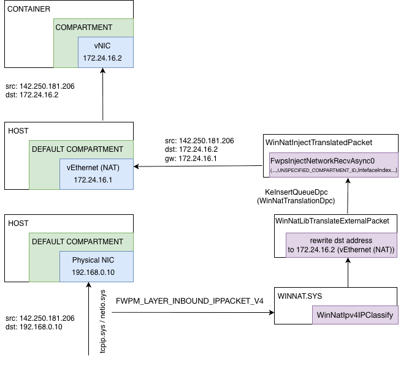
</a>
</p>
<div class="emphasizer_img_text">[ NATing on the recv path ]</div>
<br>
<br>
So, traffic from the one <span class="emphasizer_code_function_2">container</span> _isolated_ inside <span class="emphasizer_code_function_2">compartment</span> get routed to the _default host_ <span class="emphasizer_code_function_2">compartment</span> and back using <span class="emphasizer_code_function_2">NAT</span> implemented by <span class="emphasizer_code_function_2">WFP</span> callout driver named <span class="emphasizer_code_function_2">winnat.sys</span>. 
<br>
Also we can conclude that a traffic from the _all_ <span class="emphasizer_code_function_2">compartments</span> is _visible_ for <span class="emphasizer_code_function_2">WFP</span> callaouts drivers.  