## INTRO


An NDIS Lightweight Filter (<span class="emphasizer_code_function_2">LFW</span>) driver is one of several driver models to monitor and filter network packets in Windows. They operate at Layer 2 (<span class="emphasizer_code_function_2">data link layer</span>) and can perform tasks such as packet _inspection_, _modification_, _dropping_, or _injection_.
A filter driver communicates with NDIS and other <span class="emphasizer_code_function_2">NDIS</span> drivers through the <span class="emphasizer_code_function_2">NDIS</span> library. The <span class="emphasizer_code_function_2">NDIS</span> library exports a full set of functions (<span class="emphasizer_code_function_2">NdisFXxx</span>) that encapsulate all of the operating system functions that a filter driver must call. The filter driver, in turn, must export a set of entry points (<span class="emphasizer_code_function_2">FilterXxx</span> functions) that <span class="emphasizer_code_function_2">NDIS</span> calls for its own purposes, or on behalf of other drivers, to access the filter driver.
A <span class="emphasizer_code_function_2">filter module</span>  is an instance of a <span class="emphasizer_code_function_2">filter driver</span> that typically layered _between_ <span class="emphasizer_code_function_2">miniport adapters</span> and <span class="emphasizer_code_function_2">protocol bindings</span> __[__ [ndis-filter-drivers](https://learn.microsoft.com/en-us/windows-hardware/drivers/network/ndis-filter-drivers) __]__:
<br>
<p align="center">
<a href="../images/lfwbinding/image0.png" target="_blank">
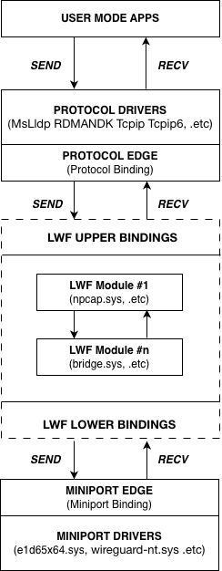
</a>
</p>
<div class="emphasizer_img_text">[ LWF Stack ]</div>
<br>
<span class="emphasizer_code_function_2">LFW</span> drivers are widely used in <span class="emphasizer_code_function_2">VPN</span>, <span class="emphasizer_code_function_2">EDR</span> and other solutions.<br>
But what if we have our private <span class="emphasizer_code_function_2">miniport driver</span> and don't want the traffic of this miniport gets _inspected_ or _modified_ by third-party <span class="emphasizer_code_function_2">LWFs</span>?
<br>
<br>
Let’s figure out how <span class="emphasizer_code_function_2">LFWs</span> get _binded_ to <span class="emphasizer_code_function_2">miniport drivers</span> and _loaded_:

- [LWF INF](#lwf-inf)
<br>
- [Network Configuration Interfaces](#network-configuration-interfaces)
<br>
- [Bindings Registry Entries](#bindings-registry-entries)
<br>
- [Netsetup2](#netsetup2)
<br>
- [NDIS Binding](#ndis-binding)
<br>
- [LWF Registration](#lwf-registration)
<br>
- [ndisCheckForNdisTestBindingsOnAllMiniports](#ndischeckforndistestbindingsonallminiports)


## LWF INF

<span class="emphasizer_code_function_2">NDIS LWF</span> bindings define how NDIS filter drivers _connect_ and _interact_ within the __Windows network stack__.
<br>
<span class="emphasizer_code_function_2">LWFs</span> are installed as network services using a single setup information (<span class="emphasizer_code_function_2">INF</span>) file, which the Windows configuration manager processes to determine _binding_ compatibility and store _configurations_.<br><br>
Key <span class="emphasizer_code_function_2">INF</span> settings that control _bindings_ include:

 - __FilterClass__: a required value that specifies the filter's functional class and determines its _position_ in the _filter stack_ relative to other <span class="emphasizer_code_function_2">LWFs</span>. Common values include:<br>
-<span class="emphasizer_code_function_2">'compression'</span> or <span class="emphasizer_code_function_2">'encryption'</span> (_for data modification_)<br>
-<span class="emphasizer_code_function_2">'scheduler'</span> or <span class="emphasizer_code_function_2">'loadbalance'</span> (_for traffic management_)<br>
-<span class="emphasizer_code_function_2">'failover'</span> (_for redundancy_)<br>
This influences _binding order_: <span class="emphasizer_code_function_2">NDIS</span> stacks _filters_ from <span class="emphasizer_code_function_2">lowest</span> to <span class="emphasizer_code_function_2">highest</span> class _during_ attachment.

- __FilterMediaTypes__: a value listing supported network media types (e.g., <span class="emphasizer_code_function_2">'ethernet'</span>, <span class="emphasizer_code_function_2">'wlan</span>, <span class="emphasizer_code_function_2">'nativewifi'</span>).<br> Bindings _only occur_ to adapters matching these types; for example, a _Wi-Fi-specific_ <span class="emphasizer_code_function_2">LWF</span> might specify  <span class="emphasizer_code_function_2">'wlan'</span> to avoid binding to _Ethernet_ adapters.

- __Ndi\Interfaces__: defines _binding_ interfaces via <span class="emphasizer_code_function_2">UpperRange</span> and <span class="emphasizer_code_function_2">LowerRange</span> values.<br>
-<span class="emphasizer_code_function_2">UpperRange</span>: Interfaces the LWF exposes at its <span class="emphasizer_code_function_2">top edge</span> (e.g., <span class="emphasizer_code_function_2">'ndis5'</span> for general <span class="emphasizer_code_function_2">NDIS</span> protocols, or protocol-specific like <span class="emphasizer_code_function_2">'ndis5ip'</span> for _TCP/IP-only_). This allows _upper-layer_ protocols (e.g.,  <span class="emphasizer_code_function_2">TCP/IP</span>) to _bind_ to the _filter_.<br>
-<span class="emphasizer_code_function_2">LowerRange</span>: Interfaces the  <span class="emphasizer_code_function_2">LWF</span> _binds_ to at its <span class="emphasizer_code_function_2">bottom edge</span> (e.g.,  <span class="emphasizer_code_function_2">'ethernet'</span>,  <span class="emphasizer_code_function_2">'wlan'</span>, or  <span class="emphasizer_code_function_2">ndis5'</span> for _non-specific_).<br> 
Values as <span class="emphasizer_code_function_2">UpperRange=noupper</span> and <span class="emphasizer_code_function_2">LowerRange=nolower</span> allow the _filter_ to _bind_ <span class="emphasizer_code_function_2">above</span> and <span class="emphasizer_code_function_2">below</span> _all_ other components

Example <span class="emphasizer_code_function_2">INF</span> snippet (_Ndi installation support_ section):<br>
```cpp
;-------------------------------------------------------------------------
; Installation Section
;-------------------------------------------------------------------------
[Install]
AddReg=LWF_Ndi
; All LWFs must include the 0x40000 bit (NCF_LW_FILTER). Unlike miniports, you
; don't usually need to customize this value.
; Added flags NCF_HIDDEN | NCF_NOT_USER_REMOVABLE to avoid manual intervention.
Characteristics=0x40028
NetCfgInstanceId="{A54A4CFA-050D-4DC4-9D29-04E50393CB9B}"

;-------------------------------------------------------------------------
; Ndi installation support
;-------------------------------------------------------------------------
[LWF_Ndi]
HKR, Ndi,Service,,"SWSLWF"
HKR, Ndi,CoServices,0x00010000,"SWSLWF"
; The FilterClass controls the order in which filters are bound to the underlying miniport.
HKR, Ndi,FilterClass,, encryption
; Specify whether you have a Modifying or Monitoring filter.
; For a Monitoring filter, use this:
;     HKR, Ndi,FilterType,0x00010001, 1 ; Monitoring filter
; For a Modifying filter, use this:
;     HKR, Ndi,FilterType,0x00010001, 2 ; Modifying filter
HKR, Ndi,FilterType,0x00010001,2
HKR, Ndi\Interfaces,UpperRange,,"noupper"
HKR, Ndi\Interfaces,LowerRange,,"ndis5,ndis4"
HKR, Ndi\Interfaces, FilterMediaTypes,,"ethernet, wan, ppip, bluetooth, ndis5, nolower"
```
<br>
Installation of the <span class="emphasizer_code_function_2">LWFs</span> requires the <span class="emphasizer_code_function_2">INetCfg*</span> APIs __[__ [Network Configuration Interfaces](https://learn.microsoft.com/en-us/previous-versions/windows/hardware/network/ff559080(v=vs.85)) __]__ or the <span class="emphasizer_code_function_2">netcfg.exe</span> tool __[__ [NetCfg](https://learn.microsoft.com/en-us/previous-versions/windows/hardware/network/ff559080(v=vs.85)) __]__. During installation, the <span class="emphasizer_code_function_2">configuration manager</span> validates _bindings_ based on the <span class="emphasizer_code_function_2">INF</span> file settings and generates a list of applicable _filter_ modules for each _miniport_ adapter __[__ [NDIS filter driver installation](https://learn.microsoft.com/en-us/windows-hardware/drivers/network/ndis-filter-driver-installation) __]__ .


## Network Configuration Interfaces

Network Configuration Interfaces (<span class="emphasizer_code_function_2">INetCfg</span>) are a family of <span class="emphasizer_code_function_2">COM</span> objects in Windows that provide programmatic access to network _configuration_ and _installation_.<br>
<span class="emphasizer_code_function_2">INetCfg</span> is the root interface that provides methods to load basic networking information into memory, apply changes to network configuration, and retrieve network components.<br>
<span class="emphasizer_code_function_2">NDIS</span> protocol and filter drivers are installed by calling into the <span class="emphasizer_code_function_2">INetCfg</span> family of Network Configuration Interfaces __[__ [NetCfg](https://learn.microsoft.com/en-us/previous-versions/windows/hardware/network/ff559080(v=vs.85)) __]__.<br><br>
<span class="emphasizer_code_function_2">INetCfg</span> family allows:

- Enumerate network adapters, protocols, clients, and services
- Install and uninstall network components
- Enable/disable bindings between components
- Modify network component settings
- Query binding paths between network stack layers

<br>
The <span class="emphasizer_code_function_2">INetCfg</span> family includes multiple related interfaces:

- <span class="emphasizer_code_function_2">INetCfg</span> - root interface for all network configuration
- <span class="emphasizer_code_function_2">INetCfgLock</span> - provides locking mechanism for configuration changes
- <span class="emphasizer_code_function_2">INetCfgComponent</span> - represents a specific network component
- <span class="emphasizer_code_function_2">INetCfgComponentBindings</span> - controls bindings for a component
- <span class="emphasizer_code_function_2">INetCfgBindingPath</span> - represents a binding path between components
- <span class="emphasizer_code_function_2">INetCfgClass</span> - represents a class of components (adapters, protocols, etc.)
- <span class="emphasizer_code_function_2">INetCfgClassSetup</span> - used for installing/removing components

Usage of the <span class="emphasizer_code_function_2">INetCfg</span> objects related to _binding_ functionality can be found in <span class="emphasizer_code_function_2">bindview.exe</span> tool __[__ [BindView](https://github.com/microsoft/windows-driver-samples/tree/main/network/config/bindview) __]__.


## Bindings Registry Entries

All information about <span class="emphasizer_code_function_2">NDIS</span> _bindings_ is stored in <span class="emphasizer_code_function_2">Windows Registry</span>
Let's consider example of the _bindings_ registry entries for <span class="emphasizer_code_function_2">Realtek 8822CE Wireless LAN 802.11ac PCI-E NIC adapter</span>:
<br>
<p align="center">
<a href="../images/lfwbinding/image1.png" target="_blank">
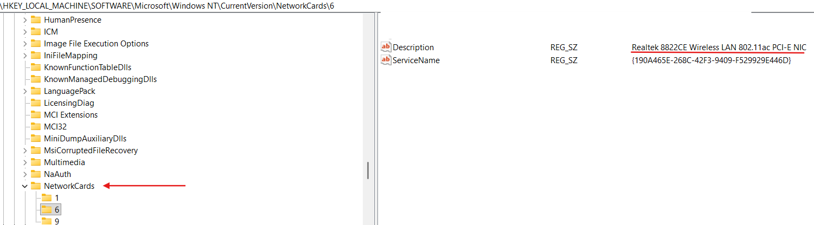
</a>
</p>
<div class="emphasizer_img_text">[ Realtek 8822CE Wireless LAN 802.11ac PCI-E NIC ]</div>
<br>

We can see the full description of this NIC in the <span class="emphasizer_code_function_2">HKLM\SYSTEM\ControlSet001\Control\Class\{4d36e972-e325-11ce-bfc1-08002be10318}</span> registry key (this registry key stands for <span class="emphasizer_code_function_2">Network Class</span> devices):
<br>
<p align="center">
<a href="../images/lfwbinding/image2.png" target="_blank">
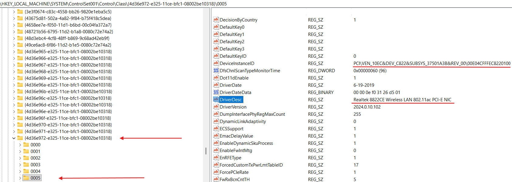
</a>
</p>
<div class="emphasizer_img_text">[ Network Class registry key ]</div>
<br>
<hr class="line_1">
<br>
<p align="center">
<a href="../images/lfwbinding/image3.png" target="_blank">
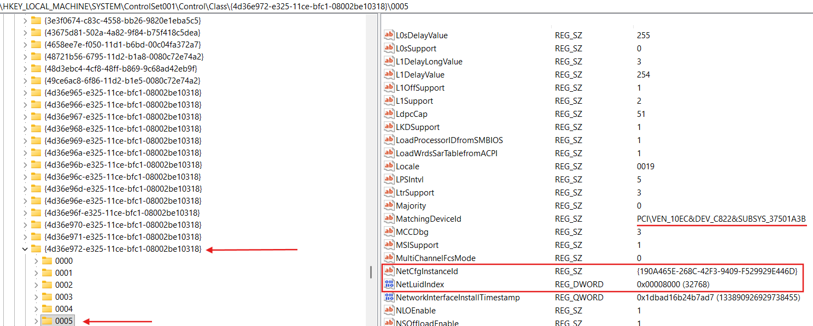
</a>
</p>
<div class="emphasizer_img_text">[ Network Class registry key ]</div>
<br>
Also we can see that _binding_ information for our NIC is stored in the <span class="emphasizer_code_function_2">HKLM\SYSTEM\ControlSet001\Control\Class\{4d36e972-e325-11ce-bfc1-08002be10318}\0005\Linkage</span>:
<br>
<p align="center">
<a href="../images/lfwbinding/image4.png" target="_blank">
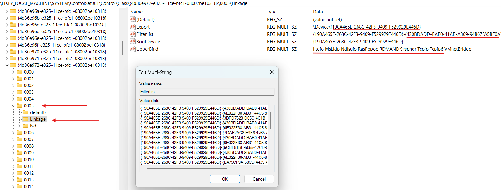
</a>
</p>
<div class="emphasizer_img_text">[ Linkage registry key ]</div>
<br>
<span class="emphasizer_code_function_2">HKLM\SYSTEM\ControlSet001\Control\Class\{4d36e972-e325-11ce-bfc1-08002be10318}\0005\Linkage\FilterList</span> contains the list of the <span class="emphasizer_code_function_2">LWFs</span> _GUIDs_ (<span class="emphasizer_code_function_2">NetCfgInstanceId</span> value in an <span class="emphasizer_code_function_2">INF</span> file for <span class="emphasizer_code_function_2">LWF</span>).<br><br>
Overall record as <span class="emphasizer_code_function_2">{190A465E-268C-42F3-9409-F529929E446D}-{430BDADD-BAB0-41AB-A369-94B67FA5BE0A}</span> is called <span class="emphasizer_code_function_2">binding path</span>, where <span class="emphasizer_code_function_2">{190A465E-268C-42F3-9409-F529929E446D}</span> is our NIC <span class="emphasizer_code_function_2">NetCfgInstanceId</span> and <span class="emphasizer_code_function_2">{430BDADD-BAB0-41AB-A369-94B67FA5BE0A}</span> is some LWF <span class="emphasizer_code_function_2">NetCfgInstanceId</span>.<br><br>
Let's search for <span class="emphasizer_code_function_2">{430BDADD-BAB0-41AB-A369-94B67FA5BE0A}</span> value in the registry:
<br>
<p align="center">
<a href="../images/lfwbinding/image5.png" target="_blank">
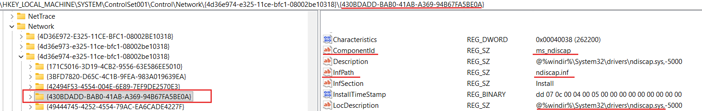
</a>
</p>
<div class="emphasizer_img_text">[ ndiscap.sys registry key ]</div>
<br>
As we can see <span class="emphasizer_code_function_2">{430BDADD-BAB0-41AB-A369-94B67FA5BE0A}</span> is for <span class="emphasizer_code_function_2">ndiscap.sys</span> (Microsoft NDIS Packet Capture Filter Driver).<br>
Here is the <span class="emphasizer_code_function_2">INF</span> file (<span class="emphasizer_code_function_2">ndiscap.inf</span>) for Microsoft NDIS Packet Capture Filter Driver:
<br>
```cpp
;-------------------------------------------------------------------------
; NdisCap.INF -- NDIS Packet Capture Filter Driver
; Copyright (c) Microsoft Corporation.  All rights reserved.
;-------------------------------------------------------------------------
[version]
Signature   = "$Windows NT$"
Class       = NetService
ClassGUID   = {4D36E974-E325-11CE-BFC1-08002BE10318}
Provider    = %Msft%
PnpLockdown = 1
;-------------------------------------------------------------------------
; Installation Section
;-------------------------------------------------------------------------
[Install]
AddReg=Inst_Ndi
Characteristics=0x40038 ; NCF_LW_FILTER | NCF_NO_SERVICE | NCF_NOT_USER_REMOVABLE | NCF_HIDDEN
NetCfgInstanceId="{430BDADD-BAB0-41AB-A369-94B67FA5BE0A}"
;-------------------------------------------------------------------------
; Ndi installation support
;-------------------------------------------------------------------------
[Inst_Ndi]
HKR, Ndi,Service,,"NdisCap"
HKR, Ndi,CoServices,0x00010000,"NdisCap"
HKR, Ndi,HelpText,,"@%%SystemRoot%%\System32\drivers\ndiscap.sys,-5001"
HKR, Ndi,FilterClass,, ms_switch_capture
HKR, Ndi,FilterType,0x00010001,0x00000001
HKR, Ndi\Interfaces,UpperRange,,"noupper"
HKR, Ndi\Interfaces,LowerRange,,"nolower"
HKR, Ndi\Interfaces, FilterMediaTypes,,"ethernet, wlan, ppip, vmnetextension"
HKR, Ndi,FilterRunType, 0x00010001, 2 ; Optional
HKR, Ndi,NdisBootStart, 0x00010001, 0 ; Don't wait for this driver to start at boot
[Strings]
Msft = "Microsoft"
NdisCap_Desc = "Microsoft NDIS Capture"
```
<br>
We can see that <span class="emphasizer_code_function_2">NetCfgInstanceId="{430BDADD-BAB0-41AB-A369-94B67FA5BE0A}"</span> is specified in the <span class="emphasizer_code_function_2">Install Section</span> of the <span class="emphasizer_code_function_2">INF</span> file, and this <span class="emphasizer_code_function_2">LWF</span> can attach to _all_ interfaces (<span class="emphasizer_code_function_2">Ndi\Interfaces,UpperRange,,"noupper"</span> and <span class="emphasizer_code_function_2">Ndi\Interfaces,LowerRange,,"nolower"</span>) within media types like <span class="emphasizer_code_function_2">'ethernet'</span>, <span class="emphasizer_code_function_2">'wlan'</span>, <span class="emphasizer_code_function_2">'ppip'</span> and <span class="emphasizer_code_function_2">'vmnetextension'</span>.


## Netsetup2

We have already discovered <span class="emphasizer_code_function_2">HKLM\SYSTEM\ControlSet001\Control\NetworkSetup2</span> registry key in  [windows-containers-network-isolation](https://safesws.github.io/windows-containers-network-isolation/#net-setup), and know it stores various configurations for <span class="emphasizer_code_function_2">NDIS</span>:
<br>
<p align="center">
<a href="../images/lfwbinding/image6.png" target="_blank">
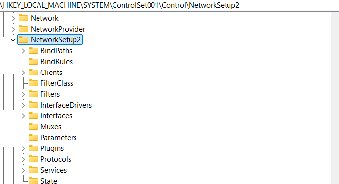
</a>
</p>
<div class="emphasizer_img_text">[ NetworkSetup2 registry key ]</div>
<br>
Let's little bit observer <span class="emphasizer_code_function_2">HKLM\SYSTEM\ControlSet001\Control\NetworkSetup2</span>:
<br>
<p align="center">
<a href="../images/lfwbinding/image7.png" target="_blank">
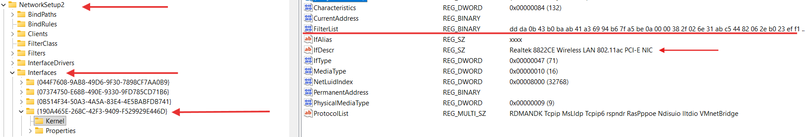
</a>
</p>
<div class="emphasizer_img_text">[ NetworkSetup2\Interfaces registry key ]</div>
<br>
As we can see <span class="emphasizer_code_function_2">HKLM\SYSTEM\ControlSet001\Control\NetworkSetup2\Interfaces</span> contains necessary _interfaces_ configuration for <span class="emphasizer_code_function_2">NDIS</span>. <br> <br>
And here are <span class="emphasizer_code_function_2">FilterList</span> and <span class="emphasizer_code_function_2">ProtocolList</span> which we already have seen previously in the <span class="emphasizer_code_function_2">HKLM\SYSTEM\ControlSet001\Control\Class\{4d36e972-e325-11ce-bfc1-08002be10318}\0005\Linkage</span> (where <span class="emphasizer_code_function_2">ProtocolList</span> was presented as <span class="emphasizer_code_function_2">UpperBind</span> value).
<br><br>
Also we can see here <span class="emphasizer_code_function_2">HKLM\SYSTEM\ControlSet001\Control\NetworkSetup2\Filters</span> key:
<br>
<p align="center">
<a href="../images/lfwbinding/image8.png" target="_blank">

</a>
</p>
<div class="emphasizer_img_text">[ NetworkSetup2\Filters registry key ]</div>
<br>
Obviously <span class="emphasizer_code_function_2">HKLM\SYSTEM\ControlSet001\Control\NetworkSetup2\Filters</span> contains necessary _filters_ configuration for <span class="emphasizer_code_function_2">NDIS</span>. <br> <br>
And here is our Microsoft NDIS Packet Capture Filter Driver (<span class="emphasizer_code_function_2">NetCfgInstanceId={430BDADD-BAB0-41AB-A369-94B67FA5BE0A}</span>).
<br>
Here are also a lot of the some properties for <span class="emphasizer_code_function_2">HKLM\SYSTEM\ControlSet001\Control\NetworkSetup2\Filters\430BDADD-BAB0-41AB-A369-94B67FA5BE0A\Properties</span>:
<br>
<p align="center">
<a href="../images/lfwbinding/image9.png" target="_blank">
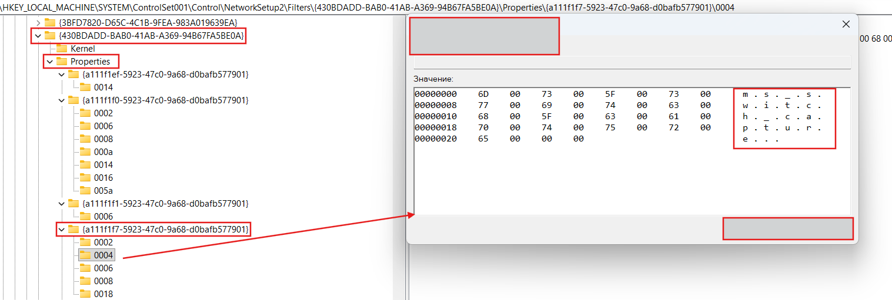
</a>
</p>
<div class="emphasizer_img_text">[ Properties registry key for Microsoft NDIS Packet Capture Filter Driver]</div>
<br>


## NDIS Binding


<span class="emphasizer_code_function_2">NDIS</span> binds objects like _Miniport_, _Interface_, _Protocol_ and _Filter_ to each other based on the information stored in the <span class="emphasizer_code_function_2">\Registry\Machine\System\CurrentControlSet\Control\NetworkSetup2</span> registry key. Path to this key is built by <span class="emphasizer_code_function_2">netsetupBuildObjectPath</span> function:
<br>
<p align="center">
<a href="../images/lfwbinding/image9-0.png" target="_blank">
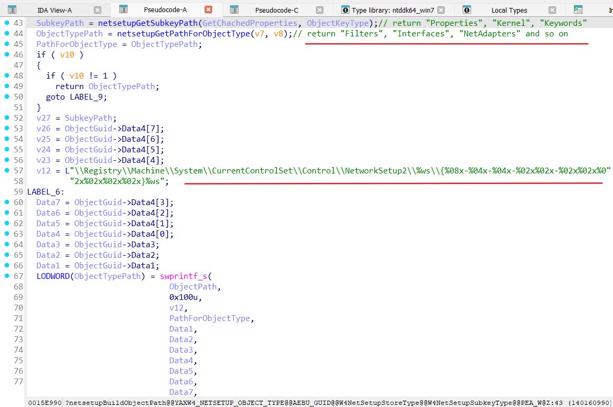
</a>
</p>
<div class="emphasizer_img_text">[ netsetupBuildObjectPath function ]</div>
<br>
In common this path built by <span class="emphasizer_code_function_2">netsetupBuildObjectPath</span> looks like:<br> <span class="emphasizer_code_function_2">HKLM\SYSTEM\ControlSet001\Control\NetworkSetup2\{OBJECT-TYPE}\{OBJECT-GUID}\{OBJECT-PROPERTY}</span>, where:
<br>
<br>
<span class="emphasizer_code_function_2">OBJECT-TYPE</span> - can be _"Interfaces"_, _"Filters"_, _"Protocols"_, _"BindPaths"_, _"Muxes"_, .etc
<br>
<span class="emphasizer_code_function_2">OBJECT-GUID</span> - _GUID_ of the requested object, like _InterfaceGuid_, _FilterGuid_, _ProtocolGuid_, .etc
<br>
<span class="emphasizer_code_function_2">OBJECT-PROPERTY</span> - can be _"Properties"_, _"Kernel"_, _"Keywords", _"CachedRuntimeProperties"_
<br>
<br>
For example full path to <span class="emphasizer_code_function_2">Realtek 8822CE Wireless LAN 802.11ac PCI-E NIC adapter</span> interface looks like 
<span class="emphasizer_code_function_2">HKLM\SYSTEM\ControlSet001\Control\NetworkSetup2\Interfaces\{190A465E-268C-42F3-9409-F529929E446D}\Kernel</span>:
<br>
<p align="center">
<a href="../images/lfwbinding/image9-1.png" target="_blank">
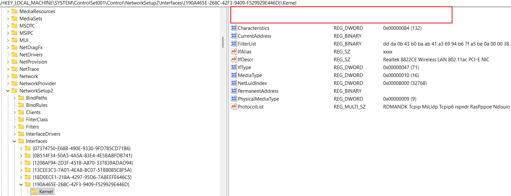
</a>
</p>
<div class="emphasizer_img_text">[ Kernel property for Realtek 8822CE PCI-E NIC adapter ]</div>
<br>
Internally <span class="emphasizer_code_function_2">NDIS</span> _binding_ is implemented by objects like <span class="emphasizer_code_function_2">Ndis::BindEngine</span>, <span class="emphasizer_code_function_2">Ndis::BindStack</span> and <span class="emphasizer_code_function_2">Ndis::BindRegistry</span>:
<br>
<p align="center">
<a href="../images/lfwbinding/image9-2.png" target="_blank">
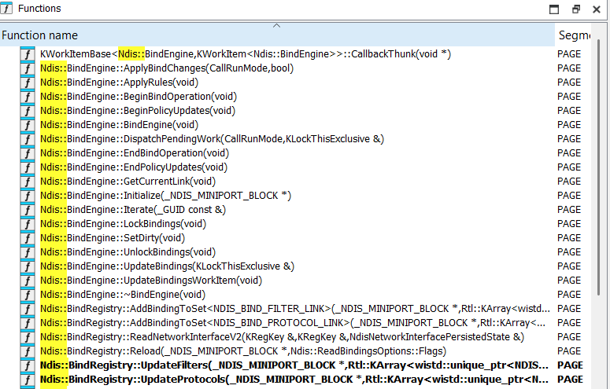
</a>
</p>
<div class="emphasizer_img_text">[ Ndis::Bind* objects ]</div>
<br>
Each _Miniport_ (<span class="emphasizer_code_function_2">_NDIS_MINIPORT_BLOCK</span>) has fields <span class="emphasizer_code_function_2">Bindings</span> and <span class="emphasizer_code_function_2">BindEngine</span>:
```cpp
struct __cppobj _NDIS_MINIPORT_BLOCK
{
  .....
  Ndis::BindStack Bindings;
  Ndis::BindEngine BindEngine;
  .....
};
```
<br>
_Binding_ process for a <span class="emphasizer_code_function_2">Miniport</span> is trigerred by <span class="emphasizer_code_function_2">Ndis::BindRegistry::Reload(_NDIS_MINIPORT_BLOCK *Miniport, Ndis::ReadBindingsOptions::Flags)</span> method:
<br>
<p align="center">
<a href="../images/lfwbinding/image9-3.png" target="_blank">
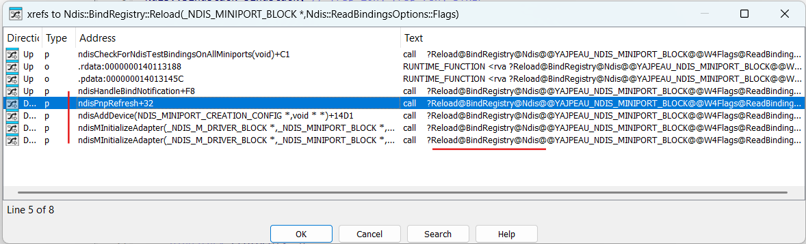
</a>
</p>
<div class="emphasizer_img_text">[ Invocation of the  Ndis::BindRegistry::Reload ]</div>
<br>
Let's analyze <span class="emphasizer_code_function_2">Ndis::BindRegistry::Reload</span>:
<br>
<p align="center">
<a href="../images/lfwbinding/image9-4.png" target="_blank">
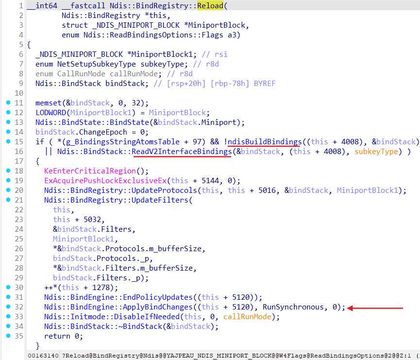
</a>
</p>
<div class="emphasizer_img_text">[ Ndis::BindRegistry::Reload method ]</div>
<br>
As we can see from the <span class="emphasizer_code_function_2">Ndis::BindRegistry::Reload</span> it starts the building of the _binding stack_ for a <span class="emphasizer_code_function_2">Miniport</span> ( functions <span class="emphasizer_code_function_2">ndisBuildBindings</span> and <span class="emphasizer_code_function_2">Ndis::BindStack::ReadV2InterfaceBindings</span>) and run actuall _binding_ process by call of the <span class="emphasizer_code_function_2">Ndis::BindEngine::ApplyBindChanges</span>.
<br>
<br>
Method <span class="emphasizer_code_function_2">Ndis::BindStack::ReadV2InterfaceBindings</span> retrieves _binding properties_ for a <span class="emphasizer_code_function_2">Miniport</span> (from the  <span class="emphasizer_code_function_2">Registry\Machine\System\CurrentControlSet\Control\NetworkSetup2\Interfaces\{IFACE-GUID}\FilterList</span>):
<br>
<p align="center">
<a href="../images/lfwbinding/image9-5.png" target="_blank">
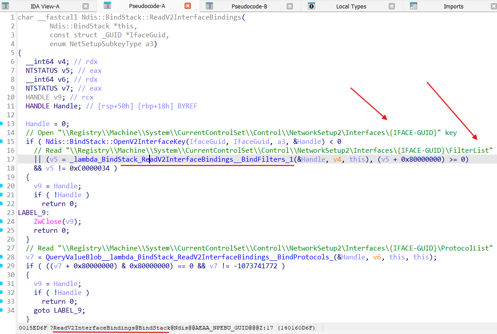
</a>
</p>
<div class="emphasizer_img_text">[ Ndis::BindStack::ReadV2InterfaceBindings ]</div>
<br>
<hr class="line_1">
<br>
<p align="center">
<a href="../images/lfwbinding/image9-6.png" target="_blank">
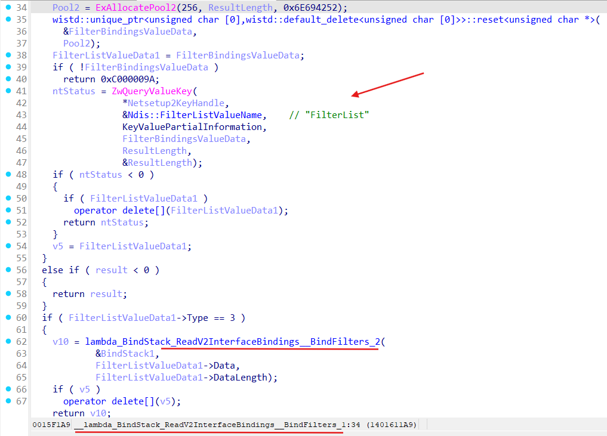
</a>
</p>
<div class="emphasizer_img_text">[ Retrieving of the LWFs bindings ]</div>
<br>
After getting _binding properties_ for a <span class="emphasizer_code_function_2">Miniport</span> method <span class="emphasizer_code_function_2">Ndis::BindStack::AddStaticFilterBinding</span> gets invoked for each _binding path_ in the _binding properties_: 
<br>
<p align="center">
<a href="../images/lfwbinding/image9-7.png" target="_blank">
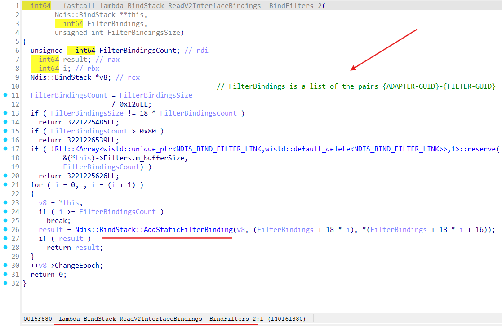
</a>
</p>
<div class="emphasizer_img_text">[ Adding of the LWFs to the binding stack ]</div>
<br>
<br>
Method <span class="emphasizer_code_function_2">Ndis::BindStack::AddStaticFilterBinding</span> builds _filter's link_ (method <span class="emphasizer_code_function_2">Ndis::BindStack::BuildFilterLink</span>) for given <span class="emphasizer_code_function_2">LWF</span> and add this link to the <span class="emphasizer_code_function_2">Bindings</span> field of the <span class="emphasizer_code_function_2">Miniport</span> _bindings_ performed on:
<br>
<p align="center">
<a href="../images/lfwbinding/image9-7-0.png" target="_blank">
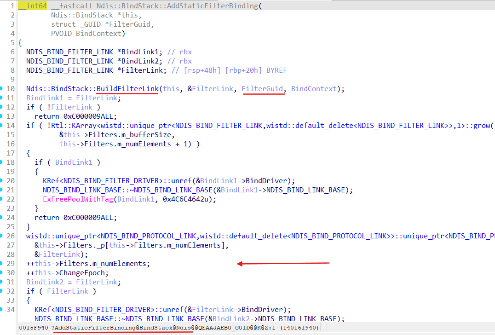
</a>
</p>
<div class="emphasizer_img_text">[ Adding of the LWFs to the binding stack ]</div>
<br>
In the registry such _binding properties_ are presented as:
<br>
<p align="center">
<a href="../images/lfwbinding/image9-8.png" target="_blank">
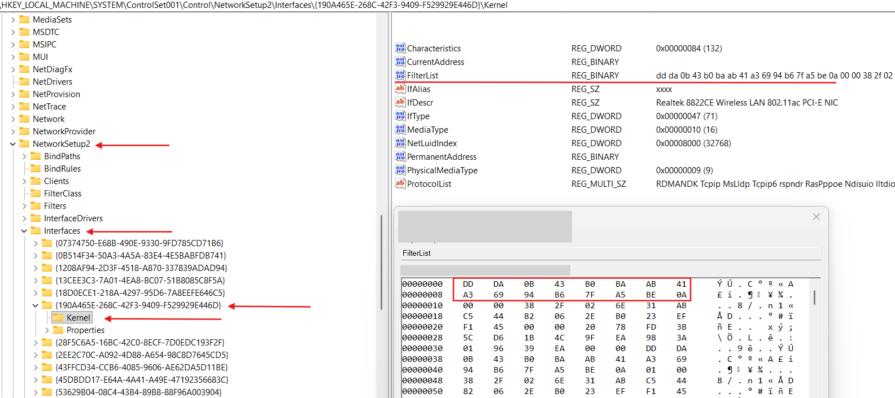
</a>
</p>
<div class="emphasizer_img_text">[ Netsetup2 registry with LWFs binding properties ]</div>
<br>
After bind stack gets built for a _Miniport_, <span class="emphasizer_code_function_2">Ndis::BindRegistry</span> run <span class="emphasizer_code_function_2">Ndis::BindEngine::ApplyBindChanges</span>:
<br>
<p align="center">
<a href="../images/lfwbinding/image9-9.png" target="_blank">
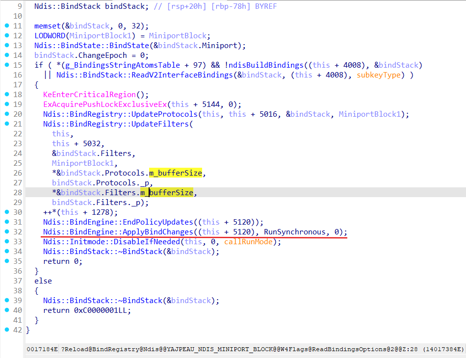
</a>
</p>
<div class="emphasizer_img_text">[ Invocation of the Ndis::BindEngine::ApplyBindChanges ]</div>
<br>
Method <span class="emphasizer_code_function_2">Ndis::BindEngine::ApplyBindChanges</span> invokes <span class="emphasizer_code_function_2">Ndis::BindEngine::UpdateBindings</span>, where <span class="emphasizer_code_function_2">Ndis::BindEngine::Iterate</span> performs actuall binding <span class="emphasizer_code_function_2">LWFs</span> to a <span class="emphasizer_code_function_2">Miniport</span>:
<br>
<p align="center">
<a href="../images/lfwbinding/image9-9-0.png" target="_blank">
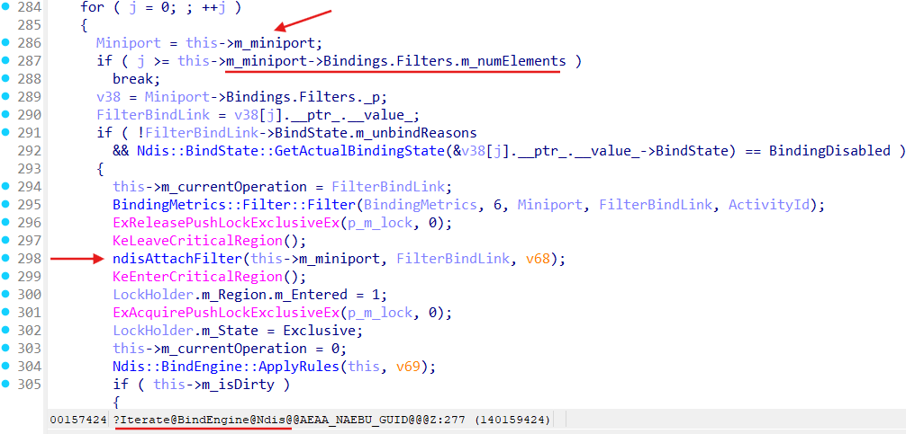
</a>
</p>
<div class="emphasizer_img_text">[ Ndis::BindEngine::Iterate method ]</div>
<br>
Here we can see that <span class="emphasizer_code_function_2">Ndis::BindEngine::Iterate</span> iterates over _Miniport_  <span class="emphasizer_code_function_2">BindStack</span> object's (field <span class="emphasizer_code_function_2">Bindings</span> in the  <span class="emphasizer_code_function_2">_NDIS_MINIPORT_BLOCK</span> strucure) <span class="emphasizer_code_function_2">Filters</span> member:
<br>
```cpp
for ( j = 0; ; ++j )
    {
      Miniport = this->m_miniport;
      if ( j >= this->m_miniport->Bindings.Filters.m_numElements )
        break;
      v38 = Miniport->Bindings.Filters._p;
      FilterBindLink = v38[j].__ptr_.__value_;
      if ( !FilterBindLink->BindState.m_unbindReasons
        && Ndis::BindState::GetActualBindingState(&v38[j].__ptr_.__value_->BindState) == BindingDisabled )
      {
        this->m_currentOperation = FilterBindLink;
        BindingMetrics::Filter::Filter(BindingMetrics, 6, Miniport, FilterBindLink, ActivityId);
        ExReleasePushLockExclusiveEx(p_m_lock, 0);
        KeLeaveCriticalRegion();
        ndisAttachFilter(this->m_miniport, FilterBindLink, v68);
        .....
```
<br>
That <span class="emphasizer_code_function_2">m_miniport->Bindings.Filters</span> member was filled in the <span class="emphasizer_code_function_2">Ndis::BindStack::AddStaticFilterBinding</span> during _binding_ stack building:
<br>
<p align="center">
<a href="../images/lfwbinding/image9-9-1.png" target="_blank">

</a>
</p>
<div class="emphasizer_img_text">[ Ndis::BindStack::AddStaticFilterBinding method ]</div>
<br>
<br>
We can conclude that <span class="emphasizer_code_function_2">NDIS</span> attach <span class="emphasizer_code_function_2">LWFs</span> to the _Miniports_ based on information established during <span class="emphasizer_code_function_2">LWF</span> installation (by network configuration procedure and using filter's <span class="emphasizer_code_function_2">INF</span> file) stored in the <span class="emphasizer_code_function_2">HKEY_LOCAL_MACHINE\SYSTEM\ControlSet001\Control\NetworkSetup2\Interfaces\{IFACE-GUID}\Kernel\FilterList</span> regystry key.

## LWF Registration


Consider simple <span class="emphasizer_code_function_2">LWF</span> driver sample:
<br>
<p align="center">
<a href="../images/lfwbinding/image10.png" target="_blank">
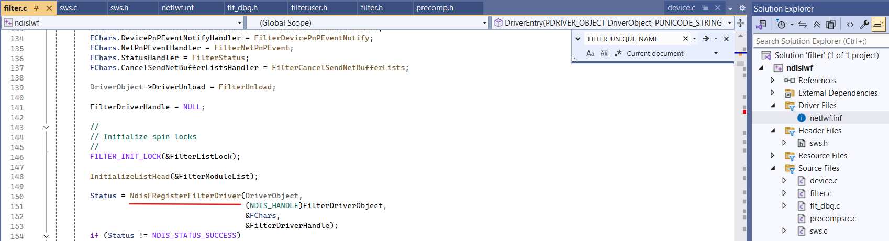
</a>
</p>
<div class="emphasizer_img_text">[ DriverEntry function for the LWF sample driver ]</div>
<br>
<hr class="line_1">
<br>
<p align="center">
<a href="../images/lfwbinding/image11.png" target="_blank">
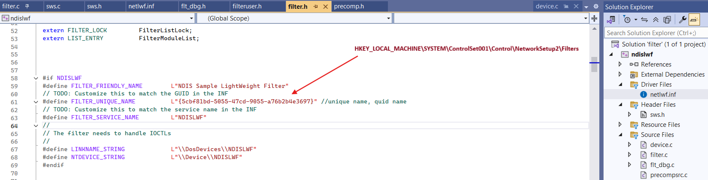
</a>
</p>
<div class="emphasizer_img_text">[ Definitions of the LWF sample driver ]</div>
<br>
Remeber that <span class="emphasizer_code_function_2">FILTER_UNIQUE_NAME</span> must match <span class="emphasizer_code_function_2">NetCfgInstanceId</span> in the <span class="emphasizer_code_function_2">INF</span> file for our <span class="emphasizer_code_function_2">LWF</span>:
<br>
```cpp
;-------------------------------------------------------------------------
; Installation Section
;-------------------------------------------------------------------------
[Install]
AddReg=Inst_Ndi
; All LWFs must include the 0x40000 bit (NCF_LW_FILTER). Unlike miniports, you
; don't usually need to customize this value.
Characteristics=0x40000
NetCfgInstanceId="{5cbf81bd-5055-47cd-9055-a76b2b4e3697}"

;-------------------------------------------------------------------------
; Ndi installation support
;-------------------------------------------------------------------------
[Inst_Ndi]
HKR, Ndi,FilterClass,, compression
HKR, Ndi,FilterType,0x00010001,2
; Do not change these values
HKR, Ndi\Interfaces,UpperRange,,"noupper"
HKR, Ndi\Interfaces,LowerRange,,"nolower"
HKR, Ndi\Interfaces, FilterMediaTypes,,"ethernet, wan, ppip"
```
<br>
When we register our <span class="emphasizer_code_function_2">LWF</span> invoking <span class="emphasizer_code_function_2">NdisFRegisterFilterDriver</span> it lands in <span class="emphasizer_code_function_2">NDIS.SYS</span> driver:
<br>
<p align="center">
<a href="../images/lfwbinding/image12.png" target="_blank">
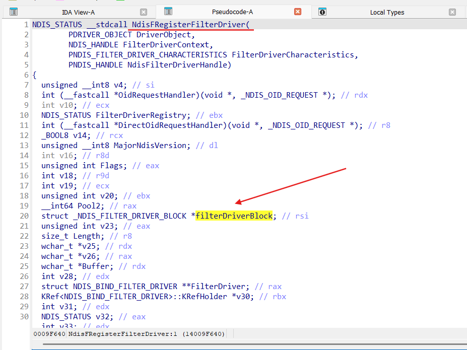
</a>
</p>
<div class="emphasizer_img_text">[ NdisFRegisterFilterDriver function in NDIS.SYS ]</div>
<br>
At the moment we invoke <span class="emphasizer_code_function_2">NdisFRegisterFilterDriver</span> function <span class="emphasizer_code_function_2">NDIS</span> already has buit all _binding_ information for our <span class="emphasizer_code_function_2">LWF</span> driver during its installation (via <span class="emphasizer_code_function_2">INF</span> file) by <span class="emphasizer_code_function_2">Ndis::BindRegistry::Reload</span> method. We get this _binding_ information in view of the <span class="emphasizer_code_function_2">NDIS_BIND_FILTER_DRIVER</span> object (via function <span class="emphasizer_code_function_2">ndisBindGetFilterDriver</span>):
<br>
<p align="center">
<a href="../images/lfwbinding/image12-0.png" target="_blank">
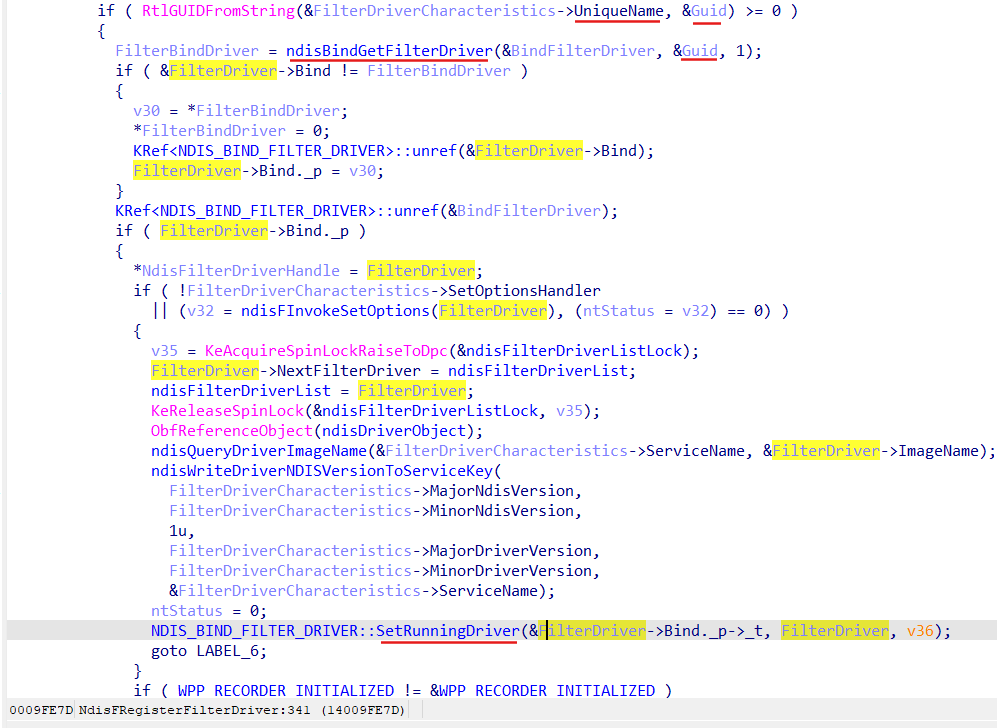
</a>
</p>
<div class="emphasizer_img_text">[ FILTER_UNIQUE_NAME for LWF]</div>
<br>
<span class="emphasizer_code_function_2">FilterDriverCharacteristics->UniqueName</span> here is our filter <span class="emphasizer_code_function_2">FILTER_UNIQUE_NAME = {5cbf81bd-5055-47cd-9055-a76b2b4e3697}</span>. 
<br>
<br>
And eventually <span class="emphasizer_code_function_2">NDIS</span> start attachment procedure for our <span class="emphasizer_code_function_2">LWF</span>:
<br>
<p align="center">
<a href="../images/lfwbinding/image21.png" target="_blank">
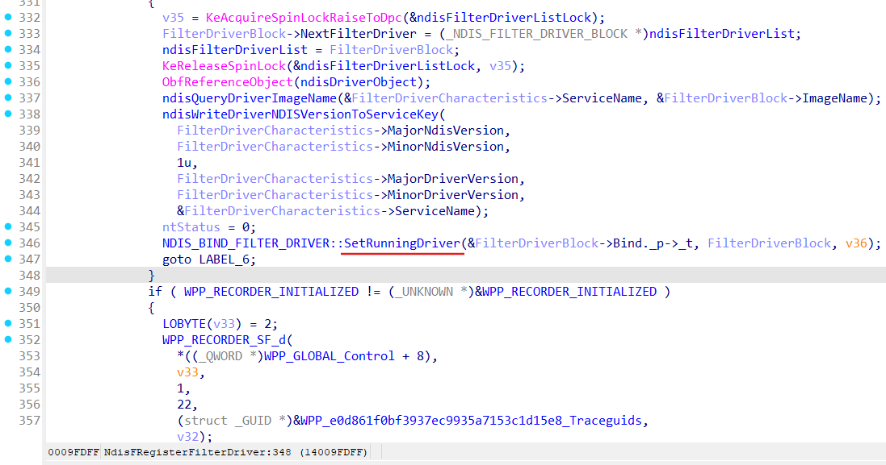
</a>
</p>
<div class="emphasizer_img_text">[ Starting of the attachment procedure in NdisFRegisterFilterDriver ]</div>
<br>
Function <span class="emphasizer_code_function_2">SetRunningDriver</span> set <span class="emphasizer_code_function_2">RunningDriver</span> as our <span class="emphasizer_code_function_2">LWF</span> and invokes <span class="emphasizer_code_function_2">SetRunningDriverIsReady</span>:
<br>
<p align="center">
<a href="../images/lfwbinding/image21-0.png" target="_blank">
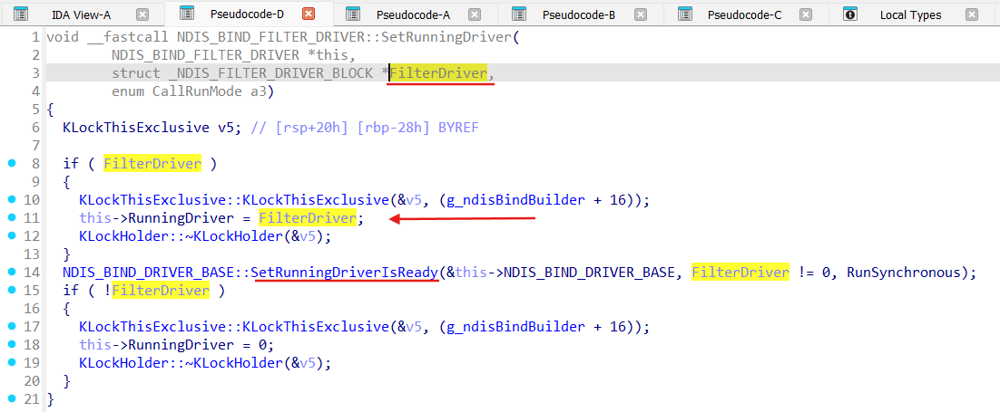
</a>
</p>
<div class="emphasizer_img_text">[ SetRunningDriver function ]</div>
<br>
<hr class="line_1">
<br>
<p align="center">
<a href="../images/lfwbinding/image22.png" target="_blank">
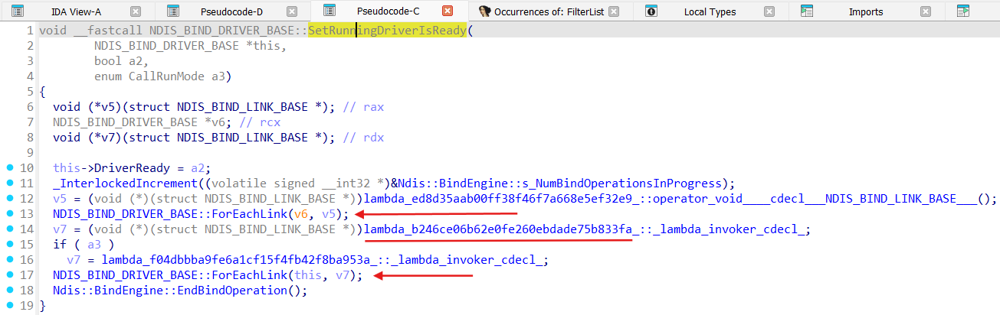
</a>
</p>
<div class="emphasizer_img_text">[ SetRunningDriverIsReady function ]</div>
<br>
Under the hood of the _lambda_ functions invoked by <span class="emphasizer_code_function_2">SetRunningDriverIsReady</span> effectively <span class="emphasizer_code_function_2">Ndis::BindEngine</span> gets run, especially <span class="emphasizer_code_function_2">ApplyBindChanges</span> method (here as <span class="emphasizer_code_function_2">RunSynchronous</span>):
<br>
<p align="center">
<a href="../images/lfwbinding/image23.png" target="_blank">

</a>
</p>
<div class="emphasizer_img_text">[ Invoking of the Ndis::BindEngine::ApplyBindChanges ]</div>
<br>
We already know that Ndis::BindEngine::ApplyBindChanges run actuall binding process by call to the <span class="emphasizer_code_function_2">Ndis::BindEngine::UpdateBindings</span> method which eventually leads to the <span class="emphasizer_code_function_2">Ndis::BindEngine::Iterate</span>, and all this sequence from the <span class="emphasizer_code_function_2">NdisFRegisterFilterDriver</span> lands in the <span class="emphasizer_code_function_2">ndisAttachFilter</span>:
<br>
<p align="center">
<a href="../images/lfwbinding/image24.png" target="_blank">
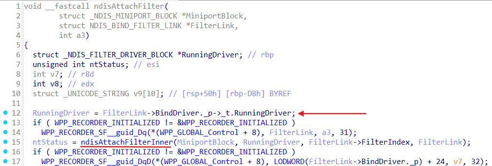
</a>
</p>
<div class="emphasizer_img_text">[ ndisAttachFilter function ]</div>
<br>


## ndisCheckForNdisTestBindingsOnAllMiniports


To control what <span class="emphasizer_code_function_2">LWFs</span> can attach to our <span class="emphasizer_code_function_2">Miniport</span> we should control <span class="emphasizer_code_function_2">HKLM\SYSTEM\ControlSet001\Control\NetworkSetup2\Interfaces{OUR-MINIPORT-GUID}\Kernel\FilterList</span> registry key, removing unwanted filters from the list (one of the possible ways):
- check if unwanted filters are already in the <span class="emphasizer_code_function_2">FilterList</span>, remove if so, issue something to trigger <span class="emphasizer_code_function_2">Ndis::BindRegistry::Reload</span>;
<br>

To trigger <span class="emphasizer_code_function_2">Ndis::BindRegistry::Reload</span> after modifications of the <span class="emphasizer_code_function_2">FilterList</span> magic _unexported_ function <span class="emphasizer_code_function_2">ndisCheckForNdisTestBindingsOnAllMiniports</span> can be invoked:
<br>
<p align="center">
<a href="../images/lfwbinding/image25.png" target="_blank">
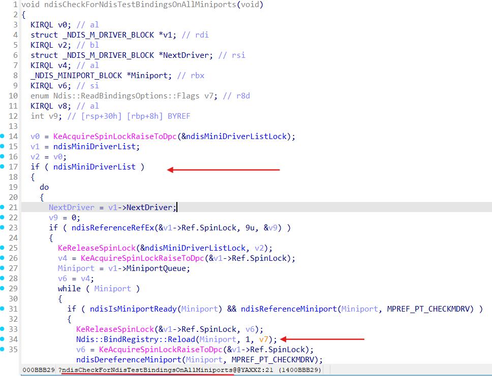
</a>
</p>
<div class="emphasizer_img_text">[ ndisCheckForNdisTestBindingsOnAllMiniports function ]</div>
<br>
This function despite it is _unexported_ can be invoked via <span class="emphasizer_code_function_2">NdisReEnumerateProtocolBindings</span> function:
<br>
<p align="center">
<a href="../images/lfwbinding/image26.png" target="_blank">
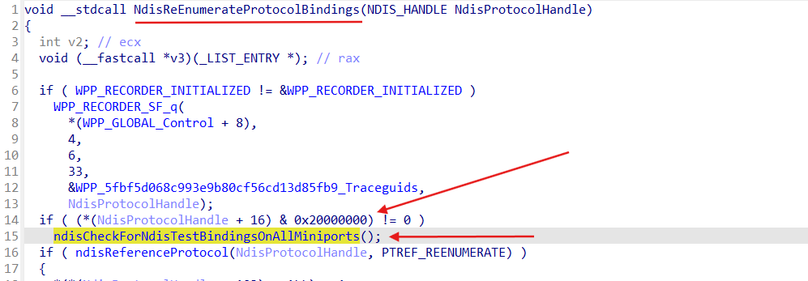
</a>
</p>
<div class="emphasizer_img_text">[ NdisReEnumerateProtocolBindings function ]</div>
<br>
<br>
There are more simple and robust ways to run <span class="emphasizer_code_function_2">Ndis::BindRegistry::Reload</span>, everything depends on the requirements:
- usage of the <span class="emphasizer_code_function_2">INetCfgComponentBindings::UnbindFrom</span> method __[__ [INetCfgComponentBindings](https://learn.microsoft.com/en-us/previous-versions/windows/hardware/network/ff547724(v=vs.85)) __]__;
- control the operations to the with help of the <span class="emphasizer_code_function_2">CmRegisterCallbackEx</span> with modification what can be stored, removing unwanted filters from the request __[__ [CmRegisterCallbackEx](https://learn.microsoft.com/en-us/windows-hardware/drivers/ddi/wdm/nf-wdm-cmregistercallbackex) __]__;
- issuing <span class="emphasizer_code_function_2">Refresh PnP</span> reguest for an adapter;
- .etc