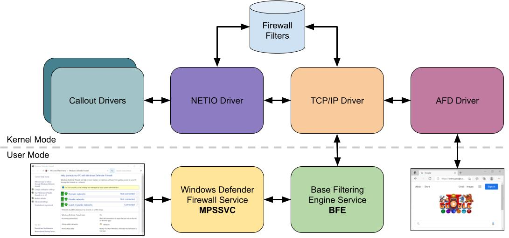
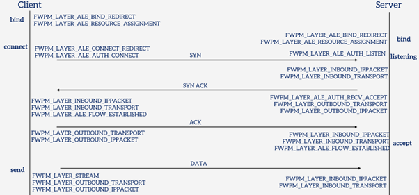
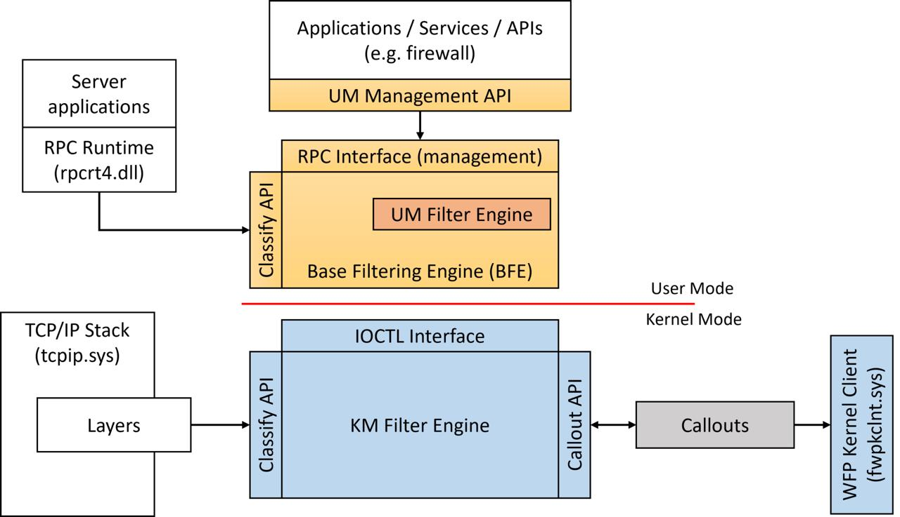
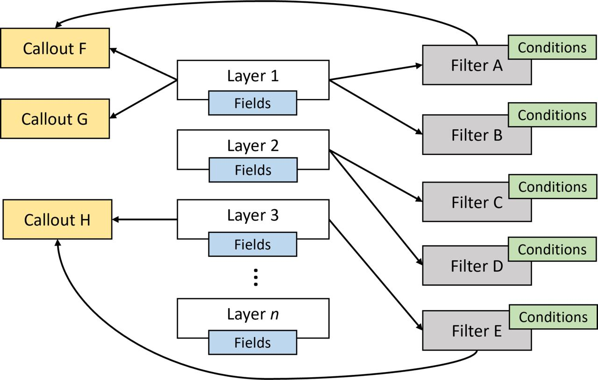
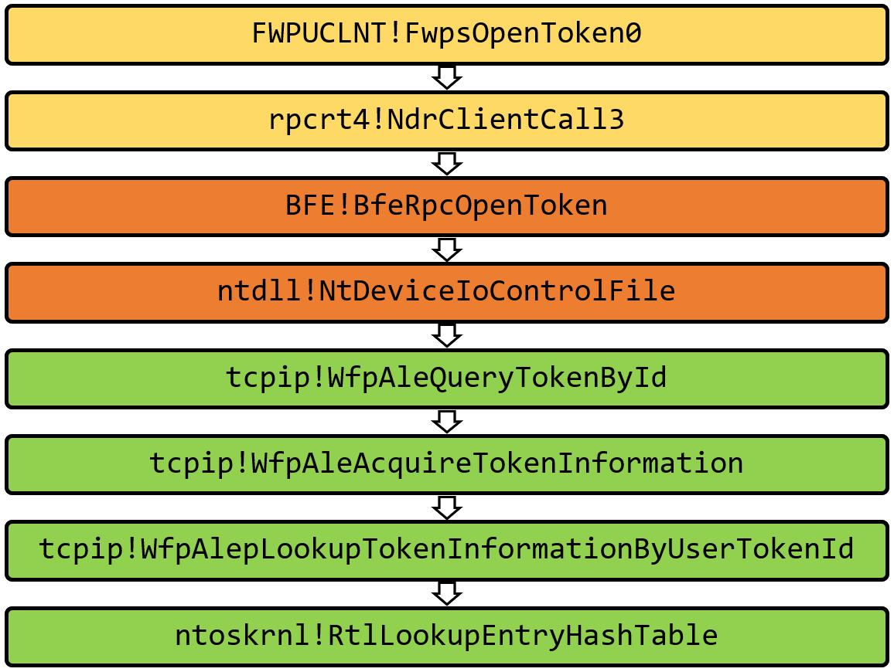
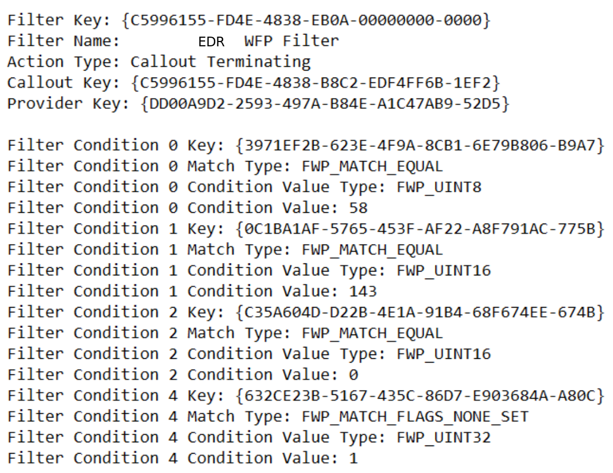
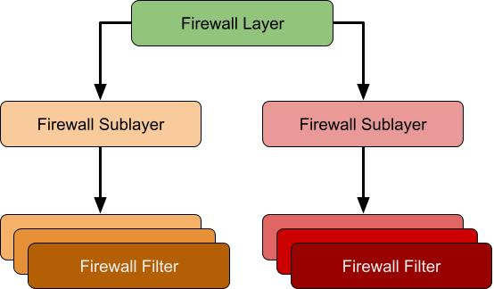
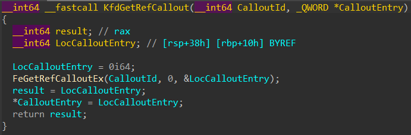

## INTRO

Windows Filtering Platform (<span class="emphasizer_code_function_2">WFP</span>) is a set of system services in Windows Vista and later that allows Windows software to process and filter network traffic ([https://learn.microsoft.com/en-us/windows/win32/fwp/windows-filtering-platform-start-page](https://learn.microsoft.com/en-us/windows/win32/fwp/windows-filtering-platform-start-page)).
<br>
<br>
<br>
Let’s figure out something about <span class="emphasizer_code_function_2">WFP</span>:

- [WFP](#wfp)
<br>
- [Finding WFP Callouts](#finding-wfp-callouts)
<br>
- [WFP And EDRSilencer](#WFP-and-edrsilencer)
<br>
- [WFP And EDRPrison](#edrprison)


## WFP

Overall <span class="emphasizer_code_function_2">WFP's</span> main components are:
<br>

<span class="emphasizer_code_function_2">Filter Engine (kernel mode)</span> — implemented in <span class="emphasizer_code_function_2">netio.sys</span>, the filter engine evaluates every network event against a set of registered filters. When a packet or connection event occurs, the engine walks through matching filters in weight order and produces a verdict: permit, block, or defer to a callout for further inspection.
<br>
<br>
<span class="emphasizer_code_function_2">Base Filtering Engine (BFE)</span> — a user-mode service (<span class="emphasizer_code_function_2">bfe.dll</span>, hosted in <span class="emphasizer_code_function_2">svchost.exe</span>) that acts as the policy store and management plane. <span class="emphasizer_code_function_2">BFE</span> owns the persistent filter database. When you add a firewall rule through Windows Firewall, Group Policy, or the <span class="emphasizer_code_function_2">Fwpm*</span> API, <span class="emphasizer_code_function_2">BFE</span> validates it, stores it, and pushes it down to the kernel filter engine. <span class="emphasizer_code_function_2">BFE</span> also manages provider and sublayer registration, enforces access control on filter objects, and handles transactions.
<br>
<br>
<span class="emphasizer_code_function_2">Callout Drivers</span> — kernel-mode drivers that register callout functions with the filter engine. When a filter's action is <span class="emphasizer_code_function_2">"callout"</span> rather than simple permit/block, the engine invokes the registered callout, handing it the packet or connection metadata (and sometimes the raw data).
<br>
<br>
<span class="emphasizer_code_function_2">User-Mode API (fwpuclnt.dll)</span> — Win32 API for managing<span class="emphasizer_code_function_2">WFP</span> objects from user mode. Applications use <span class="emphasizer_code_function_2">FwpmEngineOpen</span>, <span class="emphasizer_code_function_2">FwpmFilterAdd</span>, <span class="emphasizer_code_function_2">FwpmSubLayerAdd</span>, and related functions to interact with BFE and, through it, the kernel filter engine.
<br>
<br>
<p align="center">
<a href="../images/wfp/wfp_arch.png" target="_blank">

</a>
</p>
<div class="emphasizer_img_text">[ WFP ARCHITECTURE ]</div>
<br>
<hr class="line_1">
<p align="center">
<a href="../images/wfp/wfp_tcp_flow.png" target="_blank">

</a>
</p>
<div class="emphasizer_img_text">[ WFP TCP FLOW ]</div>
<br>

Introduction to the Windows Filtering Platform (<span class="emphasizer_code_function_2">WFP</span>): 
<br>
[https://scorpiosoftware.net/2022/12/25/introduction-to-the-windows-filtering-platform](https://scorpiosoftware.net/2022/12/25/introduction-to-the-windows-filtering-platform/)
<br>
<p align="center">
<a href="../images/wfp/wfp_arch_1.png" target="_blank">

</a>
</p>
<div class="emphasizer_img_text">[ WFP ARCHITECTURE ]</div>
<br>
<br>
<hr class="line_1">
<p align="center">
<a href="../images/wfp/wfp_arch_2.png" target="_blank">

</a>
</p>
<div class="emphasizer_img_text">[ WFP LAYERS, FILTERS, CALLOUTS ]</div>
<br>

Evasive and privilege escalation technique that abuses the <span class="emphasizer_code_function_2">WFP</span> with the analysis of the various components of the <span class="emphasizer_code_function_2">WFP</span>:
<br>
[https://www.deepinstinct.com/blog/nofilter-abusing-windows-filtering-platform-for-privilege-escalation](https://www.deepinstinct.com/blog/nofilter-abusing-windows-filtering-platform-for-privilege-escalation)
<br>
<p align="center">
<a href="../images/wfp/wfp_0.png" target="_blank">

</a>
</p>
<div class="emphasizer_img_text">[ WFP TOKEN PATH ]</div>
<br>

Abusing <span class="emphasizer_code_function_2">WFP</span> for EDR Evasion:
<br>
[https://jacobkalat.com/edr-evasion/2025/02/12/WFP-Wizardry-Abusing-WFP-for-EDR-Evasion](https://jacobkalat.com/edr-evasion/2025/02/12/WFP-Wizardry-Abusing-WFP-for-EDR-Evasion.html)
<br>
<p align="center">
<a href="../images/wfp/wfpCallout.png" target="_blank">

</a>
</p>
<div class="emphasizer_img_text">[ WFP CALLOUT FILTERS ]</div>
<br>

Network Access in Windows AppContainers:
<br>
[https://projectzero.google/2021/08/understanding-network-access-windows-app](https://projectzero.google/2021/08/understanding-network-access-windows-app.html)
<br>
<p align="center">
<a href="../images/wfp/wfp_1.png" target="_blank">

</a>
</p>
<div class="emphasizer_img_text">[ WFP FW LAYERS ]</div>
<br>

Guided tour inside WinDefender’s network inspection <span class="emphasizer_code_function_2">WFP</span> driver:
<br>
[https://blog.quarkslab.com/guided-tour-inside-windefenders-network-inspection-driver](https://blog.quarkslab.com/guided-tour-inside-windefenders-network-inspection-driver.html)


## Finding WFP Callouts

<span class="emphasizer_code_function_2">WFP</span> callouts are functions that are registered by kernel mode <span class="emphasizer_code_function_2">WFP</span> filters with the networking stack (<span class="emphasizer_code_function_2">NETIO.sys</span>). Here is the technique to find a list of <span class="emphasizer_code_function_2">WFP</span> callouts registered on the system.

A driver registers a callout with the filter engine using Reversing <span class="emphasizer_code_function_2">FwpsCalloutRegister</span>:

```c
typedef struct FWPS_CALLOUT0_ 
{
  GUID                                calloutKey;
  UINT32                              flags;
  FWPS_CALLOUT_CLASSIFY_FN0           classifyFn;
  FWPS_CALLOUT_NOTIFY_FN0             notifyFn;
  FWPS_CALLOUT_FLOW_DELETE_NOTIFY_FN0 flowDeleteFn;
} FWPS_CALLOUT0;
```

Reversing <span class="emphasizer_code_function_2">FwpsCalloutRegister</span> we will end up with the following sequence of calls :

```c
fwpkclnt!FwpsCalloutRegister -> fwpkclnt!FwppCalloutRegister -> NETIO!KfdAddCalloutEntry -> NETIO!FeAddCalloutEntry
```

The variable <span class="emphasizer_code_function_2">netio!gWfpGlobal</span> is the starting point for most WFP data structures.
And there's <span class="emphasizer_code_function_2">FeGetWfpGlobalPtr</span> function exported by <span class="emphasizer_code_function_2">NETIO.SYS</span> that will return the address of <span class="emphasizer_code_function_2">gWfpGlobal</span>:

```c
__int64 FeGetWfpGlobalPtr()
{
    return gWfpGlobal;
}
```


```c
0: kd> dp   netio!gWfpGlobal L1
fffff880`017536a0  fffffa80`03718000 ;pointer to the WFP global structure
```

The number of callouts and the pointer the array of callout structures is stored in this global table. To find the offset of these fields:

```c
0: kd> u netio!FeInitCalloutTable
NETIO!FeInitCalloutTable:
fffff880`01732a60 fff3            push    rbx
fffff880`01732a62 4883ec20        sub     rsp,20h
fffff880`01732a66 488b05330c0200  mov     rax,qword ptr [NETIO!gWfpGlobal (fffff880`017536a0)]
fffff880`01732a6d 33c9            xor     ecx,ecx
fffff880`01732a6f ba57667043      mov     edx,43706657h
fffff880`01732a74 48898848050000  mov     qword ptr [rax+548h],rcx ;Offset of number of Entries
fffff880`01732a7b 48898850050000  mov     qword ptr [rax+550h],rcx ;Offset of pointer to array of callout structures
fffff880`01732a82 4c8b05170c0200  mov     r8,qword ptr [NETIO!gWfpGlobal (fffff880`017536a0)]
```

The find the number of built in layers and the pointer to the array of callout structures:

```c
0: kd> dq fffffa80`03718000 + 548 L1
fffffa80`03718548  00000000`0000011e ;number of entries

0: kd> dps fffffa80`03718000 + 550 L1
fffffa80`03718550  fffffa80`0509c000 ;Pointer to array of callout structures
```

To confirm that callout array pointer is correct:

```c
0: kd> !pool fffffa80`0509c000 
Pool page fffffa800509c000 region is Nonpaged pool
*fffffa800509c000 : large page allocation, Tag is WfpC, size is 0x4790 bytes
            Pooltag WfpC : WFP callouts, Binary : netio.sys
```

To find the size of each structure in this array:

```c
0: kd>  u NETIO!InitDefaultCallout
NETIO!InitDefaultCallout:
fffff880`01730230 fff3            push    rbx
fffff880`01730232 4883ec20        sub     rsp,20h
fffff880`01730236 4c8d05ab320200  lea     r8,[NETIO!gFeCallout (fffff880`017534e8)]
fffff880`0173023d ba57667043      mov     edx,43706657h
fffff880`01730242 b940000000      mov     ecx,40h ;size of each entry in the array allocated from NPP
fffff880`01730247 e8f4eefdff      call    NETIO!WfpPoolAllocNonPaged (fffff880`0170f140) 
fffff880`0173024c 488bd8          mov     rbx,rax
fffff880`0173024f 4885c0          test    rax,rax
```

But there is also more elegant way to find _callouts entries_ : there’s an _undocumented export_ named <span class="emphasizer_code_function_2">NETIO!KfdGetRefCallout</span>, it can be used to get a pointer to the callout entry structure associated with a specific callout id, without using any offsets.
<br>
<p align="center">
<a href="../images/wfp/wfp_4.png" target="_blank">

</a>
</p>
<div class="emphasizer_img_text">[ NETIO!KfdGetRefCallout ]</div>
<br>

Implementation is here: [WFPCalloutReserach](https://github.com/0mWindyBug/WFPCalloutReserach)

More info is here: [WFPCalloutReserach](https://0mwindybug.github.io/WFP/)

## WFP And EDRSilencer


<span class="emphasizer_code_function_2">EDRSilencer</span> is the red team tool that leverages <span class="emphasizer_code_function_2">WFP</span> to block <span class="emphasizer_code_function_2">AV/EDR</span> telemetry reports.

<span class="emphasizer_code_function_2">EDRSilencer</span> uses the documented <span class="emphasizer_code_function_2">Fwpm*</span> user-mode API:

- Enumerate running processes — <span class="emphasizer_code_function_2">CreateToolhelp32Snapshot + Process32Next</span> to walk the process list, matching against a hardcoded table of known EDR executable names
<br>
- Obtain the <span class="emphasizer_code_function_2">WFP app ID</span> — for each matched EDR process, construct the <span class="emphasizer_code_function_2">FWP_BYTE_BLOB</span> application identifier that <span class="emphasizer_code_function_2">WFP</span> uses for per-application filtering. The standard API <span class="emphasizer_code_function_2">FwpmGetAppIdFromFileName0</span> calls <span class="emphasizer_code_function_2">CreateFileW</span> internally to open the target executable, which can fail if the EDR's minifilter denies handle creation to its own processes.  <span class="emphasizer_code_function_2">EDRSilencer</span> works around this by constructing the <span class="emphasizer_code_function_2">app ID blob</span> manually — converting the _NT device path_ format without ever touching <span class="emphasizer_code_function_2">CreateFileW</span>
<br>
- Add blocking filters — for each EDR process, add <span class="emphasizer_code_function_2">FWP_ACTION_BLOCK</span> filters on both <span class="emphasizer_code_function_2">FWPM_LAYER_ALE_AUTH_CONNECT_V4</span> and <span class="emphasizer_code_function_2">FWPM_LAYER_ALE_AUTH_CONNECT_V6</span>, conditioned on the <span class="emphasizer_code_function_2">app ID</span>. The filter weight is set to maximum to ensure the block takes precedence over any permit filters in the same sublayer
<br>
- Persist the filters — the filters are added as persistent (not <span class="emphasizer_code_function_2">FWPM_SESSION_FLAG_DYNAMIC</span>), so they survive across reboots. Even if <span class="emphasizer_code_function_2">EDRSilencer</span> is discovered and removed, the blocking filters remain active until explicitly deleted
<br><br>
Implementation is here: [EDRSilencer](https://github.com/netero1010/EDRSilencer)


## EDRPrison

<span class="emphasizer_code_function_2">EDRPrison</span> leverages a legitimate <span class="emphasizer_code_function_2">WFP</span> callout driver, <span class="emphasizer_code_function_2">WinDivert</span>, to effectively silence EDR systems. 
<br>
<p align="center">
<a href="../images/wfp/wfp_3.png" target="_blank">

</a>
</p>
<div class="emphasizer_img_text">[ WFP WinDivert ]</div>
<br>
Unlike its predecessors, <span class="emphasizer_code_function_2">EDRPrison</span> installs and loads an external legitimate <span class="emphasizer_code_function_2">WFP</span> callout driver instead of relying solely on the built-in <span class="emphasizer_code_function_2">WFP</span>. <br><br>
Additionally, it blocks outbound traffic from EDR processes by dynamically adding runtime filters without directly interacting with the EDR processes or their executables.

Implementation is here: [EDRPrison](https://github.com/senzee1984/EDRPrison)

More info is here: [EDRPrison](https://www.3nailsinfosec.com/post/edrprison-borrow-a-legitimate-driver-to-mute-edr-agent)

