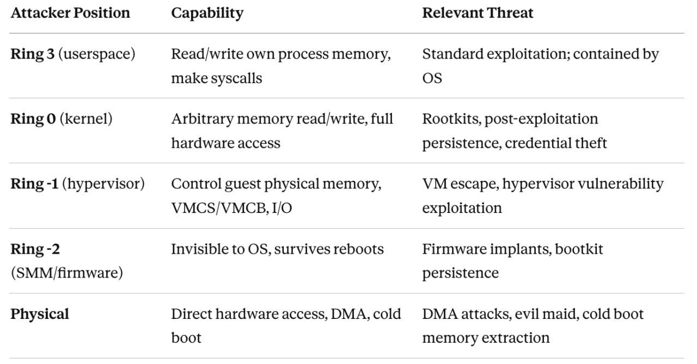
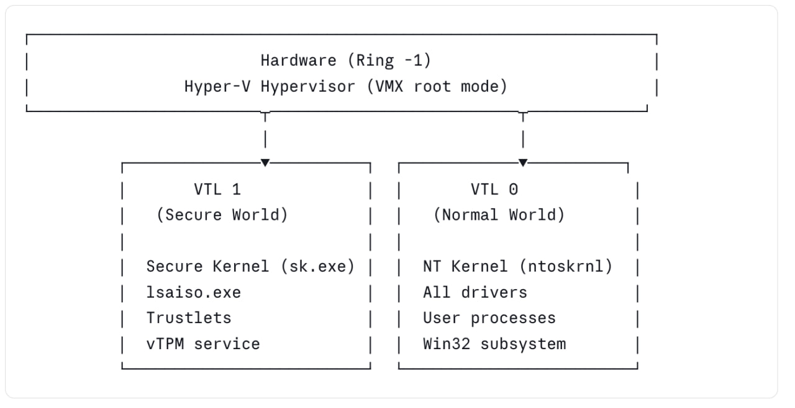

## INTRO

Virtualization-Based Security (__VBS__) has become one of the most significant architectural shifts in OS security of the past decade. 
The term itself is Microsoft's — it describes a family of Windows security features that use the __Hyper-V__ hypervisor to create isolated memory regions that the Windows kernel itself cannot tamper with. 
But the underlying ideas — using hardware virtualization to enforce security invariants that the OS cannot subvert — appear in both ecosystems, in very different forms.

Let's describe and compare the modern security solutions on Windows and Linux:

- [Threat Model](#threat-model)
<br>
- [Windows VBS Architecture](#windows-vbs-architecture)
<br>
- [Linux Security Architecture](#linux-security-architecture)
<br>
- [Confidential Computing](#confidential-computing)
<br> 
- [Side-by-Side Comparison](#side-by-side-comparison)
<br>
- [Deployment Context Analysis](#deployment-context-analysis)
<br>
- [The Architectural Philosophy Difference](#the-architectural-philosophy-difference)
<br>
- [References](#references)

<br>
<br>

## Threat Model

<br>
<p align="center">
<a href="../images/vbswinlin/vbs_0.jpg" target="_blank">

</a>
</p>
<div class="emphasizer_img_text">[ Threat Model ]</div>
<br>

A classical OS security model (__pre-VBS__) only meaningfully defends __ring-3__ attackers. Kernel compromise is game over: the attacker owns memory, can patch code, dump credentials from __LSASS__, install unsigned drivers, disable security telemetry. 
The OS kernel is both the security enforcer and the attack target — _a fundamental conflict of interest_.
VBS on Windows resolves this by moving the security enforcement boundary below the OS kernel. The _hypervisor_ becomes the _enforcer_; the __NT kernel__ becomes just another guest that cannot escape its constraints even with full __ring-0__ access.
Linux's security philosophy is different in emphasis: invest heavily in preventing kernel compromise in the first place, and use hardware features to make compromise harder rather than to contain post-compromise attackers. These both approaches have genuine merit and genuine blind spots.

<br>
<br>

## Windows VBS Architecture

### Virtual Trust Levels (VTLs)

The foundational concept in Windows __VBS__ is the __Virtual Trust Level__. 
VTLs are an abstraction layer provided by the Microsoft __Hyper-V__ hypervisor, layered on top of standard __x86/ARM__ virtualization privilege levels (VMX root/non-root, exception levels on ARM).

<br>
<p align="center">
<a href="../images/vbswinlin/vbs_1.jpg" target="_blank">

</a>
</p>
<div class="emphasizer_img_text">[ Windows VBS ]</div>
<br>

The hypervisor enforces the __VTL__ boundary via _Second Level Address Translation_ (__SLAT__ — Intel EPT or AMD NPT). 
__VTL1__ can mark physical memory pages as inaccessible to __VTL0__ regardless of what page tables the NT kernel constructs. 
The NT kernel cannot see __VTL1__ memory even with <span class="emphasizer_code_function_2">MmMapIoSpace</span>, <span class="emphasizer_code_function_2">MmGetPhysicalAddress</span>, or any other kernel API. The constraint is enforced in hardware.
__VTL__ transitions (__VTL 0 → VTL 1__ and back) go through the hypervisor. There is no direct call gate. This means __VTL1__ code is protected not just from kernel memory reads, but from arbitrary code injection — __VTL1__ controls its own entry points entirely.
One critical architectural decision: on Secured-core PCs, __VTL1__ is initialized _before_ the NT kernel boots. The __Secure Kernel__ establishes the __SLAT__ restrictions, verifies the NT kernel image, and then releases control. This means even a compromised bootloader cannot retroactively disable __VBS__ without being visible to the __Secure Kernel__'s measurement chain.

### Hypervisor-Protected Code Integrity (HVCI)

__HVCI__ is arguably the most significant individual component of Windows __VBS__ from a kernel security standpoint. 
Its purpose is to ensure that the NT kernel can only execute code that has been cryptographically verified — and to make this guarantee hold even if the kernel itself is compromised.

The mechanism:

 - At boot, the Secure Kernel (__VTL1__) configures __SLAT__ so that no physical page is simultaneously writable and executable from __VTL0__'s perspective.
 - When the NT kernel needs to make a page executable (for __JIT__ output, driver loading, etc.), it must ask the __Secure Kernel__ via a __hypercall__.
 - The __Secure Kernel__ (running in __VTL1__) evaluates the request: is this page backed by a signed, Microsoft-approved image? Does it pass __KMCI__ (Kernel Mode Code Integrity) policy?
 - If yes, the __Secure Kernel__ updates the __SLAT__ entry to grant execute permission. 
 - If no, the request is denied and the NT kernel cannot execute that code.
 The critical implication: even if an attacker achieves arbitrary kernel write (via a driver vulnerability, a race condition in a kernel subsystem, a memory corruption bug), they cannot make their payload executable. The __W^X__ (Write XOR Execute) invariant is enforced at the __SLAT__ level, which the NT kernel cannot modify. This closes the entire class of kernel shellcode injection attacks.
__HVCI__ also enforces that all kernel-mode drivers must be Microsoft-signed. An unsigned driver cannot be loaded, even by kernel code attempting to manually map it, because the resulting pages will never receive execute permission from the __Secure Kernel__.

__HVCI__ does not protect against: data-only attacks. An attacker who can write to kernel data structures — token values, process privilege flags, __EPROCESS__ fields — and achieve privilege escalation purely through data manipulation is not stopped by __HVCI__. This is a known limitation and an active research area. 
Return-oriented programming (__ROP__) chains using already-mapped kernel code are also not directly stopped (though __PatchGuard__ and __Control Flow Guard__ add additional friction).

### Kernel Data Protection (KDP)

__KDP__ extends the VBS model from code integrity to data integrity. Introduced in Windows 10 2004, KDP allows kernel components and drivers to mark memory regions as _read-only_ via __SLAT__ — enforced by the __Secure Kernel__.

There are two forms:
 - Static KDP: A driver or kernel subsystem marks a region read-only at initialization time. The region cannot be modified afterward from __VTL0__, ever. Used for driver configuration structures, policy blobs, and security-critical kernel data.
 - Dynamic KDP (via <span class="emphasizer_code_function_2">VslMarkInaccessiblePages</span>): A page can be made write-protected dynamically.

From a practical security standpoint, __KDP__ closes data-only attack paths against protected structures. __Credential Guard__ uses __KDP__ to protect its memory-mapped communication interface. __WDAC__ policy blobs are __KDP__-protected. An attacker who modifies these from __VTL0__ cannot succeed — the write simply faults.
Compare this to Linux's <span class="emphasizer_code_function_2">__ro_after_init</span> attribute, which marks kernel data read-only after initialization using standard page table permissions. It is effective against software bugs and accidental modification, but a kernel-level attacker who can manipulate page tables can bypass it. HVCI-enforced KDP cannot be bypassed from VTL 0 because the SLAT is not modifiable from VTL 0 by definition.

### Credential Guard

__Credential Guard__ is the most visible end-user feature of VBS. It isolates the Windows Local Security Authority (__LSA__) process — the component responsible for authentication, credential storage, and Kerberos ticket management — into __VTL1__ as a trustlet (__lsaiso.exe__, LSA Isolated).
The normal __LSA__ (lsass.exe) continues running in __VTL0__ as a stub. When operations requiring credential material are needed, __lsass.exe__ makes requests to lsaiso.exe via a secure communication channel mediated by the __Secure Kernel__. The actual NTLM hashes, Kerberos TGTs, and derived key material never exist in __VTL0__ memory.
The entire class of __LSASS__ memory dumping attacks is defeated. An attacker with full kernel-level access to __VTL0__ cannot read __VTL1__ memory. The credentials are physically inaccessible.

Credential Guard does not protect: on-disk credential stores (SAM, NTDS.dit), credentials that flow through VTL 0 during network authentication, and smart-card-based credentials in some configurations. It specifically targets the in-memory credential cache problem, which is the primary enabler of lateral movement in pass-the-hash and pass-the-ticket attacks.

### Secure Launch and DRTM

__VBS__'s security guarantees are only meaningful if the __VBS__ initialization itself was not tampered with. This is the problem __Secure Launch__ (also called __DRTM__ — Dynamic Root of Trust for Measurement) addresses.
Traditional Secure Boot establishes a static root of trust: the firmware verifies the bootloader, which verifies the OS kernel. This chain is established before any security software can observe it and depends entirely on firmware integrity. Firmware-level attacks (__DXE__ driver tampering, __UEFI__ rootkits) can subvert it.
__DRTM__ uses CPU hardware capabilities — __Intel TXT__ or __AMD SKINIT__ — to create a late launch event that cryptographically measures the hypervisor and OS loader in a way that is independent of firmware and verifiable via __TPM PCR__ values. Even if the firmware is compromised, the __TPM__ measurements taken during __DRTM__ accurately reflect what is actually running.
On Secured-core PCs, __DRTM__ measurements are chained into the __vTPM__ maintained by the __Secure Kernel__ in __VTL1__, producing an attestable chain from hardware measurement through hypervisor initialization through __Secure Kernel__ boot. Remote attestation can verify this entire chain.

### Windows Defender Application Control (WDAC)

__WDAC__ is the Windows kernel's code execution policy enforcement mechanism. 
It operates via the Kernel Mode Code Integrity (__KMCI__) subsystem, which is in turn backed by __HVCI__ when __VBS__ is enabled.
__WDAC__ policy is expressed as a structured __XML__ document, compiled to a binary blob (__SIPolicy.p7b__), and enforced by the kernel at image load time. Policies can allow/deny execution based on: publisher signature, file hash, file path (with caveats), __PE__ attributes, and managed installer rules.
When __VBS__ is enabled, the active __WDAC__ policy blob is __KDP__-protected — it cannot be modified at runtime even by kernel-level code. This is a key distinction from earlier __AppLocker__-based policies which were enforced by userspace processes that a kernel-level attacker could trivially disable.

<br>
<br>

## Linux Security Architecture

Linux does not have __VBS__. It has no hypervisor-enforced code integrity boundary for the host kernel. 
What it does have is a layered set of mechanisms that together address overlapping (but not identical) threat surfaces. 

### Kernel Lockdown LSM

Kernel __Lockdown__ (merged in Linux 5.4) is an LSM (Linux Security Module) that restricts what root-privileged userspace code can do to the running kernel. 
It has two modes:

 - Integrity mode: Prevents userspace from modifying the running kernel. Blocks __/dev/mem__, __/dev/kmem__, raw __I/O__ port access (__ioperm/iopl__), __PCI BAR__ writes, loading unsigned kernel modules, kexec_load with unsigned images, hibernation (to prevent cold-boot attacks on RAM content), and debugfs interfaces that expose kernel internals.
 - Confidentiality mode: Additionally restricts access to kernel memory that could expose secrets — __PCIe__ config space, certain __ACPI__ table access patterns, kernel core dumps.

__Lockdown__ is automatically enabled when __UEFI Secure Boot__ is active (if the kernel was built with __CONFIG_LOCK_DOWN_IN_EFI_SECURE_BOOT__), creating a chain: firmware verifies bootloader verifies kernel, and the running kernel refuses to load unsigned code or expose modification interfaces.

Critical distinction from __HVCI__: __Lockdown__ is enforced by the kernel itself. A kernel-level attacker who has compromised the kernel can disable Lockdown by overwriting the relevant kernel data structures. It is a prevention mechanism, not a post-compromise containment mechanism. A sufficiently privileged attacker (_kernel RW primitive_) defeats it. __HVCI__ cannot be defeated this way.

### Integrity Measurement Architecture (IMA) and EVM

__IMA__ is a kernel subsystem that measures files before they are accessed and extends the measurements into __TPM PCR__s. 
This creates an auditable log of what code and data the kernel has loaded, verifiable by a remote attestation service.
__IMA__ operates through __LSM__ hooks at __mmap__, __file_open__, __bprm_check_security__, and similar points. For each measured file, it computes a hash, extends it into a __TPM PCR__, and (optionally) logs the event. __IMA appraisal__ mode goes further: it checks that the hash of a file matches a hash stored in an extended attribute (__security.ima__), effectively providing file-level integrity enforcement.

__EVM__ (Extended Verification Module) protects the __IMA__ security.ima extended attributes themselves against tampering, using an __HMAC__ keyed from a __TPM__-sealed key or an asymmetric signature. Without __EVM__, an attacker who can write to filesystem extended attributes could bypass __IMA appraisal__.
In practice, __IMA__ + __EVM__ + __TPM__-backed key provides a measurement and appraisal stack that:

 - Detects (via attestation) any unauthorized modification to measured binaries
 - Prevents execution of files whose IMA hash does not match the stored value (in enforce mode)
 - Roots trust in the TPM, not just the running kernel

This is conceptually related to what __Windows DRTM__ + __Secure Boot__ achieves, but without the hypervisor-enforced boundary. The measurement integrity is as strong as the __TPM__; the enforcement integrity is as strong as the kernel (which is weaker).

### Integrity Policy Enforcement (IPE)

__IPE__ was merged into the Linux kernel in version 6.9 and represents the closest Linux analog to Windows __WDAC__. It is a new __LSM__ that enforces a policy-based code execution model at the kernel level.
__IPE__ policy is expressed in a simple declarative language and loaded into the kernel via a securityfs interface. Policy statements describe properties of files (__dm-verity__ rooted integrity, __IMA__ signature, specific digest) and operations (kernel module loading, executable mapping, script interpretation).

This policy would deny execution of any binary not backed by a __dm-verity__ verified volume or without a passing __IMA appraisal__. The kernel enforces this policy at __mmap/execve__ time via __LSM__ hooks:

```c
policy_name="production" policy_version=0.0.1
DEFAULT action=DENY

op=EXECUTE dmverity_rooted=TRUE action=ALLOW
op=KMODULE dmverity_rooted=TRUE action=ALLOW
op=EXECUTE appraise_result=pass action=ALLOW
```

Key differences from __WDAC__: __IPE__'s policy is not yet __KDP__-equivalent (cannot be protected against kernel-level modification in the same hardware-enforced way), and __IPE__ is newer and less battle-tested. But architecturally, it demonstrates that Linux is moving toward the same kernel-enforced execution policy model that Windows has had since __Device Guard__.

### eBPF LSM and Programmable Security Policy

Linux's __eBPF LSM__ (introduced in 5.7) enables security policy to be expressed as verified __eBPF__ programs attached to __LSM__ hooks. This has no equivalent in Windows.

A __eBPF LSM__ program:

 - Is written in restricted C, compiled to eBPF bytecode
 - Is formally verified by the kernel's eBPF verifier before loading: no unbounded loops, no invalid memory access, no side channels (with some nuance)
 - Attaches to any LSM hook: __file_open__, __bprm_check__, __socket_connect__, __task_kill__, etc.
 - Executes in kernel context with access to kernel data structures via eBPF helper functions
 - Can be loaded and unloaded at runtime without kernel modules or reboots

For security product development — __EDR__ sensors, policy enforcement engines, behavioral monitoring — __eBPF LSM__ is extraordinarily powerful. You can implement per-process network policy, file access auditing, syscall argument inspection, and privilege escalation detection all as verified kernel programs that cannot crash the kernel and require no kernel module signing.
The security risk is symmetric: __eBPF__ programs run in kernel context and bugs in the __eBPF__ verifier have historically been a significant kernel exploitation surface. The verifier ensures memory safety of the __eBPF__ program, not correctness of the security logic. A __eBPF LSM__ program that incorrectly allows an operation will silently fail open.

### Kernel Hardening: CONFIG_STRICT_KERNEL_RWX and others

Linux's kernel hardening configuration options implement software-enforced __W^X__ and related invariants:

- __CONFIG_STRICT_KERNEL_RWX__: Kernel text is read-only and executable; kernel data is non-executable. Mapped via standard page table permissions (no __SLAT__ backing).
- __CONFIG_STRICT_MODULE_RWX__: Same constraints applied to loaded kernel modules.
- __CONFIG_DEBUG_WX__: Warns if a W+X mapping is created at runtime.
- __CONFIG_RANDOMIZE_BASE__ (KASLR): Randomizes the kernel's virtual base address at boot. Weakens some exploitation primitives that rely on known kernel addresses.
- __CONFIG_INIT_ON_ALLOC_USER_PAGES / CONFIG_INIT_ON_FREE_PAGES__: Zero-initializes memory on allocation/free, preventing some information leaks.
- __CONFIG_CFI_CLANG__ (Control Flow Integrity via Clang): Forward-edge CFI — validates that indirect function calls target valid function entry points.
- __CONFIG_SHADOW_CALL_STACK__ (ARM64, Clang): Separate protected stack for return addresses, mitigating return address overwrites on ARM64 platforms.

These are all software-enforced. They significantly raise the bar for exploitation (particularly __KASLR__ + __CFI__ combinations) but a kernel write primitive can in principle bypass all of them given sufficient technique. That is the fundamental ceiling of kernel self-protection without a lower-privileged enforcement layer.

### seccomp

__seccomp__ (Secure Computing Mode) filters the set of system calls a process can make. In strict mode, only read, write, exit, and sigreturn are permitted. In filter mode (__seccomp-BPF__), a __eBPF__ program runs on each syscall and returns a verdict (__ALLOW__, __ERRNO__, __KILL__).
__seccomp__ is a powerful userspace sandboxing primitive used by Chrome, Firefox, systemd, container runtimes, and many security-sensitive applications. It complements but does not replace kernel integrity mechanisms — it reduces the syscall attack surface for compromised processes but does not contain a kernel-level attacker.

## Confidential Computing

Confidential computing solves a different problem from Windows __VBS__: rather than protecting the OS kernel from itself, it protects a __VM__'s memory from the hypervisor. 
This matters enormously in cloud environments where the hypervisor is operated by a cloud provider that tenants must trust.

### AMD SEV, SEV-ES, and SEV-SNP

AMD Secure Encrypted Virtualization is a hardware technology built into processors:

 - __SEV__: VM memory is encrypted with a per-VM key managed by the AMD Secure Processor (__AMD-SP__, a dedicated ARM Cortex-A5 running a TEE firmware). The hypervisor sees only ciphertext when accessing VM physical memory.
 - __SEV-ES__ (Encrypted State): Extends encryption to CPU register state on __VMEXIT__. The hypervisor cannot inspect register values during VM transitions.
 - __SEV-SNP__ (Secure Nested Paging): Adds integrity protection (not just confidentiality). The __AMD-SP__ enforces that physical pages belonging to a VM cannot be remapped by the hypervisor to inject attacker-controlled content. Adds reverse map table (__RMP__) validation at the hardware level. Supports remote attestation — a VM can cryptographically prove to a remote party what code is running, what the launch measurement is, and that the memory is protected by SEV-SNP.

 The Linux kernel has comprehensive __SEV-SNP__ guest support (enabling Linux to run as a confidential VM) and host support (enabling __KVM__ to run confidential VMs). Windows has some __SEV__ support as a guest but the implementation depth and attestation tooling is significantly behind the Linux ecosystem.

### Intel TDX (Trust Domain Extensions)

Intel TDX is Intel's equivalent technology. Trust Domains (__TD__) are __VM__ whose memory is encrypted and integrity-protected by the Intel Trust Domain Extensions hardware. The __VMM__ (hypervisor) cannot read or modify __TD__ memory; the hardware enforces this.
__TDX__ includes a remote attestation mechanism (Intel SGX-derived, using Intel's Provisioning Certification Service) that allows a __TD__ to prove its identity and launch measurement to a remote verifier without trusting the host platform.

Linux was the first OS with comprehensive __TDX__ guest and host (__KVM__) support. The __TDX__ Linux guest patches landed in 6.7/6.8. Microsoft has announced Windows TDX guest support but it trails.

### ARM CCA (Confidential Compute Architecture)

__ARM CCA__ introduces Realms — hardware-isolated __VM__-like containers that the hypervisor cannot inspect, enforced by the Realm Management Monitor (__RMM__) running at __EL2__. 
This is the __ARM__ equivalent of __AMD SEV-SNP/Intel TDX__.
__Linux/KVM__ is the primary OS/hypervisor target for __CCA__. ARM itself develops and maintains the reference __RMM__ implementation in collaboration with the Linux ecosystem.

<br>
<br>

## Side-by-Side Comparison

### Core Security Properties


<style>
*{box-sizing:border-box;margin:0;padding:0}
body{font-family:var(--font-sans)}
.wrap{padding:1.5rem 0}
.title-row{display:flex;align-items:center;gap:12px;margin-bottom:1.25rem}
.title-row h2{font-size:15px;font-weight:500;color:var(--color-text-primary)}
.grid{width:100%;border-collapse:collapse;font-size:13px}
.grid thead th{padding:10px 14px;font-weight:500;font-size:12px;letter-spacing:.03em;text-transform:uppercase;border-bottom:1.5px solid var(--color-border-secondary)}
.grid thead th:first-child{text-align:left;color:var(--color-text-secondary);width:22%}
.grid thead th.col-w{color:#0C447C;width:39%}
.grid thead th.col-l{color:#085041;width:39%}
.grid tbody tr{border-bottom:0.5px solid var(--color-border-tertiary)}
.grid tbody tr:last-child{border-bottom:none}
.grid tbody td{padding:11px 14px;vertical-align:top;line-height:1.55}
.prop{font-weight:500;font-size:12px;color:var(--color-text-secondary)}
.cell-w{color:var(--color-text-primary)}
.cell-l{color:var(--color-text-primary)}
.tag{display:inline-block;font-size:11px;font-weight:500;padding:2px 8px;border-radius:4px;margin-bottom:5px;line-height:1.5}
.tag-w{background:#E6F1FB;color:#0C447C}
.tag-l{background:#E1F5EE;color:#085041}
.tag-none{background:#F1EFE8;color:#5F5E5A}
.tag-strong{background:#EAF3DE;color:#3B6D11}
.sub{font-size:12px;color:var(--color-text-secondary);margin-top:3px}
.badge-lead{display:inline-flex;align-items:center;gap:4px;font-size:11px;font-weight:500;padding:2px 7px;border-radius:4px;margin-left:6px;vertical-align:middle}
.w-lead{background:#E6F1FB;color:#185FA5}
.l-lead{background:#E1F5EE;color:#0F6E56}
.col-label{display:flex;align-items:center;justify-content:center;gap:8px}
.os-icon{width:22px;height:22px;border-radius:4px;display:inline-flex;align-items:center;justify-content:center}
</style>
<div class="wrap">
  <table class="grid" role="table" aria-label="Security property comparison between Windows VBS and Linux">
    <thead>
      <tr>
        <th class="col-prop" style="text-align:left;color:var(--color-text-secondary);font-size:12px;letter-spacing:.03em">Property</th>
        <th class="col-w" style="text-align:left">
          <div class="col-label" style="justify-content:flex-start;gap:7px">
            <svg width="16" height="16" viewBox="0 0 24 24" fill="#185FA5" aria-hidden="true"><path d="M3 5.5L11.5 4v8H3V5.5zm0 13L11.5 20v-8H3v6.5zm9.5 1.7L21 22V12h-8.5v8.2zm0-17.4V12H21V2L12.5 3.3z"/></svg>
            Windows VBS
          </div>
        </th>
        <th class="col-l" style="text-align:left">
          <div class="col-label" style="justify-content:flex-start;gap:7px">
            <svg width="16" height="16" viewBox="0 0 24 24" aria-hidden="true"><path d="M12 2C6.48 2 2 6.48 2 12s4.48 10 10 10 10-4.48 10-10S17.52 2 12 2zm-1 14H9V8h2v8zm4 0h-2V8h2v8z" fill="#0F6E56"/></svg>
            Linux
          </div>
        </th>
      </tr>
    </thead>
    <tbody>
      <tr>
        <td class="prop">Kernel code integrity</td>
        <td class="cell-w">
          <span class="tag tag-w">HVCI</span><br>
          Hypervisor-enforced W^X via SLAT (EPT/NPT). Secure Kernel in VTL1 owns page execute permissions. Cannot be bypassed from ring 0 — even with arbitrary kernel write.
        </td>
        <td class="cell-l">
          <span class="tag tag-none">CONFIG_STRICT_KERNEL_RWX</span><br>
          Software-enforced via standard page tables. Bypassable with a kernel write primitive that can manipulate PTE entries.
        </td>
      </tr>
      <tr>
        <td class="prop">Kernel data protection</td>
        <td class="cell-w">
          <span class="tag tag-w">KDP</span><br>
          SLAT-backed read-only data regions. NT kernel cannot modify them regardless of privilege. Used for WDAC policy blobs, Credential Guard comm buffers.
        </td>
        <td class="cell-l">
          <span class="tag tag-none">__ro_after_init</span><br>
          Page table-based; write-protected after init. Bypassable via kernel page table manipulation with sufficient exploit primitive.
        </td>
      </tr>
      <tr>
        <td class="prop">Credential / secret isolation</td>
        <td class="cell-w">
          <span class="tag tag-w">Credential Guard</span><br>
          LSA runs as a trustlet (lsaiso.exe) in VTL1. NTLM hashes and Kerberos TGTs never exist in VTL0 memory. Full kernel compromise in VTL0 cannot read them.
        </td>
        <td class="cell-l">
          <span class="tag tag-none">No equivalent</span><br>
          All process memory is accessible to a ring-0 attacker. LSASS credential dumping (Mimikatz-class) is fully possible after kernel compromise.
        </td>
      </tr>
      <tr>
        <td class="prop">Code execution policy</td>
        <td class="cell-w">
          <span class="tag tag-w">WDAC / KMCI</span><br>
          KDP-protected policy blob. Hypervisor-backed enforcement via Secure Kernel. Policy cannot be modified at runtime even by kernel-level code.
        </td>
        <td class="cell-l">
          <span class="tag tag-none">IPE (≥ 6.9)</span><br>
          Kernel-enforced LSM-based policy (dm-verity, IMA). Architecturally similar intent but not hypervisor-backed — policy not KDP-equivalent.
        </td>
      </tr>
      <tr>
        <td class="prop">DMA protection</td>
        <td class="cell-w">
          <span class="tag tag-w">Mandatory IOMMU</span><br>
          Required for VBS. Device DMA into VTL1 memory is blocked by SLAT + IOMMU integration. Enforced as a Secured-core PC requirement.
        </td>
        <td class="cell-l">
          <span class="tag tag-none">Configurable IOMMU</span><br>
          Optional; CONFIG_IOMMU_DEFAULT_PASSTHROUGH off in hardened configs. Effective when enabled but not mandated by OS or hardware spec.
        </td>
      </tr>
      <tr>
        <td class="prop">Kernel self-protection ceiling</td>
        <td class="cell-w">
          <span class="tag tag-w">VTL1 holds post-compromise</span><br>
          NT kernel compromise does not break the VTL1 security boundary. HVCI, KDP, and Credential Guard guarantees remain intact.
        </td>
        <td class="cell-l">
          <span class="tag tag-none">No containment floor</span><br>
          Kernel compromise defeats all kernel-mode protections. There is no enforcement layer below the kernel to contain a ring-0 attacker.
        </td>
      </tr>
      <tr>
        <td class="prop">Secure boot chain</td>
        <td class="cell-w">
          <span class="tag tag-w">DRTM</span><br>
          DRTM (Intel TXT / AMD SKINIT) → Hyper-V → Secure Kernel → NT Kernel. Late-launch measurement independent of firmware integrity.
        </td>
        <td class="cell-l">
          <span class="tag tag-none">UEFI Secure Boot</span><br>
          UEFI Secure Boot → GRUB/shim → signed kernel. Static root of trust; firmware compromise can subvert it. No DRTM mandate.
        </td>
      </tr>
      <tr>
        <td class="prop">Attestation</td>
        <td class="cell-w">
          <span class="tag tag-w">vTPM in VTL1</span><br>
          DRTM-rooted PCR chain. vTPM operated by Secure Kernel; measurements reflect actual loaded code. Coherent end-to-end attestation for endpoints.
        </td>
        <td class="cell-l">
          <span class="tag tag-none">IMA TPM measurements</span><br>
          No unified stack on bare metal. Strong in CVM context (SEV-SNP / TDX): hardware-rooted attestation of confidential VM launch measurements.
        </td>
      </tr>
      <tr>
        <td class="prop">Programmable security policy</td>
        <td class="cell-w">
          <span class="tag tag-none">No equivalent</span><br>
          No runtime-loadable kernel security programs. WDAC policy is static and requires offline authoring + signed update.
        </td>
        <td class="cell-l">
          <span class="tag tag-l">eBPF LSM</span><br>
          Verified eBPF programs attached to LSM hooks. Load / unload at runtime without kernel modules. No reboot. Used by EDR sensors and policy engines.
        </td>
      </tr>
      <tr>
        <td class="prop">Confidential VMs</td>
        <td class="cell-w">
          <span class="tag tag-none">Limited / trailing</span><br>
          SEV-SNP and TDX guest support present but behind Linux ecosystem in depth and attestation tooling. Hypervisor (Hyper-V) is always trusted by design.
        </td>
        <td class="cell-l">
          <span class="tag tag-l">First-class</span><br>
          SEV-SNP, Intel TDX, ARM CCA guest and KVM host support. Full remote attestation tooling. Protects VM memory from a compromised hypervisor — Linux leads here.
        </td>
      </tr>
    </tbody>
  </table>
  <div style="display:flex;gap:16px;margin-top:1rem;flex-wrap:wrap">
    <span style="font-size:11px;color:var(--color-text-secondary);display:flex;align-items:center;gap:5px"><span style="display:inline-block;width:10px;height:10px;border-radius:2px;background:#E6F1FB;border:0.5px solid #B5D4F4"></span>Windows leads</span>
    <span style="font-size:11px;color:var(--color-text-secondary);display:flex;align-items:center;gap:5px"><span style="display:inline-block;width:10px;height:10px;border-radius:2px;background:#E1F5EE;border:0.5px solid #9FE1CB"></span>Linux leads</span>
    <span style="font-size:11px;color:var(--color-text-secondary);display:flex;align-items:center;gap:5px"><span style="display:inline-block;width:10px;height:10px;border-radius:2px;background:#F1EFE8;border:0.5px solid #D3D1C7"></span>Present but weaker / no equivalent</span>
  </div>
</div>


### Attack Surface Comparison

Windows __VBS__-specific attack surface:
 - __Hyper-V__ vulnerabilities. VBS is only as strong as Hyper-V. Hyper-V has had VM escape vulnerabilities (e.g., __CVE-2021-28476__, a network virtualization RCE; __CVE-2022-30190__ tangentially; Hyper-V SVID vulnerabilities). A Hyper-V escape from __VTL0__ could compromise __VTL1__. This attack surface does not exist on systems without a hypervisor.
 - __VTL__ transition surface. The __VTL__ transition path (__VMCALL__-based secure calls into __VTL1__) is a trust boundary that can be probed. The __Secure Kernel__'s syscall-equivalent interface must carefully validate all inputs from untrusted VTL0.
 - __Firmware/SMM__ attacks. System Management Mode (__SMM__) runs at a privilege level below the hypervisor on x86. A compromised __SMM__ handler can potentially interfere with Hyper-V initialization or memory, though Secured-core PCs mandate SMM supervisor mode (__WSMT__) and __SMM__ isolation validation.
 - __DXE__ driver attacks. __UEFI DXE__ drivers run before __Secure Launch__. A malicious __DXE__ driver can modify the environment that __Hyper-V__ is launched into. Secured-core PCs require firmware compliance to address this, but older hardware running __VBS__ without full Secured-core compliance is vulnerable.

Linux-specific attack surface:
 - __eBPF__ verifier bugs. The eBPF verifier is a complex piece of software that formally verifies eBPF programs before loading. Verifier bugs — incorrect type tracking, speculative execution side-channels, integer overflow in constraint tracking — have been a major kernel exploitation vector (__CVE-2021-3490__, __CVE-2022-2785__, __CVE-2023-2163__, etc.). Unprivileged eBPF (disabled by default in most distributions since __~5.16__ via __kernel.unprivileged_bpf_disabled=1__) was an especially significant attack surface.
 - __io_uring__ and complex async interfaces. io_uring has been an extremely rich exploitation surface (multiple CVEs in 2022–2024). These complex kernel subsystems provide large attack surfaces that Linux does not mitigate with containment layers.
 - Module loading. Despite __CONFIG_MODULE_SIG_FORCE__, loading kernel modules is a high-privilege operation with a long history of vulnerabilities. __Lockdown__ prevents unsigned modules when __Secure Boot__ is active, but this protection is software-enforced.
 - Lack of post-compromise containment. The most fundamental difference: once __ring-0__ is achieved on Linux, there is no further containment layer below the kernel. The attacker owns the system. On Windows with __HVCI__, kernel compromise is real but the security guarantees of __VTL1__ remain intact.

<br>
<br>

## Deployment Context Analysis

### Enterprise Endpoint / Workstation

Windows __VBS__ wins clearly here. The threat model is credential theft, ransomware, kernel rootkits, and post-exploitation lateral movement. __HVCI__ stops kernel shellcode injection. __Credential Guard__ defeats __LSASS__ dumping. __WDAC__ enforces a known-good execution policy. All enforced with hardware guarantees that survive kernel compromise.
Linux has no answer to _"kernel-level attacker dumps all in-memory secrets"_. The __LSM __stack is excellent for prevention, but prevention is a ceiling, not a floor.

### Cloud Multi-Tenant Infrastructure

Linux leads. The relevant threat model is tenant isolation, hypervisor compromise, and side-channel attacks (Spectre-class, L1TF, MDS). __SEV-SNP__ and __TDX__ on __KVM__ provide cryptographic isolation of VM memory from the hypervisor with hardware attestation. Linux's support for these technologies — both as a guest and as a __KVM__ host — is first-class and years ahead of Windows.
Windows __VBS__ trusts the hypervisor by definition. In a cloud scenario where you do not own the hypervisor, __VBS__ provides no protection against a compromised hypervisor.

### Container/Serverless Workloads
Mixed, with Linux-specific tooling advantage. Linux's __eBPF LSM__, __seccomp__, __namespaces__, __cgroups__, and __Landlock__ provide a highly composable sandboxing stack for container workloads. Kata Containers uses __KVM__-based VM isolation for containers. gVisor provides a userspace kernel sandbox. These are Linux-native technologies with no direct Windows equivalent in the container ecosystem.

### Embedded / IoT
Neither dominates; hardware varies. __ARM Cortex-A__ platforms running Linux have access to TrustZone-based TEEs (__OP-TEE__), __IMA__, and __Secure Boot__ chains. ARM Cortex-M and RISC-V embedded targets have platform-specific security features. Windows IoT Core and Windows IoT Enterprise bring __VBS__ to some embedded platforms but with significant hardware requirements. The relevant comparison here is __OP-TEE__ vs. __VTL1 Trustlets__, which deserves its own article.

<br>
<br>

## The Architectural Philosophy Difference

### Windows VBS is a post-compromise containment architecture. 

It accepts that the NT kernel may be compromised and designs a system where compromise does not mean total failure. This is a mature, pragmatic, and powerful approach. It solves the real-world problem that motivated attackers will find kernel vulnerabilities, and "don't have any kernel vulnerabilities" is not a sufficient security policy.

### Linux is a prevention-depth architecture. 

Its philosophy is to make kernel compromise as difficult as possible through a layered set of mechanisms — __Lockdown__, __IMA__, __IPE__, kernel hardening configs, __KASLR__, __CFI__, __seccomp__, __eBPF LSM__. Each layer independently raises the bar. The bet is that sufficiently many independent prevention layers will keep sophisticated attackers out. When they fail — and they do fail — there is no containment floor.

Neither philosophy is obviously correct. The Microsoft approach requires trusting Hyper-V and the Secure Kernel, which adds their own attack surfaces. The Linux approach requires trusting that prevention will hold, which is a strong assumption against sophisticated, persistent adversaries.
What is observable from CVE history and public exploitation: Windows __HVCI__ has proven very difficult to defeat in practice (most _"HVCI bypass"_ techniques in the wild are actually Secure Boot or firmware-level attacks, not direct __SLAT__ manipulation). Linux kernel exploitation remains active and productive as an attack vector, though __LTS__ kernel hardening has significantly raised the cost.

<br>
<br>

## References

- [Microsoft VBS Documentation — Microsoft Learn](https://learn.microsoft.com/en-us/windows-hardware/design/device-experiences/oem-vbs)
- [Virtualization Based Security](https://www.amossys.fr/insights/blog-technique/virtualization-based-security-part1)
- [PatchGuard Peekaboo: Hiding Processes on Systems with PatchGuard in 2026](https://www.outflank.nl/blog/2026/01/07/patchguard-peekaboo-hiding-processes-on-systems-with-patchguard-in-2026)
- [From hardware virtualization to Hyper-V's Virtual Trust Levels](https://blog.quarkslab.com/a-virtual-journey-from-hardware-virtualization-to-hyper-vs-virtual-trust-levels.html)
- [Living The Age of VBS, HVCI, and Kernel CFG](https://connormcgarr.github.io/hvci)
- [Abusing VBS Enclaves](https://www.akamai.com/blog/security-research/abusing-vbs-enclaves-evasive-malware)
- [Secure Enclaves for Offensive Operations](https://www.outflank.nl/blog/2025/02/03/secure-enclaves-for-offensive-operations-part-i)
- [Linux Kernel Lockdown LSM](https://www.kernel.org/doc/html/latest/admin-guide/LSM/lockdown.html)
- [Linux IMA/EVM Documentation](https://www.kernel.org/doc/html/latest/security/IMA-templates.html)
- [Linux Integrity Policy Enforcement](https://docs.kernel.org/security/ipe.html)
- [Linux eBPF LSM](https://www.kernel.org/doc/html/latest/BPF/prog_lsm.html)
- [AMD SEV-SNP](https://www.amd.com/en/developer/sev.html)
- [Intel TDX](https://www.intel.com/content/www/us/en/developer/articles/technical/intel-trust-domain-extensions.html)
